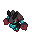

# # 📲 Pokédex

En [Mundo Pixelnet](**/README.md) tenemos Pokémon originales con sus propios modelos, Movesets e historia, consulta la lista de Pokémon originales:

| Numero |  Pokémon |                                            Sprite                                           |
| :---: | :----: | :-----------------------------------------------------------------------------------------: |
| **1** | [Cerullade](../pokemon/temporada-1/hibrido-cerullade.md) |                |
| **2** | [Gardewile](../pokemon/temporada-1/hibrido-gardewile.md) |    |
| **3** | [Lycario](../pokemon/temporada-1/hibrido-lycario.md) |  |
| **4** | [Mismapeon](../pokemon/temporada-1/hibrido-mismapeon.md) |  |
| **5** | [Zoropunny](../pokemon/temporada-1/hibrido-zoropunny.md) |  |
