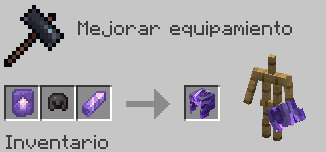
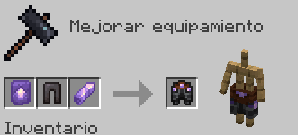
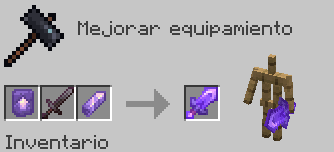
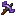
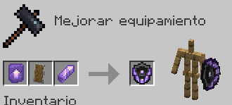

# Amatista

Fabricar el Set de Armadura de Amatista da el siguiente efecto al equiparse el Peto:

* **Visión noctuna permanente**

| Objeto                                                                          | Fabricación del objeto                                                            | Extras                                                                                                                                        |
| ------------------------------------------------------------------------------- | --------------------------------------------------------------------------------- | --------------------------------------------------------------------------------------------------------------------------------------------- |
|  **Mejora de Amatista**  | Cómpralo en `/warp esencias` por **150 Esencias** y **10 Fragmentos de Amatista** |                                                                                                                                               |
|  **Casco de Amatista**    |                                | El Casco se fabrica con el encantamiento ya aplicado de **Protección IV**                                                                     |
|  **Peto de Amatista** |                                 | Esta pieza es irrompible                                                                                                                      |
|  **Grebas de Amatista** |                               | Esta pieza es irrompible                                                                                                                      |
|  **Botas de Amatista**     |                                | Esta pieza es irrompible                                                                                                                      |
|  **Espada de Amatista**    |                               | La Espada se fabrica con el encantamiento ya aplicado de **Venom I** _(10% de probabilidad de aplicar Poision I (4s.) al golpear)_            |
|  **Pico de Amatista**    |                                 | El Pico se fabrica con el encantamiento ya aplicado de **Suerte Minera I** _(32.5% de probabilidad de conseguir 50% más de XP de las menas.)_ |
|  **Escudo de Amatista**   |                               | El Escudo es puramente estético                                                                                                               |
