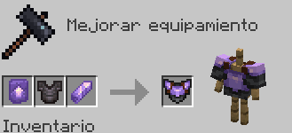
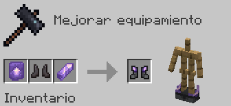
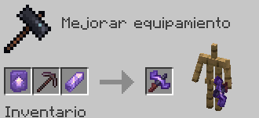

# Set de Amatista

Fabricar el Set de Armadura de Amatista da el siguiente efecto al equiparse el Peto:
- **Visión noctuna permanente**

| Objeto | Fabricación del objeto | Extras |
| - | - | - |
|  **Mejora de Amatista** | Cómpralo en `/warp esencias` por **150 Esencias** y **10 Fragmentos de Amatista** | |
|  **Casco de Amatista** |  | El Casco se fabrica con el encantamiento ya aplicado de **Protección IV** |
|  **Peto de Amatista** |  | Esta pieza es irrompible |
|  **Grebas de Amatista** |  | Esta pieza es irrompible |
|  **Botas de Amatista** |  | Esta pieza es irrompible |
|  **Espada de Amatista** |  | La Espada se fabrica con el encantamiento ya aplicado de **Venom I** *(10% de probabilidad de aplicar Poision I (4s.) al golpear)* |
|  **Pico de Amatista** |  | El Pico se fabrica con el encantamiento ya aplicado de **Suerte Minera I** *(32.5% de probabilidad de conseguir 50% más de XP de las menas.)* |
|  **Escudo de Amatista** |  | El Escudo es puramente estético |