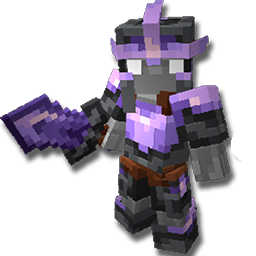

# 🛡️ Sets de Equipamiento

En Cobblemon de Universo PokéNet **tienes la capacidad de construir armaduras y herramientas de materiales que Minecraft no ofrece.**.

**Cada Set de Armadura tiene un efecto especial permanente.** Con el tiempo se irán añadiendo más Sets, comprueba esta entrada de la Wiki periódicamente, por si se ha añadido otro Set de Equipamiento.

## 📚 Sets

| Set                                                    | Entrada                                                                                        |
| ------------------------------------------------------ | ---------------------------------------------------------------------------------------------- |
|      |  [Set de Amatista](amethyst.md)         |
|    |  [Set de Esmeralda](emerald.md)         |
|  |  [Set de Prismarina](prismarine.md) |
