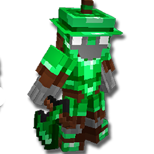
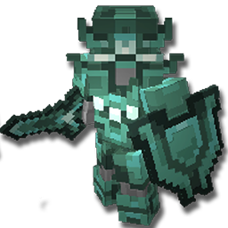
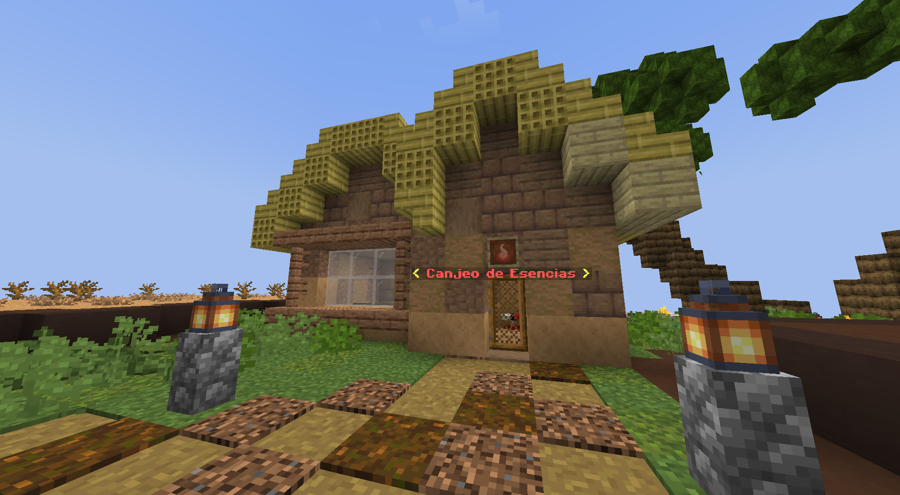

# 🛡️ Sets de Equipamiento
En Cobblemon de Universo PokéNet **tienes la capacidad de construir armaduras y herramientas de materiales que Minecraft no ofrece.**

Con el tiempo se irán añadiendo más Sets, comprueba esta entrada de la Wiki periódicamente, por si se ha añadido otro Set de Equipamiento.

## 📚 Sets
| Set | Entrada |
| - | - |
|  |  [Set de Amatista](amethyst.md) |
|  |  [Set de Esmeralda](emerald.md) |
|  |  [Set de Prismarina](prismarine.md) |

## ◻️ Mejora vacía
Todos los Sets de Equipamiento requerirán una Mejora concreta, y para conseguir esa Mejora primero tendrás que conseguir una **Mejora vacía**.

Puedes comprar Mejoras vacías en `/warp esencias`. Al NPC que se encuentra dentro de la casa.

