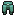

# Prismarina

Fabricar el Set de Armadura de Prismarina da el siguiente efecto al equiparse el Peto:

* **Apnea II permanente**

| Objeto                                                                                | Fabricación del objeto                                                              | Extras                                                                                                                  |
| ------------------------------------------------------------------------------------- | ----------------------------------------------------------------------------------- | ----------------------------------------------------------------------------------------------------------------------- |
|  **Mejora de Prismarina**  | Cómpralo en `/warp esencias` por **150 Esencias** y **10 Fragmentos de Prismarina** |                                                                                                                         |
|  **Casco de Prismarina**    | .png>)                           | El Casco se fabrica con el encantamiento ya aplicado de **Protección IV**                                               |
|  **Peto de Prismarina** | .png>)                            | Esta pieza es irrompible                                                                                                |
|  **Grebas de Prismarina** | .png>)                          | Esta pieza es irrompible                                                                                                |
|  **Botas de Prismarina**     | .png>)                           | Esta pieza es irrompible                                                                                                |
|  **Espada de Prismarina**    | .png>)                          | La Espada se fabrica con el encantamiento ya aplicado de **Temple I** _(Inflinge 5% más de daño por cada 0.5♥ perdido)_ |
|  **Pico de Prismarina**    | .png>)                            | El Pico se fabrica con el encantamiento ya aplicado de **Haste I** _(Aplica siempre el efecto Haste I)_                 |
|  **Escudo de Prismarina**   | .png>)                          | El Escudo es puramente estético                                                                                         |
