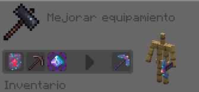

# Sugilita

## Sugilita

Fabricar el Set de Armadura de Sugilita da el siguiente efecto al equiparse el Peto:

* **Prisa minera I permanente**


Al aplicar las Mejoras del Set **se perderán los encantamientos que tuviera la herramienta/armadura original.** Por ello, es recomendable usar herramientas/armaduras nuevas a la hora de crear estos Sets.


| Objeto                                                                          | Fabricación del objeto                                                   | Extras                                                                                                                   |
| ------------------------------------------------------------------------------- | ------------------------------------------------------------------------ | ------------------------------------------------------------------------------------------------------------------------ |
|  **Mejora de Sugilita**  | Cómpralo en `/warp esencias` por **150 Esencias** y **10 Ojos de ender** |                                                                                                                          |
|  **Casco de Sugilita**    | .png>)                | El Casco se fabrica con el encantamiento ya aplicado de **Protección IV**                                                |
|  **Peto de Sugilita** | .png>)                 | Esta pieza es irrompible                                                                                                 |
|  **Grebas de Sugilita** | .png>)               | Esta pieza es irrompible                                                                                                 |
|  **Botas de Sugilita**     | .png>)                | Esta pieza es irrompible                                                                                                 |
|  **Espada de Sugilita**    | .png>)               | La Espada se fabrica con el encantamiento ya aplicado de **Aspecto Helado I** _(Congela y envenena enemigos al golpear)_ |
|  **Escudo de Sugilita**   | .png>)               | El Escudo es puramente estético                                                                                          |

***

## Pico de Sugilita

**El Pico de Sugilita tiene el encantamiento de Túnel Nivel III**, por lo que es una herramienta bastante útil de conseguir. Consigue los siguientes objetos para poder empezar la creación del Pico de Sugilita:

| Objeto                                                                          | Obtención                                                                                                                                                              |
| ------------------------------------------------------------------------------- | ---------------------------------------------------------------------------------------------------------------------------------------------------------------------- |
|  **Resonancia Contenida**      | Cómpralo en `/warp esencias` por **10**  **Fragmentos Resonantes**. Necesario para comprar el Núcleo de Resonancia. |
|  **Núcleo de Resonancia** | Cómpralo en `/warp esencias` por **5**  **Resonancias Contenidas**.                                                  |
|  **Mejora de Sugilita**  | Cómpralo en `/warp esencias` por **150 Esencias** y **10 Ojos de ender**                                                                                               |

Una vez obtenido los objetos, aplícalos en una Mesa de Herrería junto a un **Pico de Netherita** para crear el **Pico de Sugilita** _(con Túnel III)_:

