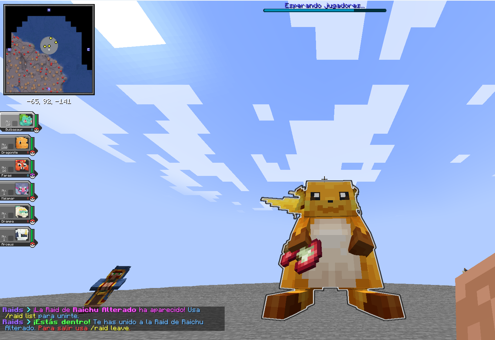

# 👾 Raids
El servidor de Cobblemon ofrece una experiencia de Raids disponible para todos los usuarios. **Enfréntate a un Pokémon Jefe junto con todos los usuarios del servidor y así conseguir muchas recompensas útiles.**

**Existen varios tipos de Raids**, aquí te explicaremos todo lo que conlleva cada una: tiempos, Pokémon, recompensas, etc.


Para todas las Raids: necesitarás un equipo con **Pokémon de nivel 50 o superior** para poder participar.


## 💥 Sistema de combate
Cuando una Raid empieza, **todos los jugadores deberán lanzar a su Pokémon contra el Jefe gigante del centro**.

Cuando la pelea empieza, tendrás que derrotarlo como si fuera un combate normal. **Cada jugador tiene un combate propio**. **Cuando derrotas al Jefe, se restará cierta cantidad de daño** de la barra global.

El combate finaliza cuando el HP total baja a 0. Y **al finalizar, se mostrará un Top** de los jugadores que más daño han realizado. **Depende del Top puedes obtener más recompensas.**

## 🛡️ Raid Normal

### ⚔️ Cómo entrar a una Raid Normal
Cuando llega la hora de inicio de una Raid Normal, aparecerá en el chat que una Raid ha aparecido.

Usa el comando `/raid list` para ver un **menú con el icono del Pokémon**. Al darle **clic te unirás a la Raid**. Después, solo tendrás que esperar a que la Raid inicie.

Si quisieras salirte de la Raid, usa el comando `/raid leave`. Recuerda que no recibirás ningún tipo de recompensa al salir. Y **si la Raid ya ha empezado, no podrás volver a entrar.**

### ⌛ Horario de Raid Normal
Las Raids tienen una hora de ejecución. Es decir, **hasta que no sea la hora indicada no aparecerá la Raid en el servidor.**

Cuando llega la hora de la Raid, **tendrás unos 5 minutos para entrar a la Raid** y ahí empezará el combate. Una vez empiece, no podrás entrar.


Las horas indicadas están en formato **UTC+1**. Si haces clic en la hora, verás una conversión para tu país.


| Día de la semana | Horas |
| - | - |
| Lunes-Viernes | [00:00](https://www.timeanddate.com/worldclock/fixedtime.html?iso=20000101T2300) / [02:00](https://www.timeanddate.com/worldclock/fixedtime.html?iso=20000101T0100) / [14:00](https://www.timeanddate.com/worldclock/fixedtime.html?iso=20000101T1300) / [16:00](https://www.timeanddate.com/worldclock/fixedtime.html?iso=20000101T1500) / [18:00](https://www.timeanddate.com/worldclock/fixedtime.html?iso=20000101T1700) / [20:00](https://www.timeanddate.com/worldclock/fixedtime.html?iso=20000101T1900) / [22:00](https://www.timeanddate.com/worldclock/fixedtime.html?iso=20000101T2100) |
| Sábado-Domingo | [00:00](https://www.timeanddate.com/worldclock/fixedtime.html?iso=20000101T2300) / [01:00](https://www.timeanddate.com/worldclock/fixedtime.html?iso=20000101T0000) / [02:00](https://www.timeanddate.com/worldclock/fixedtime.html?iso=20000101T0100) / [16:00](https://www.timeanddate.com/worldclock/fixedtime.html?iso=20000101T1500) / [17:00](https://www.timeanddate.com/worldclock/fixedtime.html?iso=20000101T1600) / [18:00](https://www.timeanddate.com/worldclock/fixedtime.html?iso=20000101T1700) / [19:00](https://www.timeanddate.com/worldclock/fixedtime.html?iso=20000101T1800) / [20:00](https://www.timeanddate.com/worldclock/fixedtime.html?iso=20000101T1900) / [21:00](https://www.timeanddate.com/worldclock/fixedtime.html?iso=20000101T2000) / [22:00](https://www.timeanddate.com/worldclock/fixedtime.html?iso=20000101T2100) / [23:00](https://www.timeanddate.com/worldclock/fixedtime.html?iso=20000101T2200) |

También puedes ver cuántas horas quedan para la siguiente Raid desde el propio servidor.

### 🐲 Pokémon de Raid Normal
En las Raids Normales **puede salir uno de los 5 Pokémon de la rotación semanal**. Esto es completamente aleatorio.

**La rotación es anunciada cada Domingo**, y se activa tras la última Raid del Domingo. Este anuncio se hace através del canal `👾︙raids-venus` del [Discord de Universo PokéNet](https://discord.com/invite/p4wryDdutf).

> FALTA IMAGEN

Este anuncio tendrá toda la información de utilidad, como por ejemplo los Sets de Recompensa de cada Pokémon.

### 🎁 Recompensas
Completar una Raid Normal haciendo algo de daño al Jefe tiene varias recompensas.

---

**Recompensas aseguradas.** Esto 100% lo obtendrás al terminar la Raid.

| Top Daño | Recompensas |
| - | - |
| 🥇 1º Puesto | 650 XP de Pase, 6000₽, 3 Tokens de Gatcha Raid, 400 Esencias |
| 🥈 2º y 🥉 3º Puesto | 500 XP de Pase, 4500₽, 2 Tokens de Gatcha Raid, 250 Esencias |
| 🎖️ Participar | 300 XP de Pase, 3200₽, 1 Token de Gatcha Raid, 120 Esencias |

---

**Tipo de Pokémon**. Dependiendo de qué tipo elemental sea el Pokémon Jefe **puedes obtener 3 de las siguientes recompensas.** 


**Si el Pokémon fuera de doble tipo, puedes obtener las 3 recompensas de los 2 Tipos.** Por ejemplo, si el Jefe fuera un Corviknight puedes conseguir las recompensas de Volador y Acero a la vez.





| Recompensa | Porcentaje |
| - | - |
| Tabla Trueno | - |

