# 👾 Raids

El servidor de Cobblemon ofrece una experiencia de Raids disponible para todos los usuarios. **Enfréntate a un Pokémon Jefe junto con todos los usuarios del servidor y así conseguir muchas recompensas útiles.**

**Existen varios tipos de Raids**, aquí te explicaremos todo lo que conlleva cada una: tiempos, Pokémon, recompensas, etc.


Para todas las Raids: necesitarás un equipo con **Pokémon de nivel 50 o superior** para poder participar.


## 💥 Sistema de combate

Cuando una Raid empieza, **todos los jugadores deberán lanzar a su Pokémon contra el Jefe gigante del centro**.

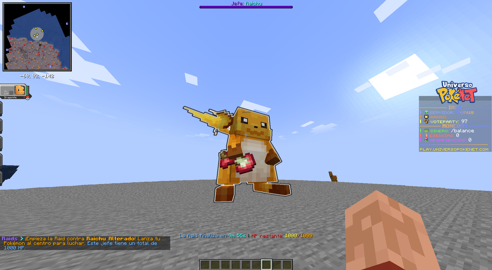

Cuando la pelea empieza, tendrás que derrotarlo como si fuera un combate normal. **Cada jugador tiene un combate propio**. **Cuando derrotas al Jefe, se restará cierta cantidad de daño** de la barra global.

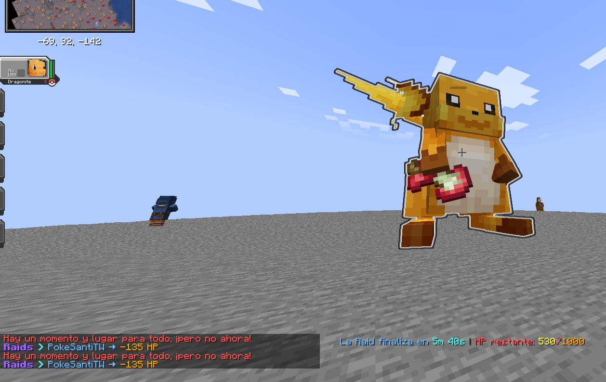

El combate finaliza cuando el HP total baja a 0. Y **al finalizar, se mostrará un Top** de los jugadores que más daño han realizado. **Depende del Top puedes obtener más recompensas.**

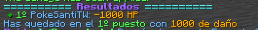

## 🛡️ Raid Semanal

### ⚔️ Cómo entrar a una Raid Semanal

Cuando llega la hora de inicio de una Raid Semanal, aparecerá en el chat que una Raid ha aparecido.

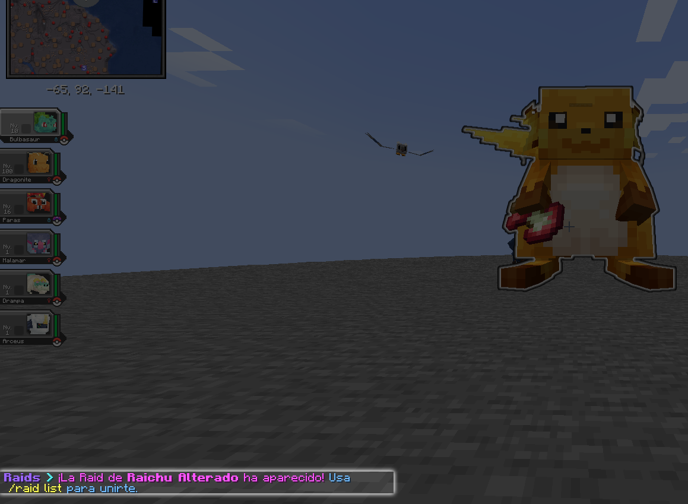

Usa el comando `/raid list` para ver un **menú con el icono del Pokémon**. Al darle **clic te unirás a la Raid**. Después, solo tendrás que esperar a que la Raid inicie.

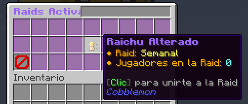

Si quisieras salirte de la Raid, usa el comando `/raid leave`. Recuerda que no recibirás ningún tipo de recompensa al salir. Y **si la Raid ya ha empezado, no podrás volver a entrar.**

### ⌛ Horario de Raid Semanal

Las Raids tienen una hora de ejecución. Es decir, **hasta que no sea la hora indicada no aparecerá la Raid en el servidor.**

Cuando llega la hora de la Raid, **tendrás unos 5 minutos para entrar a la Raid** y ahí empezará el combate. Una vez empiece, no podrás entrar.


Las horas indicadas están en formato **UTC+1**. Si haces clic en la hora, verás una conversión para tu país.


| Día de la semana | Horas                                                                                                                                                                                                                                                                                                                                                                                                                                                                                                                                                                                                                                                                                                                                                                                                                                                                                                                                                                                                                             |
| ---------------- | --------------------------------------------------------------------------------------------------------------------------------------------------------------------------------------------------------------------------------------------------------------------------------------------------------------------------------------------------------------------------------------------------------------------------------------------------------------------------------------------------------------------------------------------------------------------------------------------------------------------------------------------------------------------------------------------------------------------------------------------------------------------------------------------------------------------------------------------------------------------------------------------------------------------------------------------------------------------------------------------------------------------------------- |
| Lunes-Viernes    | [00:00](https://www.timeanddate.com/worldclock/fixedtime.html?iso=20000101T2300) / [01:30](https://www.timeanddate.com/worldclock/fixedtime.html?iso=20000101T0030) / [03:00](https://www.timeanddate.com/worldclock/fixedtime.html?iso=20000101T0200) / [04:30](https://www.timeanddate.com/worldclock/fixedtime.html?iso=20000101T0330) / [18:00](https://www.timeanddate.com/worldclock/fixedtime.html?iso=20000101T1700) / [19:30](https://www.timeanddate.com/worldclock/fixedtime.html?iso=20000101T1830) / [21:00](https://www.timeanddate.com/worldclock/fixedtime.html?iso=20000101T2000) / [22:30](https://www.timeanddate.com/worldclock/fixedtime.html?iso=20000101T2130)                                                                                                                                                                                                                                                                                                                                             |
| Sábado-Domingo   | [00:00](https://www.timeanddate.com/worldclock/fixedtime.html?iso=20000101T2300) / [01:00](https://www.timeanddate.com/worldclock/fixedtime.html?iso=20000101T0000) / [02:00](https://www.timeanddate.com/worldclock/fixedtime.html?iso=20000101T0100) / [03:00](https://www.timeanddate.com/worldclock/fixedtime.html?iso=20000101T0200) / [04:00](https://www.timeanddate.com/worldclock/fixedtime.html?iso=20000101T0300) / [05:00](https://www.timeanddate.com/worldclock/fixedtime.html?iso=20000101T0400) / [18:00](https://www.timeanddate.com/worldclock/fixedtime.html?iso=20000101T1700) / [19:00](https://www.timeanddate.com/worldclock/fixedtime.html?iso=20000101T1800) / [20:00](https://www.timeanddate.com/worldclock/fixedtime.html?iso=20000101T1900) / [21:00](https://www.timeanddate.com/worldclock/fixedtime.html?iso=20000101T2000) / [22:00](https://www.timeanddate.com/worldclock/fixedtime.html?iso=20000101T2100) / [23:00](https://www.timeanddate.com/worldclock/fixedtime.html?iso=20000101T2200) |

### 🐲 Pokémon de Raid Semanal

En las Raids Semanales **puede salir uno de los 5 Pokémon de la rotación semanal**. Esto es completamente aleatorio.

**La rotación es anunciada cada Domingo**, y se activa tras la última Raid del Domingo. Este anuncio se hace através del canal `👾︙raids-venus` del [Discord de Universo PokéNet](https://discord.com/invite/p4wryDdutf).

Este anuncio tendrá toda la información de utilidad, como por ejemplo los Sets de Recompensa de cada Pokémon.

### 🎁 Recompensas

Completar una Raid Semanal haciendo algo de daño al Jefe tiene varias recompensas.

***

**Recompensas aseguradas.** Esto 100% lo obtendrás al terminar la Raid.

| Top Daño             | Recompensas                                                  |
| -------------------- | ------------------------------------------------------------ |
| 🥇 1º Puesto         | 650 XP de Pase, 6000₽, 3 Tokens de Gatcha Raid, 400 Esencias |
| 🥈 2º y 🥉 3º Puesto | 500 XP de Pase, 4500₽, 2 Tokens de Gatcha Raid, 250 Esencias |
| 🎖️ Participar       | 300 XP de Pase, 3200₽, 1 Token de Gatcha Raid, 120 Esencias  |

***

**Tipo de Pokémon**. Dependiendo de qué tipo elemental sea el Pokémon Jefe **puedes obtener 3 de las siguientes recompensas.**


**Si el Pokémon fuera de doble tipo, puedes obtener las 3 recompensas de los 2 Tipos.** Por ejemplo, si el Jefe fuera un Corviknight puedes conseguir las recompensas de Volador y Acero a la vez.




| Recompensa                                                                    | Cantidad | Porcentaje de obtención |
| ----------------------------------------------------------------------------- | -------- | ----------------------- |
|  **Pila**                      | 1        | 16%                     |
| 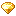 **Gema eléctrico**            | 3-6      | 16%                     |
| 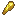 **Teralito Eléctrico** | 3-10     | 16%                     |
|  **Redstone**                      | 20-64    | 16%                     |
|  **Veloz Ball**                  | 10-20    | 16%                     |
|  **Teralito Astral**     | 3-6      | 8%                      |
|  **Chapa plateada**        | 1        | 8%                      |
|  **Tabla Trueno**                 | 1        | 4%                      |



| Recompensa                                                                | Cantidad | Porcentaje de obtención |
| ------------------------------------------------------------------------- | -------- | ----------------------- |
|  **Revestimiento metálico**  | 1        | 16%                     |
|  **Gema acero**               | 3-6      | 16%                     |
| 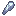 **Teralito Acero**    | 3-10     | 16%                     |
|  **Lingote de hierro**       | 20-64    | 16%                     |
| 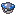 **Peso Ball**               | 10-20    | 16%                     |
|  **Teralito Astral** | 3-6      | 8%                      |
|  **Chapa plateada**    | 1        | 8%                      |
|  **Tabla Acero**             | 1        | 4%                      |



| Recompensa                                                                | Cantidad | Porcentaje de obtención |
| ------------------------------------------------------------------------- | -------- | ----------------------- |
|  **Agua Mística**          | 1        | 16%                     |
|  **Gema agua**                | 3-6      | 16%                     |
| 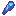 **Teralito Agua**     | 3-10     | 16%                     |
|  **Arena**                         | 20-64    | 16%                     |
|  **Buceo Ball**               | 10-20    | 16%                     |
|  **Teralito Astral** | 3-6      | 8%                      |
|  **Chapa plateada**    | 1        | 8%                      |
|  **Tabla Linfa**           | 1        | 4%                      |



| Recompensa                                                                | Cantidad | Porcentaje de obtención |
| ------------------------------------------------------------------------- | -------- | ----------------------- |
|  **Polvo Plata**          | 1        | 16%                     |
|  **Gema bicho**                 | 3-6      | 16%                     |
|  **Teralito Bicho**      | 3-10     | 16%                     |
|  **Frasco de miel**        | 2-4      | 16%                     |
|  **Malla Ball**                | 10-20    | 16%                     |
|  **Teralito Astral** | 3-6      | 8%                      |
|  **Chapa plateada**    | 1        | 8%                      |
|  **Tabla Bicho**           | 1        | 4%                      |



| Recompensa                                                                | Cantidad | Porcentaje de obtención |
| ------------------------------------------------------------------------- | -------- | ----------------------- |
| 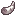 **Colmillo Dragón**        | 1        | 16%                     |
|  **Gema dragón**             | 3-6      | 16%                     |
|  **Teralito Dragón**  | 3-10     | 16%                     |
| 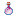 **Aliento de dragón**    | 1        | 16%                     |
|  **Lujo Ball**              | 10-20    | 16%                     |
|  **Teralito Astral** | 3-6      | 8%                      |
|  **Chapa plateada**    | 1        | 8%                      |
|  **Tabla Draco**            | 1        | 4%                      |



| Recompensa                                                                   | Cantidad | Porcentaje de obtención |
| ---------------------------------------------------------------------------- | -------- | ----------------------- |
|  **Hechizo**                     | 1        | 16%                     |
|  **Gema fantasma**               | 3-6      | 16%                     |
| 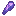 **Teralito Fantasma**    | 3-10     | 16%                     |
|  **Membrana de fantasma** | 1-4      | 16%                     |
|  **Luna Ball**                   | 10-20    | 16%                     |
|  **Teralito Astral**    | 3-6      | 8%                      |
|  **Chapa plateada**       | 1        | 8%                      |
|  **Tabla Terror**             | 1        | 4%                      |



| Recompensa                                                                | Cantidad | Porcentaje de obtención |
| ------------------------------------------------------------------------- | -------- | ----------------------- |
| 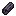 **Carbón**              | 1        | 16%                     |
|  **Gema fuego**                | 3-6      | 16%                     |
|  **Teralito Fuego**     | 3-10     | 16%                     |
|  **Vara de Blaze**            | 5-15     | 16%                     |
| 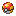 **Rapid Ball**               | 10-20    | 16%                     |
|  **Teralito Astral** | 3-6      | 8%                      |
|  **Chapa plateada**    | 1        | 8%                      |
|  **Tabla Llama**            | 1        | 4%                      |



| Recompensa                                                                      | Cantidad | Porcentaje de obtención |
| ------------------------------------------------------------------------------- | -------- | ----------------------- |
|  **Pluma feérica**              | 1        | 16%                     |
|  **Gema hada**                      | 3-6      | 16%                     |
| 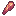 **Teralito Hada**           | 3-10     | 16%                     |
|  **Frasco con experiencia** | 15-40    | 16%                     |
|  **Sana Ball**                      | 10-20    | 16%                     |
|  **Teralito Astral**       | 3-6      | 8%                      |
|  **Chapa plateada**          | 1        | 8%                      |
|  **Tabla Duende**                 | 1        | 4%                      |



| Recompensa                                                                | Cantidad | Porcentaje de obtención |
| ------------------------------------------------------------------------- | -------- | ----------------------- |
|  **Antiderretir**        | 1        | 16%                     |
|  **Gema hielo**                 | 3-6      | 16%                     |
|  **Teralito Hielo**      | 3-10     | 16%                     |
|  **Hielo**                          | 20-42    | 16%                     |
|  **Aero Ball Antigua** | 10-20    | 16%                     |
|  **Teralito Astral** | 3-6      | 8%                      |
|  **Chapa plateada**    | 1        | 8%                      |
|  **Tabla Helada**          | 1        | 4%                      |



| Recompensa                                                                | Cantidad | Porcentaje de obtención |
| ------------------------------------------------------------------------- | -------- | ----------------------- |
|  **Cinturón negro**          | 1        | 16%                     |
|  **Gema lucha**            | 3-6      | 16%                     |
| 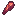 **Teralito Lucha** | 3-10     | 16%                     |
|  **Manzana de oro**        | 10-20    | 16%                     |
|  **Turno Ball**              | 10-20    | 16%                     |
|  **Teralito Astral** | 3-6      | 8%                      |
|  **Chapa plateada**    | 1        | 8%                      |
|  **Tabla Fuerte**            | 1        | 4%                      |



| Recompensa                                                                | Cantidad | Porcentaje de obtención |
| ------------------------------------------------------------------------- | -------- | ----------------------- |
|  **Pañuelo de seda**         | 1        | 16%                     |
|  **Gema normal**             | 3-6      | 16%                     |
| 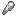 **Teralito Normal**  | 3-10     | 16%                     |
| 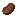 **Filete asado**           | 30-64    | 16%                     |
|  **Ultra Ball**              | 10-20    | 16%                     |
|  **Teralito Astral** | 3-6      | 8%                      |
|  **Chapa plateada**    | 1        | 8%                      |
|  **Megapiedra vacía**         | 1        | 4%                      |



| Recompensa                                                                | Cantidad | Porcentaje de obtención |
| ------------------------------------------------------------------------- | -------- | ----------------------- |
|  **Semilla milagro**       | 1        | 16%                     |
|  **Gema planta**              | 3-6      | 16%                     |
|  **Teralito Planta**   | 3-10     | 16%                     |
|  **Polvo de hueso**           | 10-30    | 16%                     |
| 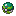 **Parque Ball**              | 10-20    | 16%                     |
|  **Teralito Astral** | 3-6      | 8%                      |
|  **Chapa plateada**    | 1        | 8%                      |
|  **Tabla Pradal**          | 1        | 4%                      |



| Recompensa                                                                  | Cantidad | Porcentaje de obtención |
| --------------------------------------------------------------------------- | -------- | ----------------------- |
|  **Cuchara torcida**        | 1        | 16%                     |
|  **Gema psíquico**            | 3-6      | 16%                     |
|  **Teralito Psíquico** | 3-10     | 16%                     |
|  **Ender Pearl**              | 10-16    | 16%                     |
| 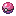 **Ensueño Ball**              | 10-20    | 16%                     |
|  **Teralito Astral**   | 3-6      | 8%                      |
|  **Chapa plateada**      | 1        | 8%                      |
|  **Tabla Mental**              | 1        | 4%                      |



| Recompensa                                                                | Cantidad | Porcentaje de obtención |
| ------------------------------------------------------------------------- | -------- | ----------------------- |
|  **Piedra dura**             | 1        | 16%                     |
|  **Gema roca**                 | 3-6      | 16%                     |
|  **Teralito Roca**      | 3-10     | 16%                     |
| 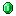 **Esmeralda**                  | 10-30    | 16%                     |
|  **Ensueño Ball**            | 10-20    | 16%                     |
|  **Teralito Astral** | 3-6      | 8%                      |
|  **Chapa plateada**    | 1        | 8%                      |
|  **Tabla Pétrea**           | 1        | 4%                      |



| Recompensa                                                                | Cantidad | Porcentaje de obtención |
| ------------------------------------------------------------------------- | -------- | ----------------------- |
|  **Gafas de Sol**         | 1        | 16%                     |
|  **Gema siniestro**            | 3-6      | 16%                     |
|  **Teralito Siniestro** | 3-10     | 16%                     |
| 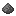 **Pólvora**                  | 20-40    | 16%                     |
|  **Ocaso Ball**               | 10-20    | 16%                     |
|  **Teralito Astral** | 3-6      | 8%                      |
|  **Chapa plateada**    | 1        | 8%                      |
|  **Tabla Oscura**           | 1        | 4%                      |



| Recompensa                                                                | Cantidad | Porcentaje de obtención |
| ------------------------------------------------------------------------- | -------- | ----------------------- |
|  **Arena fina**               | 1        | 16%                     |
| 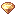 **Gema tierra**             | 3-6      | 16%                     |
| 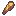 **Teralito Tierra**  | 3-10     | 16%                     |
| 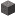 **Grava**                       | 20-40    | 16%                     |
|  **Acopio Ball**            | 10-20    | 16%                     |
|  **Teralito Astral** | 3-6      | 8%                      |
|  **Chapa plateada**    | 1        | 8%                      |
|  **Tabla Terrax**           | 1        | 4%                      |



| Recompensa                                                                | Cantidad | Porcentaje de obtención |
| ------------------------------------------------------------------------- | -------- | ----------------------- |
|  **Flecha venenosa**        | 1        | 16%                     |
|  **Gema veneno**             | 3-6      | 16%                     |
| 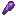 **Teralito Veneno**  | 3-10     | 16%                     |
|  **Ojo de araña**            | 5-12     | 16%                     |
| 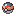 **Nivel Ball**              | 10-20    | 16%                     |
|  **Teralito Astral** | 3-6      | 8%                      |
|  **Chapa plateada**    | 1        | 8%                      |
|  **Tabla Tóxica**           | 1        | 4%                      |



| Recompensa                                                                | Cantidad | Porcentaje de obtención |
| ------------------------------------------------------------------------- | -------- | ----------------------- |
|  **Pico afilado**            | 1        | 16%                     |
|  **Gema volador**            | 3-6      | 16%                     |
|  **Teralito Volador** | 3-10     | 16%                     |
|  **Vara de Breeze**          | 5-10     | 16%                     |
| 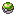 **Nido Ball**                | 10-20    | 16%                     |
|  **Teralito Astral** | 3-6      | 8%                      |
|  **Chapa plateada**    | 1        | 8%                      |
|  **Tabla Cielo**              | 1        | 4%                      |


