# 💥 Raids

## 📃 Lista de Pokémon
*Créditos a WikiDex*



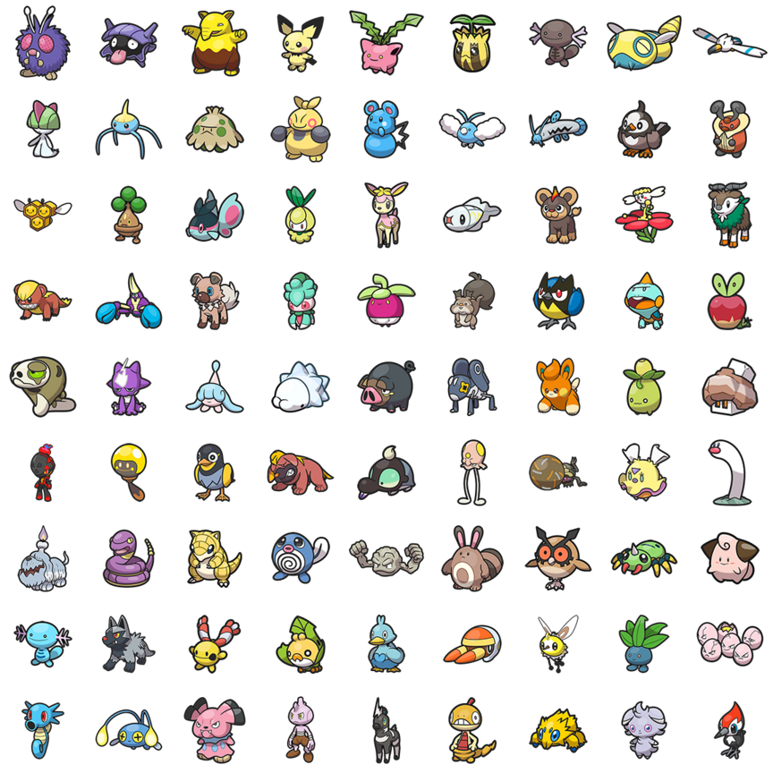


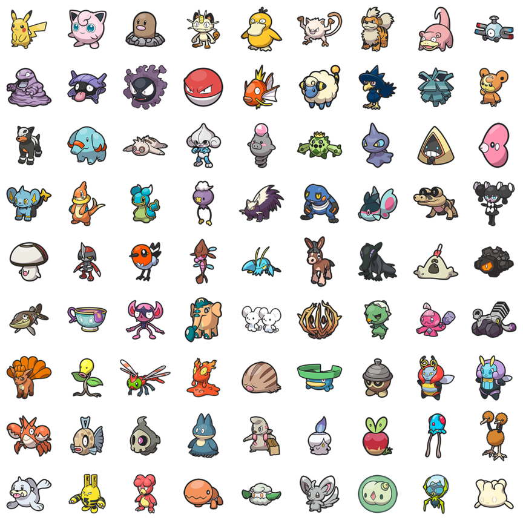


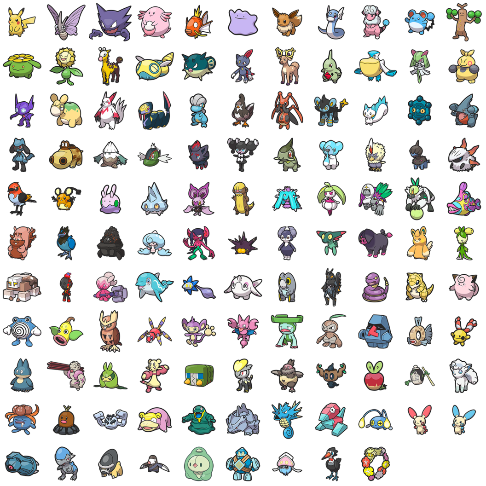


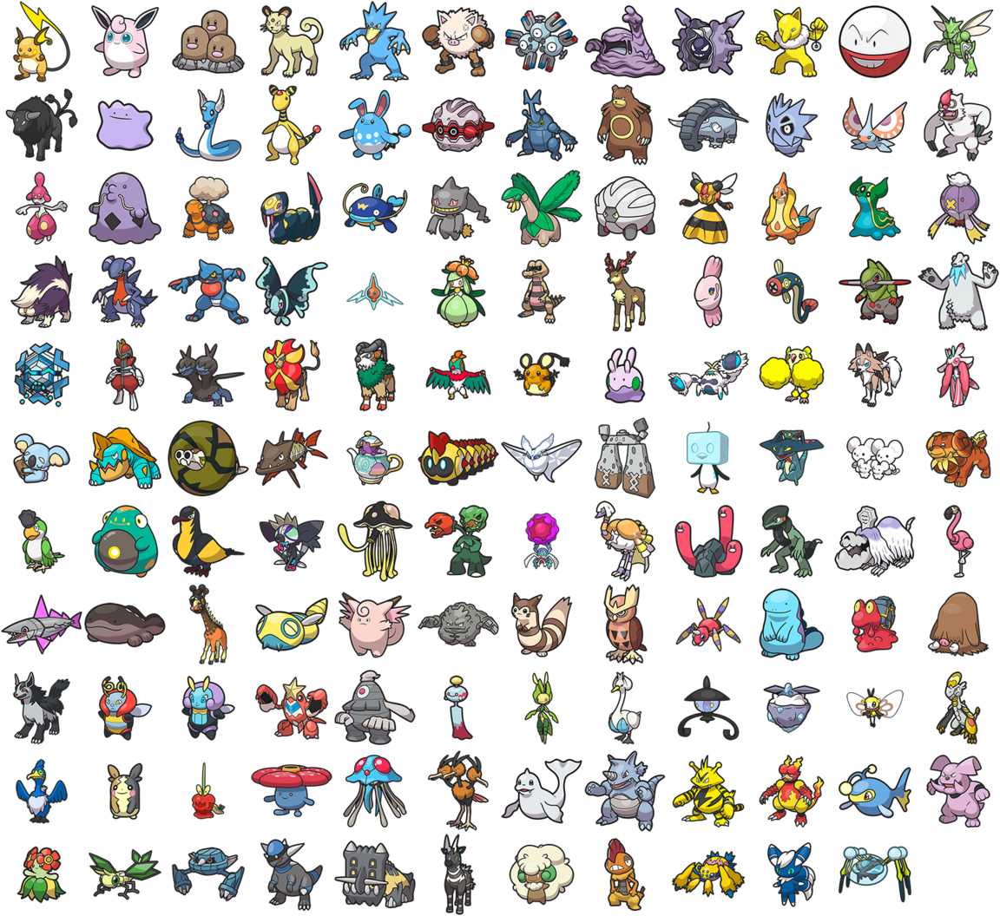


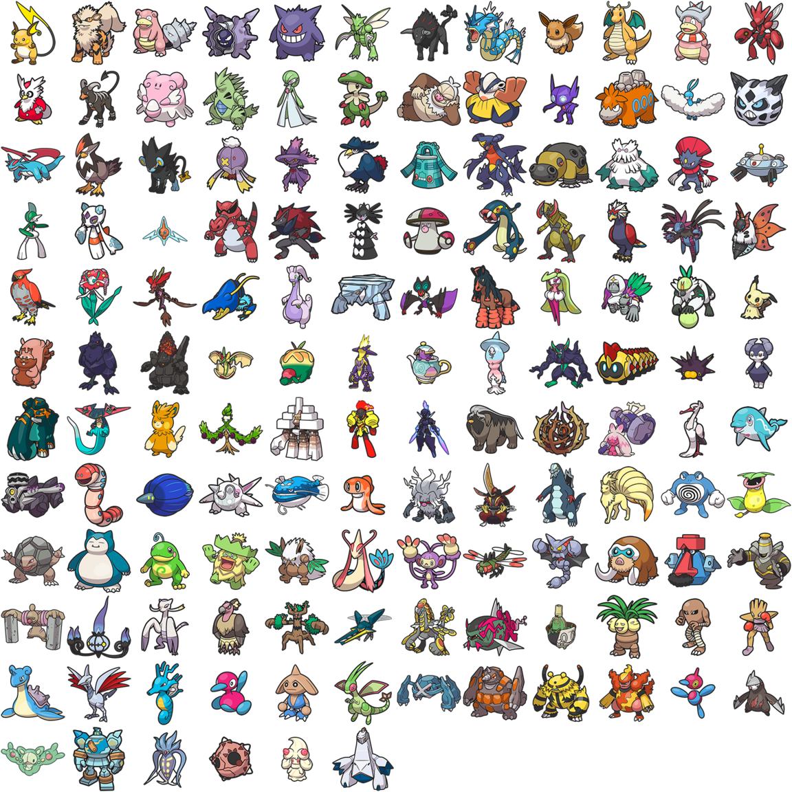


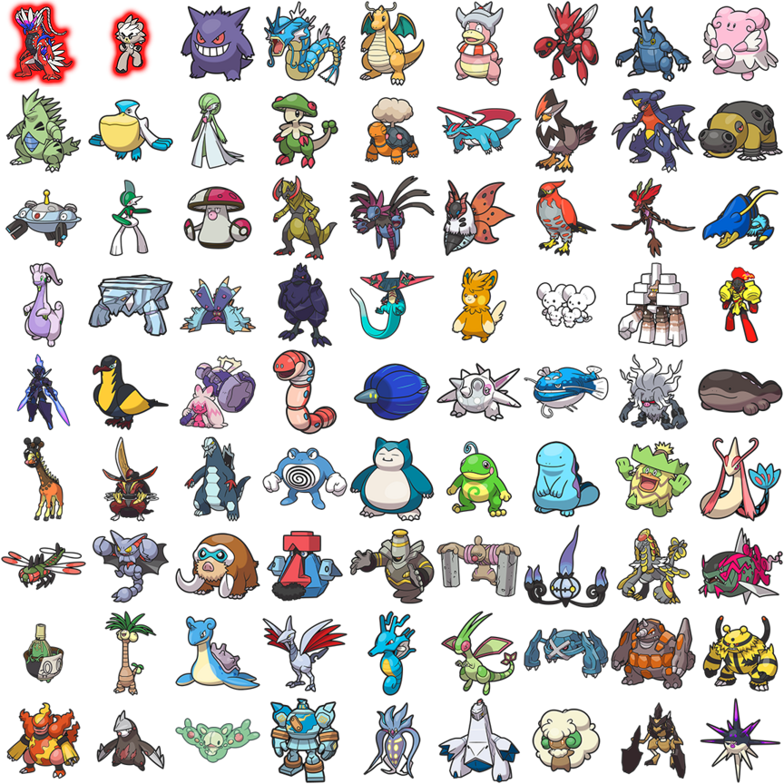
*Los Pokémon en rojo son Pokémon destacados temporalmente*



## 🎁 Recompensas

Completar una Raid haciendo daño al Jefe tiene recompensas, que varían mucho dependiendo de la 🔸 Tier de la Raid.

***

**✅ Recompensas aseguradas:** Esto 100% lo obtendrás al terminar la Raid, da igual la cantidad de daño realizada.

| Tier | Recompensas |
| - | - |
| 1 🔸 | 200 XP de Pase • 2000₽ • 1 Token de Gatcha Raid • 200 Esencias |
| 2 🔸🔸 | 400 XP de Pase • 3500₽ • 1 Token de Gatcha Raid • 350 Esencias |
| 3 🔸🔸🔸 | 600 XP de Pase • 5000₽ • 2 Token de Gatcha Raid • 500 Esencias |
| 4 🔸🔸🔸🔸 | 800 XP de Pase • 7500₽ • 2 Token de Gatcha Raid • 750 Esencias |
| 5 🔸🔸🔸🔸🔸 | 1000 XP de Pase • 10.000₽ • 3 Token de Gatcha Raid • 900 Esencias |
| 6 🔸🔸🔸🔸🔸🔸 | 2000 XP de Pase • 15.000₽ • 5 Token de Gatcha Raid • 1000 Esencias |

***

**💎 Gemas y Teralitos:** Dependiendo de la 🔸 Tier de la Raid obtendrás una cierta cantidad de Gemas y Teralitos. El tipo de la Gema y Teralito depende de los tipos elementales del Jefe.

| Tier | 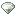 Cantidad Gemas | 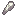 Cantidad Teralitos |
| - | - | - |
| 1 🔸 | 1-2 | 1-3 |
| 2 🔸🔸 | 1-3 | 1-5 |
| 3 🔸🔸🔸 | 2-5 | 3-6 |
| 4 🔸🔸🔸🔸 | 2-8 | 3-8 |
| 5 🔸🔸🔸🔸🔸 | 5-10 | 5-15 |
| 6 🔸🔸🔸🔸🔸🔸 | 20 | 20 |

***

**🍬 IVs perfectos:** Cuanto mayor es la dificultad de la Raid, mayores son sus IVs perfectos. Dependiendo tanto de la 🔸 Tier como de **tu puesto en daño recibirás un Pokémon con cierto número de IVs perfectos:**
| Tier | 🥇 Primero | 🥈 Segundo | 🥉 Tercero | Restante |
| - | - | - | - | - |
| 1 🔸 | 1 | 0 | 0 | 0 |
| 2 🔸🔸 | 2 | 1 | 1 | 0 |
| 3 🔸🔸🔸 | 3 | 2 | 1 | 1 |
| 4 🔸🔸🔸🔸 | 4 | 3 | 2 | 1 |
| 5 🔸🔸🔸🔸🔸 | 5 | 4 | 3 | 2 |
| 6 🔸🔸🔸🔸🔸🔸 | 6 | 5 | 4 | 3 |

***

**🔥 Objetos de Tipo:** Dependiendo de qué tipo elemental sea el Jefe **puedes obtener distintas recompensas.**


Estas recompensas solo se aplican en Raids de Tier 🔸🔸🔸 en adelante



**Si el Pokémon fuera de doble tipo, puedes obtener recompensas de los 2 Tipos.** Por ejemplo, si el Jefe fuera un Corviknight puedes conseguir las recompensas de Volador y Acero a la vez.


La cantidad de objetos que recibirás de cada lista dependerá de la Tier de la Raid. El porcentaje no cambia.
| Tier | Cantidad de objetos |
| - | - |
| 3 🔸🔸🔸 | 2 |
| 4 🔸🔸🔸🔸 | 3 |
| 5 🔸🔸🔸🔸🔸 | 3 |
| 6 🔸🔸🔸🔸🔸🔸 | 4 |



| Recompensa                                                                             | Cantidad | Porcentaje de obtención |
| -------------------------------------------------------------------------------------- | -------- | ----------------------- |
| 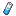 **Pila**                  | 1        | 24%                     |
| 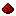 **Redstone**                  | 20-64    | 24%                     |
|  **Veloz Ball**              | 10-20    | 24%                     |
| 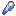 **Teralito Astral** | 3-6      | 12%                     |
|  **Chapa plateada**    | 1        | 12%                     |
| 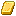 **Tabla Trueno**             | 1        | 4%                      |



| Recompensa                                                                             | Cantidad | Porcentaje de obtención |
| -------------------------------------------------------------------------------------- | -------- | ----------------------- |
| 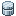 **Revestimiento metálico**  | 1        | 24%                     |
| 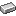 **Lingote de hierro**       | 20-64    | 24%                     |
| 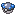 **Peso Ball**               | 10-20    | 24%                     |
|  **Teralito Astral** | 3-6      | 12%                     |
|  **Chapa plateada**    | 1        | 12%                     |
| 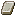 **Tabla Acero**             | 1        | 4%                      |



| Recompensa                                                                             | Cantidad | Porcentaje de obtención |
| -------------------------------------------------------------------------------------- | -------- | ----------------------- |
|  **Agua Mística**          | 1        | 24%                     |
| 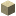 **Arena**                         | 20-64    | 24%                     |
|  **Buceo Ball**               | 10-20    | 24%                     |
|  **Teralito Astral** | 3-6      | 12%                     |
|  **Chapa plateada**    | 1        | 12%                     |
|  **Tabla Linfa**           | 1        | 4%                      |



| Recompensa                                                                             | Cantidad | Porcentaje de obtención |
| -------------------------------------------------------------------------------------- | -------- | ----------------------- |
|  **Polvo Plata**          | 1        | 24%                     |
| 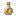 **Frasco de miel**        | 2-4      | 24%                     |
| 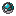 **Malla Ball**                | 10-20    | 24%                     |
|  **Teralito Astral** | 3-6      | 12%                     |
|  **Chapa plateada**    | 1        | 12%                     |
|  **Tabla Bicho**           | 1        | 4%                      |



| Recompensa                                                                             | Cantidad | Porcentaje de obtención |
| -------------------------------------------------------------------------------------- | -------- | ----------------------- |
| 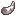 **Colmillo Dragón**        | 1        | 24%                     |
| 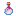 **Aliento de dragón**    | 1        | 24%                     |
|  **Lujo Ball**              | 10-20    | 24%                     |
|  **Teralito Astral** | 3-6      | 12%                     |
|  **Chapa plateada**    | 1        | 12%                     |
| 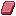 **Tabla Draco**            | 1        | 4%                      |



| Recompensa                                                                                | Cantidad | Porcentaje de obtención |
| ----------------------------------------------------------------------------------------- | -------- | ----------------------- |
| 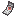 **Hechizo**                     | 1        | 24%                     |
| 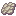 **Membrana de fantasma** | 1-4      | 24%                     |
| 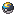 **Luna Ball**                   | 10-20    | 24%                     |
|  **Teralito Astral**    | 3-6      | 12%                     |
|  **Chapa plateada**       | 1        | 12%                     |
| 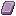 **Tabla Terror**             | 1        | 4%                      |



| Recompensa                                                                             | Cantidad | Porcentaje de obtención |
| -------------------------------------------------------------------------------------- | -------- | ----------------------- |
| 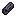 **Carbón**              | 1        | 24%                     |
|  **Vara de Blaze**            | 5-15     | 24%                     |
| 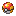 **Rapid Ball**               | 10-20    | 24%                     |
|  **Teralito Astral** | 3-6      | 12%                     |
|  **Chapa plateada**    | 1        | 12%                     |
|  **Tabla Llama**            | 1        | 4%                      |



| Recompensa                                                                                   | Cantidad | Porcentaje de obtención |
| -------------------------------------------------------------------------------------------- | -------- | ----------------------- |
| 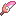 **Pluma feérica**              | 1        | 24%                     |
| 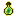 **Frasco con experiencia** | 15-40    | 24%                     |
|  **Sana Ball**                      | 10-20    | 24%                     |
|  **Teralito Astral**       | 3-6      | 12%                     |
|  **Chapa plateada**          | 1        | 12%                     |
| 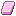 **Tabla Duende**                 | 1        | 4%                      |



| Recompensa                                                                             | Cantidad | Porcentaje de obtención |
| -------------------------------------------------------------------------------------- | -------- | ----------------------- |
|  **Antiderretir**        | 1        | 24%                     |
|  **Hielo**                          | 20-42    | 24%                     |
|  **Aero Ball Antigua** | 10-20    | 24%                     |
|  **Teralito Astral** | 3-6      | 12%                     |
|  **Chapa plateada**    | 1        | 12%                     |
|  **Tabla Helada**          | 1        | 4%                      |



| Recompensa                                                                             | Cantidad | Porcentaje de obtención |
| -------------------------------------------------------------------------------------- | -------- | ----------------------- |
| 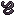 **Cinturón negro**          | 1        | 24%                     |
| 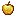 **Manzana de oro**        | 10-20    | 24%                     |
| 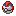 **Turno Ball**              | 10-20    | 24%                     |
|  **Teralito Astral** | 3-6      | 12%                     |
|  **Chapa plateada**    | 1        | 12%                     |
| 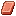 **Tabla Fuerte**            | 1        | 4%                      |



| Recompensa                                                                             | Cantidad | Porcentaje de obtención |
| -------------------------------------------------------------------------------------- | -------- | ----------------------- |
| 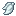 **Pañuelo de seda**         | 1        | 24%                     |
| 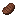 **Filete asado**           | 30-64    | 24%                     |
|  **Ultra Ball**              | 10-20    | 24%                     |
|  **Teralito Astral** | 3-6      | 12%                     |
|  **Chapa plateada**    | 1        | 12%                     |
|  **Megapiedra vacía**         | 1        | 4%                      |



| Recompensa                                                                             | Cantidad | Porcentaje de obtención |
| -------------------------------------------------------------------------------------- | -------- | ----------------------- |
| 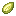 **Semilla milagro**       | 1        | 24%                     |
| 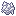 **Polvo de hueso**           | 10-30    | 24%                     |
| 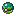 **Parque Ball**              | 10-20    | 24%                     |
|  **Teralito Astral** | 3-6      | 12%                     |
|  **Chapa plateada**    | 1        | 12%                     |
| 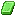 **Tabla Pradal**          | 1        | 4%                      |



| Recompensa                                                                             | Cantidad | Porcentaje de obtención |
| -------------------------------------------------------------------------------------- | -------- | ----------------------- |
|  **Cuchara torcida**      | 1        | 24%                     |
| 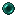 **Ender Pearl**            | 10-16    | 24%                     |
| 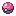 **Ensueño Ball**            | 10-20    | 24%                     |
|  **Teralito Astral** | 3-6      | 12%                     |
|  **Chapa plateada**    | 1        | 12%                     |
|  **Tabla Mental**            | 1        | 4%                      |



| Recompensa                                                                             | Cantidad | Porcentaje de obtención |
| -------------------------------------------------------------------------------------- | -------- | ----------------------- |
| 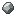 **Piedra dura**             | 1        | 24%                     |
| 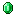 **Esmeralda**                  | 10-30    | 24%                     |
|  **Ensueño Ball**            | 10-20    | 24%                     |
|  **Teralito Astral** | 3-6      | 12%                     |
|  **Chapa plateada**    | 1        | 12%                     |
| 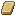 **Tabla Pétrea**           | 1        | 4%                      |



| Recompensa                                                                             | Cantidad | Porcentaje de obtención |
| -------------------------------------------------------------------------------------- | -------- | ----------------------- |
| 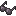 **Gafas de Sol**         | 1        | 24%                     |
| 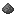 **Pólvora**                  | 20-40    | 24%                     |
|  **Ocaso Ball**               | 10-20    | 24%                     |
|  **Teralito Astral** | 3-6      | 12%                     |
|  **Chapa plateada**    | 1        | 12%                     |
|  **Tabla Oscura**           | 1        | 4%                      |



| Recompensa                                                                             | Cantidad | Porcentaje de obtención |
| -------------------------------------------------------------------------------------- | -------- | ----------------------- |
| 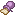 **Arena fina**               | 1        | 24%                     |
| 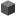 **Grava**                       | 20-40    | 24%                     |
| 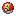 **Acopio Ball**            | 10-20    | 24%                     |
|  **Teralito Astral** | 3-6      | 12%                     |
|  **Chapa plateada**    | 1        | 12%                     |
| 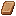 **Tabla Terrax**           | 1        | 4%                      |



| Recompensa                                                                             | Cantidad | Porcentaje de obtención |
| -------------------------------------------------------------------------------------- | -------- | ----------------------- |
| 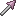 **Flecha venenosa**        | 1        | 24%                     |
|  **Ojo de araña**            | 5-12     | 24%                     |
| 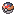 **Nivel Ball**              | 10-20    | 24%                     |
|  **Teralito Astral** | 3-6      | 12%                     |
|  **Chapa plateada**    | 1        | 12%                     |
| 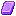 **Tabla Tóxica**           | 1        | 4%                      |



| Recompensa                                                                             | Cantidad | Porcentaje de obtención |
| -------------------------------------------------------------------------------------- | -------- | ----------------------- |
| 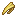 **Pico afilado**            | 1        | 24%                     |
|  **Vara de Breeze**          | 5-10     | 24%                     |
| 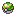 **Nido Ball**                | 10-20    | 24%                     |
|  **Teralito Astral** | 3-6      | 12%                     |
|  **Chapa plateada**    | 1        | 12%                     |
|  **Tabla Cielo**              | 1        | 4%                      |

