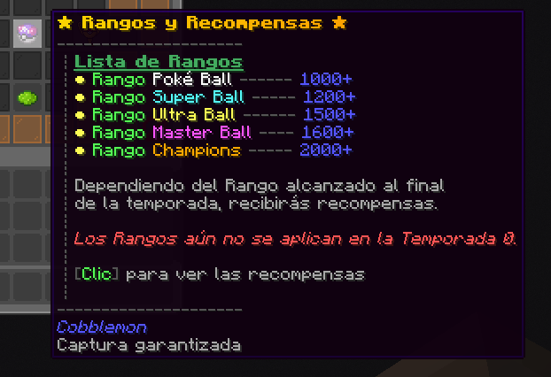
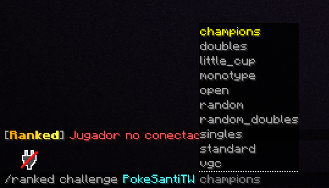
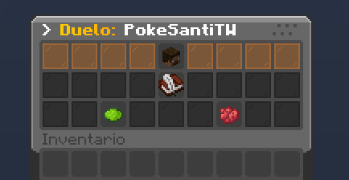
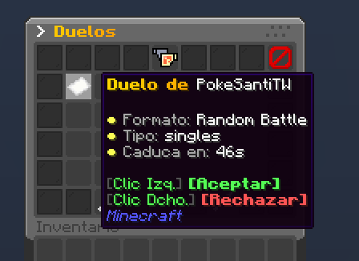
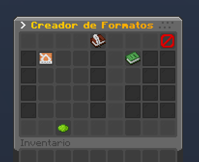
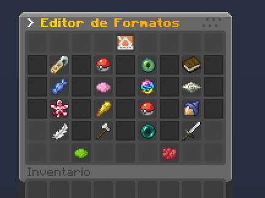
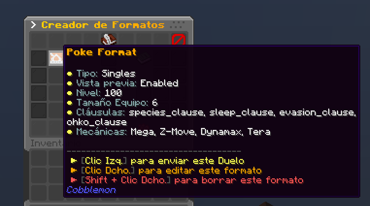

# ⚔️ Ranked


**ENTRADA OBSOLETA**
Este contenido pertenece a una versión anterior del servidor y puede estar obsoleta. Avisaremos cuando estas
funciones vuelvan a funcionar y actualizaremos esta entrada.


**El servidor de Cobblemon ofrece un sistema de combates sofisticado llamado Ranked**. Este sistema permite que los combates sean mucho más divertidos. En esta entrada de la Wiki se explicará cómo funciona el sistema, los comandos, consejos y más.

## 🥊 Ladders Competitivas

Actualmente existen **4 Ladders**. Estas son:

> * Random Battle
> * Random Doubles
> * Singles (6v6)
> * Champions VGC

¿Qué es un Ladder?

Una Ladder es un Formato competitivo que funciona a través de un sistema de puntuación de jugadores. Las Ladders del servidor te permiten buscar combates y enfrentarte automáticamente contra jugadores de puntuación similares, en la medida de lo posible.

Estas 4 Ladders tienen su propio sistema de puntuación independiente _(estilo Pokémon Showdown)_. Pero **solo Champions VGC contiene recompensas.**

**Puedes acceder al menú de Ranked usando el comando `/ranked`**. Desde este menú podrás acceder a las 4 Ladders anteriores, además de ver tus estadísticas y más.

## 🔎 Buscar Partida

Para buscar partida de una Ladder específica deberás primero seleccionarla en el menú de `/ranked`. Después, podrás hacer **clic en el botón verde de "Buscar partida"**.

Dependiendo del formato puede que no te una a la cola porque tu equipo no cumple los requisitos. Lee el mensaje de error para saber cuál es el problema.


Para el formato Random no hace falta equipo, se asigna uno aleatorio. Por lo que podrás entrar sin problemas.


## 💫 Formato Oficial: Champions VGC

**Champions VGC es el formato oficial que usa el servidor para los torneos y competiciones más importantes**. Esto no significa que sea el único formato jugable. Siempre habrá Torneos de varios tipos.

Esta Ladder es la única que contiene recompensas y rangos dependiendo de la puntuación alcanzada.

### ⏰ Temporadas

| Temporada               | Fechas                  |
| ----------------------- | ----------------------- |
| Temporada 0 _(Balance)_ | 29/04/2025 - 07/05/2025 |

### 🐲 Regulación M-A

<table data-card-size="large" data-view="cards"><thead><tr><th></th><th></th><th data-hidden data-card-target data-type="content-ref"></th><th data-hidden data-card-cover data-type="image">Cover image</th></tr></thead><tbody><tr><td><strong>Regulación M-A</strong></td><td>Lista de Pokémon permitidos</td><td><a href="https://web-view.app.pokemonchampions.jp/battle/pages/events/rs177501629259kmzbny/es/pokemon.html">https://web-view.app.pokemonchampions.jp/battle/pages/events/rs177501629259kmzbny/es/pokemon.html</a></td><td data-object-fit="fill"><a href="https://news.pokemon-home.com/es/page/banner/7_1773200273_82971775450954.jpg">https://news.pokemon-home.com/es/page/banner/7_1773200273_82971775450954.jpg</a></td></tr></tbody></table>

### 🎁 Rangos y Recompensas

Dependiendo de la puntuación alcanzada, el jugador recibirá un Rango de las Rankeds.


De momento, estos Rangos no se muestran fuera de las Rankeds. Pronto añadiremos una forma de visualizar tu Rango, como una Tag en tu nombre


Existen 2 tipos de Recompensas que se pueden otorgar durante una Temporada Competitiva. Además, puedes consultar las recompensas dentro de la Ladder de Champions VGC al hacer clic en la Master Ball.

* **Recompensas por Hitos:** Se entregan al completar ciertos desafíos como número de victorias, puntuación alcanzada, etc.
* **Recompensas de Fin de Temporada:** Dependiendo del rango alcanzado, en el momento que acabe una Temporada Competitiva recibirás ciertas recompensas. Cada una mejor que la anterior.

## 🤼 Duelos entre jugadores

Este sistema no sirve exclusivamente para buscar partidas competitivas, también puede usarse para **enfrentarte directamente contra otro jugador aplicando las reglas que queráis**.

Fuera de las Ladders existen otros formatos que se pueden jugar. Estos son:

> * Little Cup
> * Monotype
> * Open
> * Doubles (6v6)
> * Standard
> * VGC (Regulación F)
> * VGC Sin Mecánicas (Regulación F)
> * Random Battle
> * Random Doubles
> * Singles (6v6)
> * Champions VGC

**Usando el comando `/ranked challenge <jugador> <formato>` podrás enviar un Duelo a un jugador** con cualquiera de los formatos anteriores.

Al enviar el Duelo, el oponente le aparecerá este **menú donde podrá aceptar o rechazar el Duelo** con las normas que hayas aplicado.


Puedes desactivar que los jugadores te envien Duelos usando `/ranked togglechallenges` o desde el menú de `/ranked`.


¿Te han enviado varios duelos o has cerrado el menú sin querer? Usa el comando `/ranked challenges` para ver la lista de Duelos.

### 📗 Formato Personalizado

¿Ningún formato anterior es de tu gusto para el Duelo? **¡Crea tu propio formato!**

**Usa el comando `/ranked myformats` para ver y crear tus Formatos Personalizados**.

Al hacer clic en el **botón verde empezará la creación del Formato**. La creación de formatos es bastante intuitiva, y desde aquí podrás: banear Pokémon, banear mecánicas, activar o desactivar cláusulas, etc.

Échale un vistazo a todas las opciones pasando el ratón por encima. Aplica un nombre a tu Formato Personalizado, ¡y dale a Crear!

### ➡️ Enviar Duelo con Formato Personalizado

**Usa el comando `/ranked challenge <jugador>`** para volver a abrir el menú anterior. Pero esta vez, solamente haz **Clic Izquierdo para enviar un Duelo con el Formato Personalizado**.

