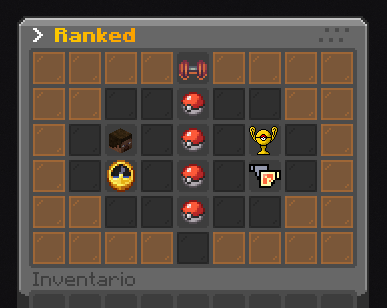

# ⚔️ Ranked

**El servidor de Cobblemon ofrece un sistema de combates sofisticado llamado Ranked**. Este sistema permite que los combates sean mucho más divertidos. En esta entrada de la Wiki se explicará cómo funciona el sistema, los comandos, consejos y más.

## 🥊 Ladders Competitivas

¿Qué es un Ladder?

Una Ladder es un Formato competitivo que funciona a través de un sistema de puntuación de jugadores. Las Ladders del servidor te permiten buscar combates y enfrentarte automáticamente (en la medida de lo posible) contra jugadores de puntuación similares.

Actualmente existen **4 Ladders**. Estas son:
> - Random Battle
> - Random Doubles
> - Singles (6v6)
> - Champions VGC

Estas 4 Ladders tienen su propio sistema de puntuación independiente *(estilo Pokémon Showdown)*. Pero **solo Champions VGC contiene recompensas.**

**Puedes acceder al menú de Ranked usando el comando `/ranked`**. Desde este menú podrás acceder a las 4 Ladders anteriores, además de ver tus estadísticas y más.

## 💫 Formato Oficial: Champions VGC
Champions VGC es el formato oficial que usa el servidor para los torneos y competiciones más importantes. Esto no significa que sea el único formato jugable. Siempre habrá Torneos de varios tipos.


**Temporada 0:** 
