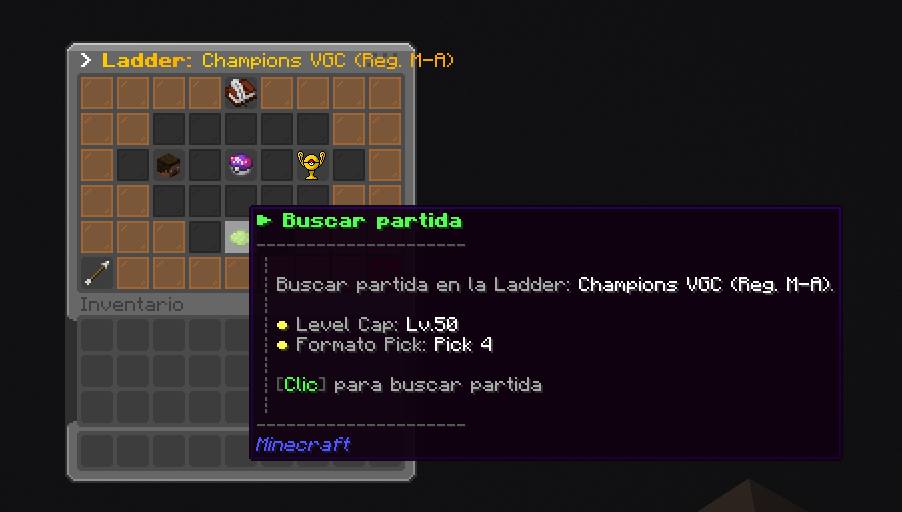

# ⚔️ Ranked

**El servidor de Cobblemon ofrece un sistema de combates sofisticado llamado Ranked**. Este sistema permite que los combates sean mucho más divertidos. En esta entrada de la Wiki se explicará cómo funciona el sistema, los comandos, consejos y más.

## 🥊 Ladders Competitivas
Actualmente existen **4 Ladders**. Estas son:
> - Random Battle
> - Random Doubles
> - Singles (6v6)
> - Champions VGC

¿Qué es un Ladder?

Una Ladder es un Formato competitivo que funciona a través de un sistema de puntuación de jugadores. Las Ladders del servidor te permiten buscar combates y enfrentarte automáticamente contra jugadores de puntuación similares, en la medida de lo posible.

Estas 4 Ladders tienen su propio sistema de puntuación independiente *(estilo Pokémon Showdown)*. Pero **solo Champions VGC contiene recompensas.**

**Puedes acceder al menú de Ranked usando el comando `/ranked`**. Desde este menú podrás acceder a las 4 Ladders anteriores, además de ver tus estadísticas y más.

## 🔎 Buscar Partida
Para buscar partida de una Ladder específica deberás primero seleccionarla en el menú de `/ranked`. Después, podrás hacer **clic en el botón verde de "Buscar partida"**.

Dependiendo del formato puede que no te una a la cola porque tu equipo no cumple los requisitos. Lee el mensaje de error para saber cuál es el problema.


Para el formato Random no hace falta equipo, se asigna uno aleatorio. Por lo que podrás entrar sin problemas.


## 💫 Formato Oficial: Champions VGC
**Champions VGC es el formato oficial que usa el servidor para los torneos y competiciones más importantes**. Esto no significa que sea el único formato jugable. Siempre habrá Torneos de varios tipos.

Esta Ladder es la única que contiene recompensas y rangos dependiendo de la puntuación alcanzada.

### 🐲 Regulación M-A
<table data-view="cards">
  <thead>
    <tr>
      <th></th>
      <th></th>
      <th data-hidden data-card-target data-type="content-ref"></th>
      <th data-hidden data-card-cover data-type="files"></th>
    </tr>
  </thead>
  <tbody>
    <tr>
      <td><strong>Example title 1</strong></td>
      <td>Example description 1.</td>
      <td><a href="https://example.com">https://example.com</a></td>
      <td><a href="https://example.com/image1.svg">example_image1.svg</a></td>
    </tr>
    <tr>
      <td><strong>Example title 2</strong></td>
      <td>Example description 2.</td>
      <td><a href="https://example.com">https://example.com</a></td>
      <td><a href="https://example.com/image2.svg">example_image2.svg</a></td>
    </tr>
    <tr>
      <td><strong>Example title 3</strong></td>
      <td>Example description 3.</td>
      <td><a href="https://example.com">https://example.com</a></td>
      <td><a href="https://example.com/image3.svg">example_image3.svg</a></td>
    </tr>
  </tbody>
</table>