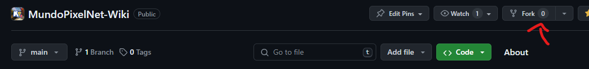
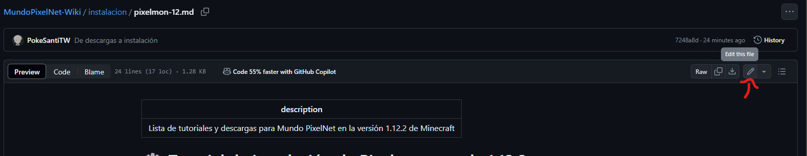
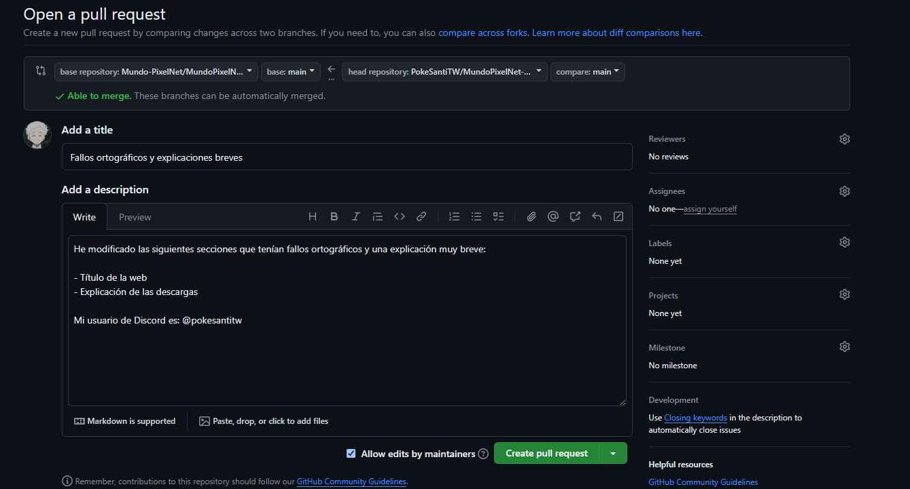

# ✍️ Contribuir

Esta Wiki de Universo PokéNet es pública, **¡cualquiera puede contribuir a ella para mejorarla!** ¿Quieres ayudar a explicar cómo funciona algo? ¿Información que falte sobre cierta función? ¿Corregir fallos ortográficos? ¡Estamos abiertos a cualquier tipo de ayuda! 🤗

Aquellos usuarios que contribuyan con muy buen contenido y regularmente aporten algo a la Wiki, podrán recibir un rango en Discord y recompensas en Universo PokéNet.

## ❓ Como editar la Wiki
Para empezar, **es recomendable tener conocimientos básicos de GitHub** para poder entender bien todo esto. Este tutorial dará por hecho que sabes lo mínimo de GitHub.

Para empezar, [**abre el repositorio de GitHub de la Wiki**](https://github.com/Mundo-PixelNet/MundoPixelNet-Wiki) y crea un **Fork** de ella estando en la branch `main`.

Una vez tengas el Fork del repositorio en tu perfil puedes **ir al archivo que necesites editar y hacerlo desde ahí**. También puedes hacer un clone del Fork y editarlo desde el editor que quieras, como Visual Studio Code.

Cuando hagas los cambios, haz clic en **Commit** y luego podrás, desde la página principal del repositorio, hacer un **Pull Request**.

En tu PR **explica en el título y descripción que has cambiado**. Aunque luego podemos ver concretamente los cambios, sería de bastante ayuda que nos expliques tus cambios y por qué. También, deja escrito tu usuario de Discord *(si quieres)* para tenerlo en cuenta.

¡Listo! Envía el PR y lo valoraremos para subir los cambios a la Wiki. ¡Gracias por tu ayuda!

## 📜 Crear nuevas páginas

Además de editar, también puedes crear nuevas páginas. Todas las páginas que los usuarios creen estarán bajo la categoría **POR USUARIOS** tras previa aprobación. 

En esta categoría entrarán todos los tutoriales o contenido que los usuarios suban a la Wiki. Al subir tu contenido no podrá aparecer de primeras en la lista de contenidos, quedará oculto hasta que todo esté correcto.


No edites el archivo `SUMMARY.md` o tu Pull Request será rechazado.


Este es el proceso para que tu contenido aparezca en la web:

### Crear contenido en la carpeta `usuarios`

En esta carpeta tienes un archivo llamado `PLANTILLA.md`, este archivo te servirá de base para crear tu página. 

Copia el contenido de la `PLANTILLA.md` *(no la edites)* y crea un nuevo archivo en la carpeta `usuarios`. 


Si vas a crear varios archivos, o para tener mejor organización, te recomendamos crear una carpeta en `usuarios` con tu nombre de Discord o GitHub. Por ejemplo, en `usuarios > pokesantitw` guardaría mi contenido. ¡Crea el tuyo!


El nombre del archivo pon el que más encaje. ¿Es un tutorial de como plantar bayas? Pon: `como-plantar-bayas.md`.

### Crea tu Pull Request

¿Todo listo? Ahora crea tu Pull Request como se explicó más arriba y valoraremos el contenido.

### Aprobación

Si vemos el contenido correcto y necesario, lo añadiremos a la lista de contenidos de la web para que sea accesible por todos. Puede que, sí el contenido es muy interesante y necesario, sea añadido a una categoría aparte. ¡Gracias por tu colaboración!