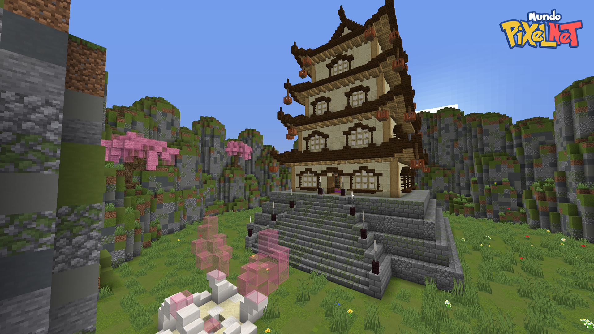

#  Armonía Mística

El desafío de gimnasio Armonía Mística es el primer gimnasio disponible para los jugadores. Sus entrenadores usan Pokémon de tipo  y , y su líder, Elena, tiene como Pokémon principal al híbrido [Gardewile](../pokemon/temporada-1/hibrido-gardewile.md). Para alcanzar a la líder del gimnasio, el jugador debe subir los pisos de la torre enfrentando a los entrenadores en el camino. Después de vencer a Elena, el jugador recibirá **5 Caramelos Exp. S, los cristales Z de tipo Psíquico y Hada, y la insignia de Armonía Mística**.

