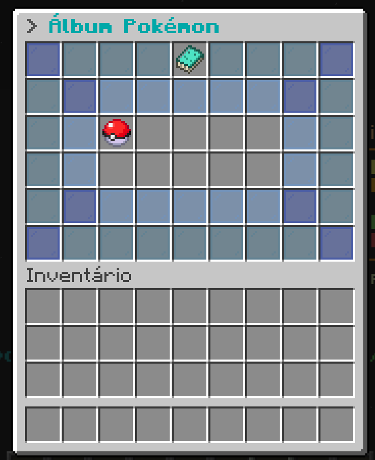

# ⭐ Álbum

Álbumes de Pokémon son una lista de coleccionista donde el entrenador debe capturar cierto tipo de Pokémon para ganar recompensas. Cada parte del álbum completada otorga una recompensa, y al completar el 100% de este álbum se desbloquea una recompensa aún mayor.

## 🕸️ Capturando para el álbum

Para capturar un Pokémon para el álbum, primero debes encontrarlo y capturarlo con una Pokébola. Los Pokémon obtenidos a través del GTS o intercambios no contarán. Una vez capturado, debes tomarle una foto usando el ítem [Cámara](https://pixelmonmod.com/wiki/Camera), y así contará para el álbum.

## 🔎 Comprobar álbum

Para verificar tu progreso en los álbumes activos, usa el comando /album y luego haz clic en el álbum que deseas verificar.

## 💰 Reclamar recompensa

Para reclamar una recompensa, debes ir a la página del álbum correspondiente y hacer clic en la skin que capturaste. Para la recompensa final, debes hacer clic en el ícono del cofre.

## 📋 Álbumes disponibles

|                       Álbum                      |                                Icono                               |
| :----------------------------------------------: | :----------------------------------------------------------------: |
|         [Mimikyu](album/album_mimikyu.md)        |             |
| [Compañeros Navideños](album/album_pixelfest.md) |  |
|                        ???                       |                                 ???                                |
