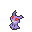
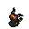
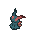
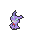
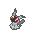
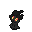
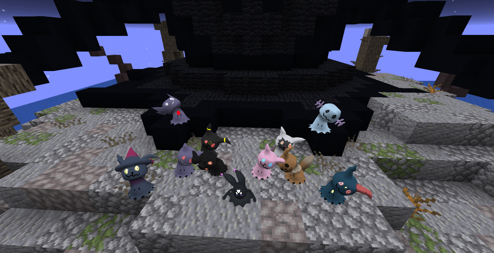

# 🎃 Album de Mimikyu

El álbum de Mimikyu llegó en la actualización de Pixelween 2024 y se basa en un ritual realizado por la especie Mimikyu, en el que rinden culto a su variación Unveilia, un Mimikyu que se ha aceptado tal como es y ha perdido el miedo a mostrar su verdadera forma. En este ritual aparecen Mimikyu con varios disfraces diferentes al habitual de Pikachu. Para completar el álbum, debes capturar un ejemplar de cada disfraz; algunos serán más difíciles, otros más fáciles. Sin embargo, al completar el álbum, el jugador será recompensado con el derecho a visitar la Isla del Mimikyu Unveilia y tendrá la oportunidad de capturarlo al vencerlo.

## 👻 Formas

|Pokemon|Sprite|
|:-----:|:----:|
| Gengar ||
| Umbreon ||
| Sneasel ||
| Sableye ||
| Poochyena ||
| Mismapeon ||
| Eevee ||
| Wooper ||
| Marshadow ||
| Mew ||
| Unveilia ||

## 💰 Recompensas

"Como recompensa, cada Mimikyu otorgará **1000 XP del pase, 6000 Pokédólares y 1 llave del gacha de Pixelween**.

Y como recompensa final, se otorgarán **2 niveles del pase actual, 20,000 Pokédólares, la Etiqueta "Corazón Unveilia" , 2 kits de modificadores, 40 fragmentos de skin, 1 llave celestial y el derecho a realizar la misión "Visita a la Isla Misteriosa"**.
