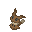
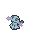
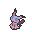

# 🎃 Álbum de Mimikyu

El álbum de Mimikyu llegó en la actualización de Pixelween 2024 y se basa en un ritual realizado por la especie Mimikyu, en el que rinden culto a su variación Unveilia, un Mimikyu que se ha aceptado tal como es y ha perdido el miedo a mostrar su verdadera forma. En este ritual aparecen Mimikyu con varios disfraces diferentes al habitual de Pikachu. Para completar el álbum, debes capturar un ejemplar de cada disfraz; algunos serán más difíciles, otros más fáciles. Sin embargo, al completar el álbum, el jugador será recompensado con el derecho a visitar la Isla del Mimikyu Unveilia y tendrá la oportunidad de capturarlo al vencerlo.

## 👻 Formas

|  Pokemon  |                          Sprite                          |                                                   Info                                                  |
| :-------: | :------------------------------------------------------: | :-----------------------------------------------------------------------------------------------------: |
|   Gengar  |        |                   Suele aparecer en el [Nether](https://pixelmonmod.com/wiki/Nether).                   |
|  Umbreon  |      |                              Suele aparecer bajo tierra (capa máxima: 60).                              |
|  Sneasel  |      | Suele aparecer en biomas [Evil](https://pixelmonmod.com/wiki/Evil) (como Dead Forest) durante la noche. |
|  Sableye  |      |     Suele aparecer en biomas [Roofed](https://pixelmonmod.com/wiki/Roofed_Forest) durante la noche.     |
| Poochyena |  |                   Suele aparecer en el [Nether](https://pixelmonmod.com/wiki/Nether).                   |
| Mismapeon |    |   Suele aparecer en biomas de [flores](https://pixelmonmod.com/wiki/Flower_Forest) durante la mañana.   |
|   Eevee   |          |       Suele aparecer en biomas de [Savanna](https://pixelmonmod.com/wiki/Savanna) durante el día.       |
|   Wooper  |        | Suele aparecer en [bosques congelados](https://pixelmonmod.com/wiki/Freezing_Forests) durante la noche. |
| Marshadow |  |          Suele aparecer en [pantanos](https://pixelmonmod.com/wiki/Swampland) durante la noche.         |
|    Mew    |              |           Suele aparecer en la [Jungla](https://pixelmonmod.com/wiki/jungle) durante la noche.          |
|  Unveilia |    |                          Se obtiene en la misión "Visita a la Isla Misteriosa".                         |

## 💰 Recompensas

"Como recompensa, cada Mimikyu otorgará **1000 XP del pase y 6000 Pokédólares**.

Y como recompensa final, se otorgarán **2 niveles del pase actual, 20,000 Pokédólares, la Etiqueta "Corazón Unveilia"** **, 2 kits de modificadores, 40 fragmentos de skin, 1 llave celestial y el derecho a realizar la misión "Visita a la Isla Misteriosa", donde se puede conseguir** [**Mimikyu Unveilia**](../../pokemon/pixelween-2024/album-mimikyu-unveilia.md).
