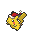
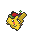
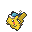
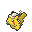
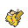
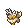
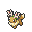
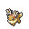

# 🎄 Album de Compañeros Navideños

## 🎁 Formas

|Pokemon|Sprite|Info|
|:-----:|:----:|:--:|
| Pikachu Santa || Suele aparecer en un lugar concreto del Spawn. |
| Pikachu Duende || Suele aparecer en [Snowy Mountains](https://pixelmonmod.com/wiki/Ice_Mountains) por encima de la capa 80. |
| Pikachu Hielo || Suele aparecer en [Frozen Ocean](https://pixelmonmod.com/wiki/Frozen_Ocean) durante el Día. |
| Pikachu Nieve || Suele aparecer en Biomas [Freezing](https://pixelmonmod.com/wiki/Freezing) durante la Noche. |
| Pikachu Año Nuevo || Suele aparecer en [Ice Spikes](https://minecraft.fandom.com/wiki/Snowy_Plains#Ice_Spikes) durante la Noche. |
| Eevee Rodolfo|| Suele aparecer en un lugar concreto del Spawn. |
| Eevee Juguetón|| Suele aparecer en [Tundras](https://pixelmonmod.com/wiki/Tundra). |
| Eevee Traviesa|| Suele aparecer en [Taigas](https://pixelmonmod.com/wiki/Taiga) durante el amanecer. |
| Eevee Trueno|| Suele aparecer en el [pantano](https://pixelmonmod.com/wiki/Swampland) durante el Día. |
| Eevee Danzarín | en [Biomas florales](https://pixelmonmod.com/wiki/Flower_Forest) durante el Día. |
| Sylveon Navideño || Se obtiene en la misión "El Regalo debajo del Árbol". |

## 💰 Recompensas

"Como recompensa, cada Compañero otorgará **1500 XP del pase y 6000 Pokédólares**.

Y como recompensa final, se otorgarán **2 niveles del pase actual, 20,000 Pokédólares, la Etiqueta "Copo de Nieve" , 2 kits de modificadores, 40 fragmentos de skin, 1 llave celestial y el derecho a realizar la misión "El Regalo debajo del Árbol", donde se puede conseguir [Sylveon Navideño](../../pokemon/pixelween/pixelfest-2024/album-sylveon-navideño.md)**.
