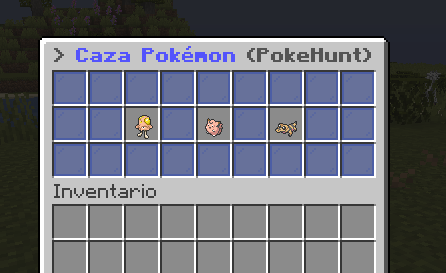

# 🪰 Caza Pokémon

También conocido como PokeHunt, la Caza Pokémon es una mecánica donde el servidor tendrá una lista de Pokémon que atrapar con ciertas características y el primero que lo atrape obtendrá recompensas.

## 📖 Lista de Pokémon

Para abrir el menú de Caza Pokémon usa el comando `/hunt`.

En este menú saldrán **3 Pokémon para Cazar** que son iguales para todas las personas conectadas en el servidor. 

**Estos Pokémon tienen una expiración de 30 minutos**. Cuando pase ese tiempo, otro Pokémon lo sustituirá.

Si pasas el ratón por encima de uno de los Pokémon **podrás ver las características especiales para cumplir con la Caza**. Estos requisitos van desde un **tamaño concreto** y una **naturaleza en concreto**.

## 🪲 Cazar el Pokémon

¿Hay algún Pokémon de la lista que crees que puedes atrapar? ¡A por él!

Si consigues encontrar un Pokémon que es **apto para la Caza le rodearán unas partículas de portal**. ¡Ve a por él, es tu Caza!

Cuando atrapes al Pokémon, saldrá un mensaje de que lo has atrapado y la Caza terminará dando paso a una nueva que podrás ver desde `/hunt`.

## 💵 Recompensas

Cuando atrapes el Pokémon recibirás varias recompensas que salen en el menú de `/hunt`.

| Objeto | Asegurado |
| - | - |
| 4000₽ | SÍ |
| Token del Gatcha Misiones | SÍ |
| Llave Diaria o Cebo de un tipo vigoroso | Una de las dos |

