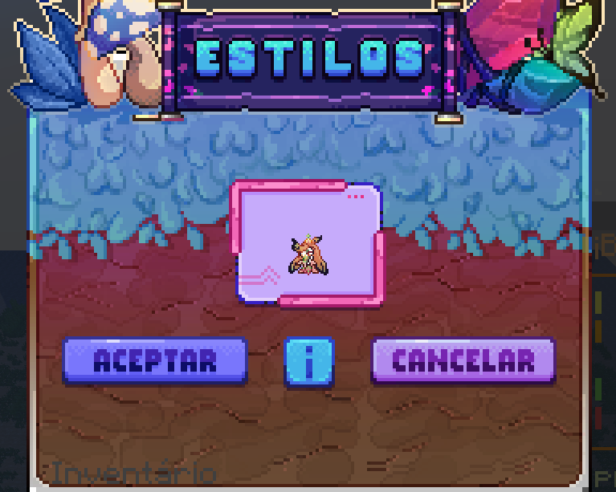
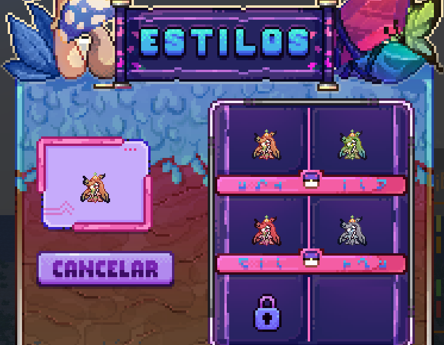

# 👔 Estilos

Los **Pokémon Pokémon con estilos son skins creadas por nosotros** que solo funcionan en Universo PokéNet. Los estilos pueden tener su propio modelo además de una textura personalizada.

A través de este sistema que hemos creado puedes elegir el estilo de tus pokémon.

**Formas de conseguir Pokémon con estilo extra**:
- Pase gratis o [premium](https://tienda.mundopixelnet.com/category/servidor-escarlata-3).
- [Tienda oficial de Universo PokéNet](https://tienda.mundopixelnet.com/category/servidor-escarlata-1).
- Misiones exclusivas del servidor.
- Eventos especiales.

Además, tener en cuenta que si tu pokémon tiene formas exclusivas pero tu no las desbloqueaste tendran un icono de candado e no te dejará elegirlas.

Para cambiar el estilo de tu Pokémon, debes dejarlo en el **primer espacio del equipo** y usar el comando **/estilos**, luego de lo cual aparecerá un menú de confirmación para que puedas estar seguro de que es el Pokémon correcto.

Después de la confirmación, debes elegir el estilo que deseas siempre que lo hayas desbloqueado, y el estilo se cambiará automáticamente **sin perder ningún atributo de estadística como IVs y EVs.**

