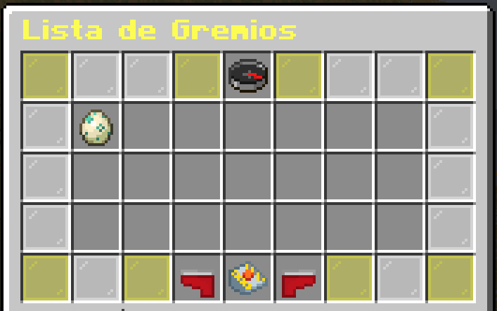
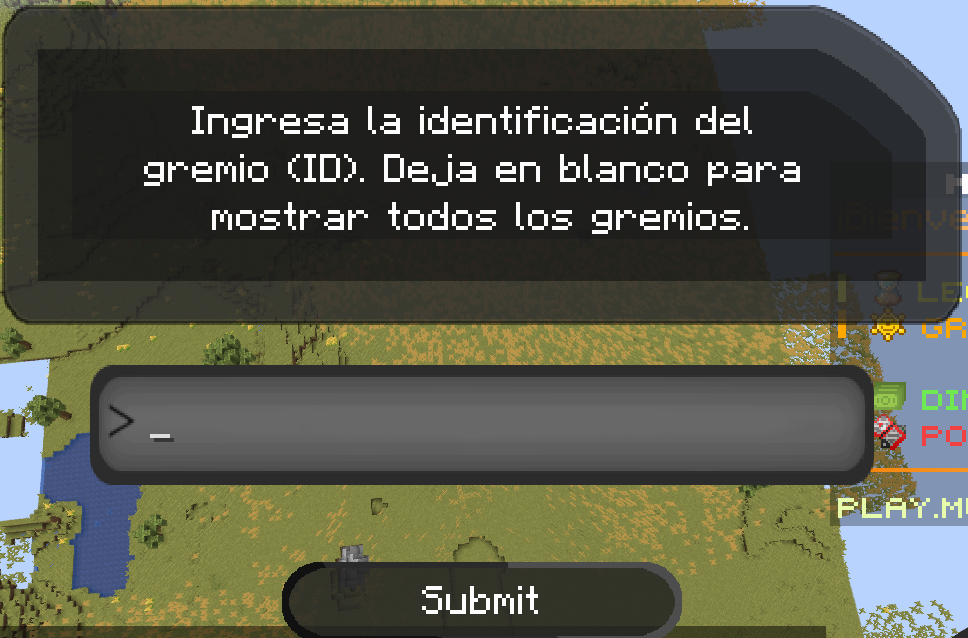

# ✨ Gremios

Los Gremios son grupos de jugadores que evolucionarán juntos y competirán con otros gremios para convertirse en los mejores de los mejores.



## Cómo puedo crear un gremio?

1- Para crear un gremio tendrás que usar /guilds y hacer clic en "crear gremio"
2- Ahora tendrás que elegir el ID, nombre, emblema, descripción y si los jugadores podrán unirse al gremio por su cuenta, sin que nadie tenga que aceptar la solicitud, no olvides que crear un gremio cuesta 250.000 pokedólares.

| Creación | Descripcion |
|:--------:|:-----------:|
|ID|Es la identificación interna de tu Gremio, todo debe estar en minúsculas, sin números, espacios ni caracteres especiales.|
|Nombre|es el nombre real de tu Gremio, y se puede personalizar con colores y caracteres que el ID no permite|
|Emblema|El ícono para representar a tu gremio, puedes usar el ID de un elemento en el servidor, como "pixelmon:poke_ball".|
|Descripción|Describe tu Gremio según tu gusto.|
|Auto-Join|Define si los jugadores pueden unirse sin necesidad de aceptar una solicitud.|

Una vez que hayas definido todos los datos usarás **shift + clic derecho** y tu gremio estará creado, recuerda que crear el gremio cuesta 250.000

## Cómo puedo unirme a un gremio?

- Para unirte a un gremio escribirás **/guilds** y harás **clic en Lista de gremios**, una vez hecho esto busca el gremio al que deseas unirte, prestando atención para asegurarte de que no esté lleno ya que cada gremio tiene un **límite de 7 jugadores, incluido el creador del gremio** y haga clic con el **botón izquierdo del mouse en el ícono del gremio** al que desea unirse, una vez hecho esto, enviará una solicitud para unirse que debe ser aceptada por los administradores del gremio, o si el gremio está abierto, se unirá automáticamente.
  
  

- Si hay muchos gremios, puedes hacer **clic en Buscar gremio y escribir el ID correspondiente al gremio al que deseas unirte**, esto filtrará la lista, mostrando solo aquellos que tengan un ID compatible con lo que escribiste.

  

## Qué puedo hacer en un gremio?

### Chat privado para miembros del gremio
Un chat exclusivo donde solo los miembros del gremio pueden leer y hablar, ayudando a comunicarse entre sí

### Warps exclusivas
Los administradores del gremio pueden crear warps exclusivos para, por ejemplo, crear una base donde todos los miembros se reúnan y vivan juntos, entre otras cosas.

###
