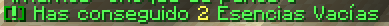

# 🧬 Híbridos

Los **Pokémon Híbridos son Pokémon creados por nosotros** que solo funcionan en Mundo PixelNet. Son Pokémon "fusionados" de otros dos, con sus estadísticas propias, ataques propios y formas propias. 

A través de este sistema que hemos creado puedes conseguir tus propios Híbridos, que por ahora son unos pocos.

**Crear un Híbrido requiere de lo siguiente**:
- 1 Esencia ADN
- Dos Pokémon concretos

Además, tener en cuenta que crear un Híbrido **no siempre será 100% efectivo**. Más adelante se explica por qué.

## 🪙 Esencia ADN
Una **Esencia ADN es una "moneda"** para poder crear un Híbrido. Para comprar una Esencia ADN necesitarás dos cosas: Esencias Vacías y algo de dinero.

Las **Esencias Vacías** se consiguen al derrotar Pokémon salvajes. Con cada combate, consigues 2 Esencias Vacías.

Con **una gran cantidad de Esencias Vacías**, y algo de dinero,** podrás comprar tu primera Esencia ADN**.

Dirígete a `/warp hibridos` y a tu derecha encontrarás la entrada a la Sala Esencias donde se crean estas Esencias ADN.

Dentro de la sala **busca a una Científica**. Ella **te abrirá la Tienda** para comprar 1 Esencia ADN.

Para comprar 1 Esencia ADN tendrás que pagar:
- **100 Esencias Vacías**
- **15.000₽**

Con la Esencia ADN comprada, puedes pasar al siguiente paso.

## 🧪 Crear Híbrido

Ve a hablar con el NPC que tienes enfrente nada más llegas a `/warp hibridos`. Este NPC, al darle clic derecho, abrirá el menú de Creación de Híbridos.

### 🧮 Porcentaje de éxito
A la hora de crear un Híbrido debes tener en cuenta el factor **Porcentaje de éxito**. Crear un Híbrido no siempre funcionará a la primera.

Fíjate en el porcentaje de éxito de este Lycario, por ejemplo. Es del 30% por defecto.

Esto significa que a la hora de crear el Híbrido este tiene un 30% de acertar y un 70% de fallar. 

**¿Qué pasa si fallo?** Si fallas, se te seguirá cobrando la Esencia ADN y tus Pokémon seguirán marcados como usados. Pero el Porcentaje de éxito aumentará un 5% más para el próximo intento.

**¿Qué pasa si acierto?** Si aciertas, ¡felicidades! Has creado tu Híbrido. A partir de ahora, crear este Híbrido siempre será del 100%.

### 🐣 Pokémon usado
**Los 2 Pokémon que vayas a usar para crear el Híbrido no podrán volver a ser usados para crear otros Híbridos.** Ten esto muy en cuenta porque no hay vuelta atrás.

Capaz quieres crear un Híbrido con IVs perfectos y pones a tu Lucario 100%. Pero si el intento falla, este Lucario 100% no podrá volver a ser usado. Así que guárdate tus Pokémon más útiles para cuando tengas el Híbrido al 100% de Porcentaje de éxito.

Por último, **los IVs del Híbrido creado serán del Pokémon usado con mayor porcentaje de IVs**.

## Hibridos

Estos son los híbridos disponibles actualmente:

|  Pokémon |                                            Sprite                                           |
| :----: | :-----------------------------------------------------------------------------------------: |
| [Cerullade](../../pokemon/temporada-1/hibrido-cerullade.md) |                |
| [Gardewile](../../pokemon/temporada-1/hibrido-gardewile.md) |    |
| [Lycario](../../pokemon/temporada-1/hibrido-lycario.md) |  |
| [Mismapeon](../../pokemon/temporada-1/hibrido-mismapeon.md) |  |
| [Zoropunny](../../pokemon/temporada-1/hibrido-zoropunny.md) |  |
