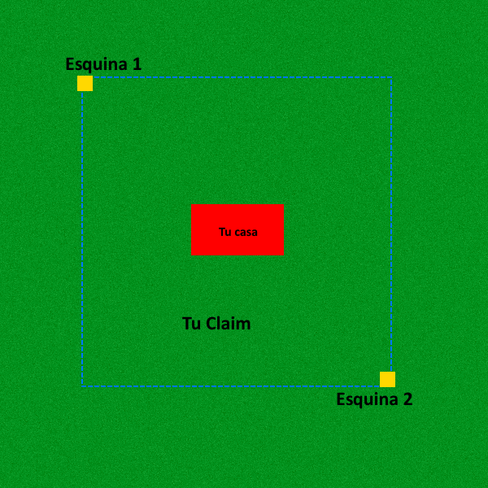

# 🔒 Claims

Los claims se utilizan para proteger la tierra para que nadie pueda abrir cofres, romper bloques o desfigurar su casa sin permisos.



## ¿Cómo puedo claimear mi casa?

Para proteger tu casa necesitarás una pala dorada que puedes conseguir a través del kit de inicio o simplemente haciendo una. Con esta pala deberás pinchar en las esquinas opuestas de donde quieres proteger, siempre prestando atención a las siguientes limitaciones:
- Debe tener la cantidad requerida de bloques de claim.
- Respetar el límite mínimo de 25 bloques **(5x5)**.
- Respetar las [normas](normas.md) del servidor, sin proteger un bioma completo por ejemplo, o que tu reclamo no esté hecho para bloquear el progreso de otros jugadores.

Para modificar un claim existente, debes hacer clic en una de las esquinas con la pala dorada y seleccionar la nueva ubicación de esa esquina.

Para eliminar un claim que ya no desea o que está mal hecho, use el comando /abandonclaim mientras está dentro del claim.

## ¿Cómo puedo obtener más bloques de claim?

Puedes comprar más bloques de claim en una de las tiendas /warp tiendas, tendrás las siguientes opciones:

| Cantidad de bloques | Precio |
| :-----------------: | :----: |
| 100 | 700 ₽ |
| 500 | 3200 ₽ |
| 1000 | 6200 ₽ |

## ¿Cómo puedo darle permisos a alguien sobre mi claim?

De forma sencilla puedes dar permiso con **/trust usuario** y quitar permiso con **/untrust usuario** pero si quieres separar los permisos de forma compleja para que una persona tenga más permisos que otras **(útil para ciudades con múltiples usuarios)** puedes usar las siguientes opciones:

| Comando | Descripción |
| :-----: | :---------: |
| /AT | Permiso para interactuar con objetos pero sin poder construir o abrir cofres. |
| /CT | Permiso para construir e interactuar con objetos sin poder abrir cofres. |
| /Trust | Permiso general pero sin derecho a gestionar el claim. |
| /MT | Permiso general pero con derecho a gestionar el claim. |

 Para ver quién tiene permiso y qué permisos tiene, utilice /trustlist.

## Subdivisiones

Las subdivisiones son sumamente útiles al momento de crear una ciudad, para activar el modo de reclamo por subdivisión debes usar /subdivideclaims y para regresar al modo normal /basicclaims

Usar el subdivisión es como si estuvieras protegiendo tu terreno ya protegido con la pala de oro, quien tiene permiso solo en el área subdividida no puede interactuar con las demás áreas, pero quien tiene permiso en la zona principal interactúa con todos los subclaims.

No hay límite en el tamaño o cantidad de la subdivisión siempre que permanezca dentro de su reclamo principal.
