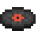
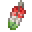
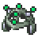
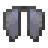
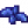
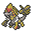
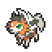
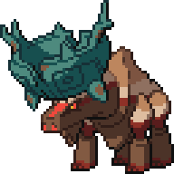

# 🛒 Lista de Precios

## 🛒 Introducción

¡Bievenidos al apartado de "listado de precios"! Aquí encontrarás un listado de precios mínimos a los cuales vender tus Pokémon/objetos en el servidor.

Dicha lista de precios es meramente orientativa y sirve para tener una idea de a qué precios mínimos vender, pudiendo así vender a más, pero no a menos de lo permitido, la lista es **oficial** aunque puede estar sujeta a cambios según como vaya la economía en el servidor.

**El incumplimiento de esta lista de precios mínimos puede llevar sanción, ya que vender bajo mínimos estarías devaluando la economía.**

**Esta lista aplica también para el servidor Venus de la modalidad Cobblemon de forma provisional.**

Está separado en diferfentes categorías: **Balls**, **Minerales**, **Crianza**, **Tablas**, **Máquinas**, **Megapiedras**, **Objetos evolutivos**, **Objetos competitivos**, **Otros**, **Encantamientos**, **Bayas**, **Gemas**, **Partes de Porygon**, **Fósiles**, **Cristales Z**, **Discos de Silvally**, **ROMs de Genesect**, **Pokémon Legendarios**, **Ultraentes**, **Pokémon Especiales**, **Crianza** y **Modificadores**.

Si tenéis alguna sugerencia sobre los precios y/o nos ha faltado algo, ¡no dudes en escribirla en [nuestro servidor de Discord](https://wiki.mundopixelnet.com/)!

## Balls x Stack

| Imagen                                              | Nombre       | Precio | Descripción                                                               |
| --------------------------------------------------- | ------------ | ------ | ------------------------------------------------------------------------- |
|        | Poké Ball    | 15K    | Ratio de captura x1.                                                      |
|      | Super Ball   | 20K    | Ratio de captura x2.                                                      |
|      | Ultra Ball   | 25K    | Ratio de captura x3.                                                      |
|        | Buceo Ball   | 20K    | Ratio x3.5 si el Pokémon está en el agua.                                 |
|        | Ocaso Ball   | 25K    | Ratio x3.0 en lugares de poca luz.                                        |
|        | Rapid Ball   | 20K    | El ratio aumenta hasta x4 con los Pokémon de mayor velocidad base de 100. |
|    | Amigo Ball   | 15K    | Aumenta la felicidad de los Pokémon capturados.                           |
|        | Sana Ball    | 15K    | Sana a los Pokémon capturados.                                            |
|      | Peso Ball    | 20K    | Aumenta el ratio con los Pokémon pesados.                                 |
|      | Nivel Ball   | 20K    | Ratio más alto si el nivel del Pokémon es bajo.                           |
|        | Amor Ball    | 20k    | El ratio aumenta si los Pokémon son de distinto género.                   |
|        | Cebo Ball    | 20K    | Ratio x5 en los encuentros por pesca.                                     |
|    | Lujo Ball    | 25K    | El Pokémon capturado gana felicidad rápidamente.                          |
|        | Luna Ball    | 15K    | Ratio x4 si el Pokémon se evoluciona con Piedra Lunar.                    |
|        | Nido Ball    | 20K    | Aumenta el ratio con Pokémon bajo nivel.                                  |
|          | Malla Ball   | 20K    | Ratio x3 con Pokémon tipo bicho y agua.                                   |
|  | Honor Ball   | 15K    | Da efecto de partículas al sacarlos de la Ball.                           |
|      | Veloz Ball   | 25K    | Ratio x5 si se usa en el primer turno.                                    |
|    | Acopio Ball  | 25K    | Ratio x3 si ya capturaste esa especie.                                    |
|    | Safari Ball  | 15K    | Ratio x1.5 en planicies.                                                  |
|      | Competi Ball | 15K    | Ratio x1.5 Pokémon tipo bicho.                                            |
|      | Turno Ball   | 25K    | Mientras más dura el combate más alto es el ratio.                        |
|      | Ensueño Ball | 30K    | Ratio x4 en Pokémon dormidos.                                             |

## Balls x Unidad

| Imagen                                                  | Nombre       | Precio | Descripción                                                                                            |
| ------------------------------------------------------- | ------------ | ------ | ------------------------------------------------------------------------------------------------------ |
|      | Gloria Ball  | 15K    | Poké Ball de evento.                                                                                   |
|        | Master Ball  | 80K    | Nunca falla.                                                                                           |
|            | Parque Ball  | 80K    | Nunca falla.                                                                                           |
|          | Ente Ball    | 100k   | Ratio x5 en Ultraentes.                                                                                |
|                | GS Ball      | 500K   | Se usa para invocar a Celebi.                                                                          |
|        | Origen Ball  | 100K   | Poké Ball de evento.                                                                                   |
|      | Extraña Ball | 100K   | Poké Ball especial. Ratio de captura x1.                                                               |
|  | Navidad Ball | 25K    | Poké Ball especial. Ratio de captura x1. Posible obtener Skins exclusivas al capturarse con esta Ball. |

## Mineral x Stack

| Mineral                    | Precio |
| -------------------------- | ------ |
| Mena de hierro             | 16K    |
| Oro                        | 18K    |
| Mena de Bauxita o Aluminio | 16K    |
| Diamante                   | 20K    |
| Redstone                   | 3K     |
| Plata                      | 25K    |
| Carbón                     | 7K     |
| Cristal                    | 10K    |
| Silicio                    | 10K    |
| Rubí y Zafiro              | 10K    |
| Esmeralda                  | 20K    |
| Platino                    | 30K    |

## Objetos de Crianza

| Icono                                                       | Nombre            | Precio |
| ----------------------------------------------------------- | ----------------- | ------ |
|             | Inciensos         | 15K    |
|  | Cápsula Habilidad | 20K    |
|    | Parche Habilidad  | 80K    |
|       | Piedra eterna     | 10K    |
|     | Lazo destino      | 50K    |
|     | Pesa Recia        | 40K    |
|       | Lente Recia       | 40K    |
|     | Brazal Recio      | 40K    |
|       | Cinto Recio       | 40K    |
|       | Banda Recia       | 40K    |
|     | Franja Recia      | 40K    |

## Tablas

| Icono                                              | Nombre           | Precio |
| -------------------------------------------------- | ---------------- | ------ |
|   | Tabla Draco      | 25K    |
|   | Tabla Oscura     | 25K    |
|   | Tabla Terrax     | 25K    |
|    | Tabla Fuerte     | 25K    |
|   | Tabla Llama      | 25K    |
|  | Tabla Helada     | 25K    |
|  | Tabla Bicho      | 25K    |
|  | Tabla Pradal     | 25K    |
|    | Tabla Mental     | 25K    |
|   | Tabla Duende     | 25K    |
|     | Tabla Cielo      | 25K    |
|  | Tabla Linfa      | 25K    |
|  | Tabla Terror     | 25K    |
|   | Tabla Pétrea     | 25K    |
|   | Tabla Tóxica     | 25K    |
|     | Tabla Trueno     | 25K    |
|   | Tabla Neutra     | 25K    |
|  | Tabla Legendaria | 425K   |

## Máquinas

| Icono                                              | Nombre                 | Precio |
| -------------------------------------------------- | ---------------------- | ------ |
|                    | PC                     | 5K     |
|               | Infusor                | 5K     |
|       | Máquina de curación    | 5K     |
|    | Limpiador de fósiles   | 5K     |
|      | Máquina de fósiles     | 15K    |
|  | Máquina de Intercambio | 5K     |
|     | Placa de movimiento    | 2K     |
|              | Elevador               | 1K     |
|    | Máquina de Clonación   | 50K    |
|             | Guardería              | 27K    |

## Megapiedras

| Icono                                                   | Nombre         | Precio    | Descripción                                  |
| ------------------------------------------------------- | -------------- | --------- | -------------------------------------------- |
|        | Abomasnowita   | 20K-40K   | Megapiedra para Megaevolucionar a Abomasnow  |
|             | Absolita       | 50K-75K   | Megapiedra para Megaevolucionar a Absol      |
|   | Aerodactylita  | 100K-120K | Megapiedra para Megaevolucionar a Aerodactyl |
|           | Aggronita      | 25K-50K   | Megapiedra para Megaevolucionar a Aggro      |
|         | Alakazamita    | 70K-80K   | Megapiedra para Megaevolucionar a Alakazam   |
|       | Altarianita    | 100K-120K | Megapiedra para Megaevolucionar a Altaria    |
|       | Ampharosita    | 30K-50K   | Megapiedra para Megaevolucionar a Ampharos   |
|             | Audinita       | 40K-60K   | Megapiedra para Megaevolucionar a Audino     |
|           | Banettita      | 50K-60K   | Megapiedra para Megaevolucionar a Banette    |
|       | Beedrillita    | 20K-30K   | Megapiedra para Megaevolucionar a Beedrill   |
|     | Blastoisita    | 100K-120K | Megapiedra para Megaevolucionar a Blastoise  |
|       | Blazikenita    | 120K-140K | Megapiedra para Megaevolucionar a Blaziken   |
|       | Cameruptita    | 40K-50K   | Megapiedra para Megaevolucionar a Camerupt   |
|  | Charizardita X | 190K-200K | Megapiedra para Megaevolucionar a Charizard  |
|  | Charizardita Y | 200K-220K | Megapiedra para Megaevolucionar a Charizard  |
|             | Diancita       | 140K-150K | Megapiedra para Megaevolucionar a Diancie    |
|           | Galladita      | 70K-90K   | Megapiedra para Megaevolucionar a Gallade    |
|       | Garchompita    | 110K-130K | Megapiedra para Megaevolucionar a Garchomp   |
|     | Gardevoirita   | 120K-140K | Megapiedra para Megaevolucionar a Gardevoir  |
|           | Gengarita      | 90K-100K  | Megapiedra para Megaevolucionar a Gengar     |
|             | Glalita        | 20K-30K   | Megapiedra para Megaevolucionar a Glalie     |
|     | Sharpedonita   | 65K-80K   | Megapiedra para Megaevolucionar a Sharpedo   |
|         | Steelixita     | 50K-60K   | Megapiedra para Megaevolucionar a Steelix    |
|     | Tyranitarita   | 115K-125K | Megapiedra para Megaevolucionar a Tyranitar  |
|       | Gyaradosita    | 100K-120K | Megapiedra para Megaevolucionar a Gyarados   |
|      | Heracrossita   | 20K-30K   | Megapiedra para Megaevolucionar a Heracross  |
|     | Houndoomita    | 50K-60K   | Megapiedra para Megaevolucionar a Houndoom   |
|   | Kangaskhanita  | 90K-100K  | Megapiedra para Megaevolucionar a Kangaskhan |
|           | Latiasita      | 170K-200K | Megapiedra para Megaevolucionar a Latias     |
|           | Latiosita      | 150-180K  | Megapiedra para Megaevolucionar a Latios     |
|           | Lopunnita      | 180K-200K | Megapiedra para Megaevolucionar a Lopunny    |
|          | Lucarita       | 170K-180K | Megapiedra para Megaevolucionar a Lucario    |
|        | Manectricita   | 30K-50K   | Megapiedra para Megaevolucionar a Manectric  |
|             | Mawilita       | 100K-110K | Megapiedra para Megaevolucionar a Mawile     |
|       | Medichamita    | 60K-70K   | Megapiedra para Megaevolucionar a Medicham   |
|     | Metagrossita   | 160K-170K | Megapiedra para Megaevolucionar a Metagross  |
|       | Mewtwoita X    | 220K-240K | Megapiedra para Megaevolucionar a Mewtwo     |
|       | Mewtwoita Y    | 230K-250K | Megapiedra para Megaevolucionar a Mewtwo     |
|         | Pidgeotita     | 30K-40K   | Megapiedra para Megaevolucionar a Pidgeot    |
|           | Pinsirita      | 40K-55K   | Megapiedra para Megaevolucionar a Pinsir     |
|          | Sableynita     | 30K-50K   | Megapiedra para Megaevolucionar a Sableye    |
|       | Salamencita    | 200K-210K | Megapiedra para Megaevolucionar a Salamence  |
|         | Sceptilita     | 90K-100K  | Megapiedra para Megaevolucionar a Sceptile   |
|           | Scizorita      | 90K-100K  | Megapiedra para Megaevolucionar a Scizor     |
|       | Slowbronita    | 40K-55K   | Megapiedra para Megaevolucionar a Slowbro    |
|       | Swampertita    | 110K-130K | Megapiedra para Megaevolucionar a Swampert   |
|       | Venusaurita    | 90K-100K  | Megapiedra para Megaevolucionar a Venusaur   |

## Objetos de Evolución

| Icono                                                  | Nombre             | Precio |
| ------------------------------------------------------ | ------------------ | ------ |
|        | Piedra Hielo       | 10K    |
|       | Piedra Alba        | 10K    |
|       | Piedra Fuego       | 10K    |
|       | Piedra Hoja        | 10K    |
|       | Piedra Lunar       | 10K    |
|      | Piedra Día         | 10K    |
|        | Piedra Solar       | 10K    |
|    | Piedra Trueno      | 10K    |
|       | Piedra Noche       | 10K    |
|      | Piedra Agua        | 10K    |
|    | Escama marina      | 10K    |
|    | Diente marino      | 10K    |
|     | Escamadragón       | 10K    |
|     | Discoextraño       | 25K    |
|     | Electrizador       | 30K    |
|      | Magmatizador       | 30K    |
|       | Piedra Oval        | 10K    |
|      | Escama bella       | 30K    |
|       | Protector          | 30K    |
|     | Telaterrible       | 20K    |
|          | Saquito fragante   | 15K    |
|         | Mejora             | 25K    |
|    | Dulce de nata      | 15K    |
|    | Brazal galanuez    | 30K    |
|      | Tetera agrietada   | 20K    |
|       | Manzana ácida      | 20K    |
|      | Manzana dulce      | 20K    |
|       | Roca del Rey       | 15K    |
|  | Armadura Maliciosa | 50K    |
|       | Colmillo Agudo     | 15K    |

## Objetos Competitivos

| Icono                                                  | Nombre                 | Precio |
| ------------------------------------------------------ | ---------------------- | ------ |
|       | Diamansfera            | 100K   |
|      | Lustresfera            | 100K   |
|      | Griseosfera            | 100K   |
|    | Nerviosfera            | 10     |
|   | Gran Diamansfera       | 100K   |
|    | Gran Lustresfera       | 100K   |
|     | Gran Griseosfera       | 100K   |
|       | Tubérculo              | 10K    |
|       | Globo Helio            | 20K    |
|      | Chaleco Asalto         | 25K    |
|       | Zumo                   | 5K     |
|          | Raíz Grande            | 10K    |
|      | Banda Atadura          | 10K    |
|        | Cinturón Negro         | 15K    |
|     | Gafas de sol           | 15K    |
|      | Lodo Negro             | 20K    |
|     | Polvo Brillo           | 5K     |
|      | Pila                   | 10K    |
|         | Carbón                 | 10K    |
|         | Roca Lluvia            | 20K    |
|       | Colmillo Dragón        | 15K    |
|      | Botón Escape           | 25K    |
|         | Mineral Evolutivo      | 30K    |
|       | Semilla Hierba         | 15K    |
|     | Semilla Electro        | 15K    |
|      | Semilla Psique         | 15K    |
|        | Semilla Bruma          | 15K    |
|       | Cinta Experto          | 20K    |
|         | Llamasfera             | 20K    |
|       | Piedra Pómez           | 10K    |
|        | Cinta Focus            | 20K    |
|        | Banda Focus            | 10K    |
|         | Garra Garfio           | 5K     |
|        | Piedra Dura            | 5K     |
|         | Roca Calor             | 15K    |
|   | Botas Gruesas          | 25K    |
|          | Roca Hielo             | 10K    |
|         | Bola Férrea            | 10K    |
| .png>) | Roca del Rey           | 15K    |
|      | Cola Plúmbea           | 8K     |
|        | Restos                 | 20K    |
|          | Vidasfera              | 25K    |
|        | Bola Luminosa          | 20K    |
|        | Refleluz               | 20K    |
|         | Huevo Suerte           | 30K    |
|       | Puño Suerte            | 5K     |
|     | Musgo Brillante        | 5K     |
|       | Brazal Firme           | 5K     |
|           | Imán                   | 5K     |
|       | Hierba Mental          | 15K    |
|        | Hierba Única           | 20K    |
|      | Polvo Metálico         | 5K     |
|      | Semilla Milagro        | 5K     |
|        | Revestimiento Metálico | 25K    |
|        | Metrónomo              | 10K    |
|       | Cinta Fuerte           | 20K    |
|      | Agua Mística           | 10K    |
|     | Antiderretir           | 10K    |
|       | Flecha Venenosa        | 5K     |
|        | Garra Rápida           | 10K    |
|      | Polvo Veloz            | 5K     |
|        | Garra Afilada          | 15K    |
| .png>) | Colmillo Agudo         | 15K    |
|          | Tarjeta Roja           | 10K    |
|       | Blanco                 | 5K     |
|      | Casco Dentado          | 25K    |
|    | Gafas Protectoras      | 15K    |
|        | Periscopio             | 15K    |
|        | Pico Afilado           | 10K    |
|        | Muda Concha            | 5K     |
|        | Campana Concha         | 15K    |
|        | Pañuelo Seda           | 15K    |
|     | Polvo Plata            | 5K     |
|        | Bola Humo              | 5K     |
|       | Roca Suave             | 10K    |
|         | Bola de Nieve          | 5K     |
|         | Arena fina             | 5K     |
|       | Campana Alivio         | 2K     |
|          | Rocío Bondad           | 20K    |
|         | Hechizo                | 15K    |
|            | Puerro                 | 15K    |
|       | Toxiestrella           | 5K     |
|        | Hueso Grueso           | 20K    |
|         | Toxisfera              | 15K    |
|   | Paracontacto           | 15K    |
|     | Cuchara Torcida        | 10K    |
|   | Seguro Debilidad       | 15K    |
|        | Hierba Blanca          | 20K    |
|         | Lupa                   | 15K    |
|      | Gafas Especiales       | 10K    |
|         | Telescopio             | 15K    |
|      | Spray Bucal            | 15K    |
|      | Servicio Raro          | 10K    |
|       | Cinta Elegida          | 20K    |
|      | Pañuelo Elección       | 25K    |
|      | Gafas Elección         | 20K    |

## Otros (por unidad)

| Icono                                                        | Nombre                          | Precio |
| ------------------------------------------------------------ | ------------------------------- | ------ |
|             | Carameloraro                    | 1,5K   |
|              | Refresco Raro                   | 5K     |
|         | Refresco Genial                 | 10K    |
|            | Caramelo EXP XL                 | 8K     |
|             | Caramelo EXP L                  | 5K     |
|             | Caramelo EXP M                  | 3K     |
|             | Caramelo EXP S                  | 1K     |
|            | Caramelo EXP XS                 | 500    |
|                                                              | Foto Pokémon                    | 1K     |
|         | MT                              | 25K    |
|        | MO                              | 25K    |
|       | DT                              | 10K    |
|            | Estrella del Nether             | 150K   |
|                | Faro                            | 50K    |
|             | Disco de Música                 | 2K     |
|     | Lente Plateada de Ras           | 10K    |
|     | Lente Dorada de Ras             | 100K   |
|          | Riendas Unión                   | 100K   |
|      | Manuscrito de las Sombras       | 100K   |
|        | Manuscrito de las Aguas         | 100K   |
|           | Espada Oxidada                  | 80K    |
|          | Escudo Oxidado                  | 80K    |
|   | Reloj de Arena argénteo de Isis | 10K    |
|     | Reloj de Arena aúrico de Isis   | 25K    |
|           | Ala Arcoiris                    | 100K   |
|              | Supercaña                       | 35K    |
| .png>)      | Chapa Plateada                  | 20K    |
| .png>)  | Chapa Dorada                    | 100K   |
|            | Fragmento Azul                  | 25K    |
|            | Fragmento Rojo                  | 25K    |
|               | Orbe Azul                       | 100K   |
|                | Orbe Rojo                       | 100K   |
|                  | Rubí de la Emoción              | 100K   |
|                  | Rubí del Conocimiento           | 100K   |
|                  | Rubí de la Voluntad             | 100K   |
|              | Cadena Roja                     | 300K   |
|             | Campana Clara                   | 120K   |
|             | Campana Oleaje                  | 120K   |
|          | Botella de Prisión              | 50K    |
|              | Gracídea                        | 20K    |
|             | Meteorito                       | 20K    |
|           | Punta ADN                       | 50K    |
|                | Compartir Exp                   | 60K    |
|              | Repartir Exp                    | 35K    |
|            | Necrosol                        | 150K   |
|            | Necroluna                       | 150K   |
|                   | Orbe vacío                      | 50K    |
|               | Orbe lleno                      | 100K   |
|           | Bonguris (por stack)            | 5K     |
|                | Elitras                         | 10K    |
|               | Maxisopa                        | 25K    |
|            | Maxiseta                        | 8K     |
|           | Trozo Deseo                     | 15K    |
|  | Trozo Deseo Legendario          | 800K   |

## Mentas

| Icono                                  | Nombre | Precio | Descripción |
| -------------------------------------- | ------ | ------ | ----------- |
|  | Todas  | valen  | 25K         |

## Encantamientos

| Icono                                                                | Nombre                     | Precio |
| -------------------------------------------------------------------- | -------------------------- | ------ |
|                  | Reparación                 | 50K    |
|          | Irrompibilidad III         | 35K    |
|  | El resto de encantamientos | 30K    |

## Bayas

| Icono                                              | Nombre | Precio | Descripción |
| -------------------------------------------------- | ------ | ------ | ----------- |
|  | Todas  | valen  | 10K         |

## Gemas

| Icono                                             | Nombre         | Precio |
| ------------------------------------------------- | -------------- | ------ |
|       | Gema Bicho     | 2K     |
|      | Gema Siniestro | 2K     |
|    | Gema Dragón    | 2K     |
|  | Gema Eléctrico | 2K     |
|     | Gema Hada      | 2K     |
|  | Gema Lucha     | 2K     |
|      | Gema Fuego     | 2K     |
|    | Gema Volador   | 2K     |
|     | Gema Fantasma  | 2K     |
|     | Gema Planta    | 2K     |
|    | Gema Tierra    | 2K     |
|    | Gema Normal    | 2K     |
|    | Gema Veneno    | 2K     |
|   | Gema Psíquico  | 2K     |
|      | Gema Roca      | 2K     |
|     | Gema Agua      | 2K     |

## Partes de Porygon (por unidad)

| Icono                                                | Nombre             | Precio |
| ---------------------------------------------------- | ------------------ | ------ |
|            | Porygon (completo) | 10K    |
|  | Cuerpo de Porygon  | 1K     |
|   | Pierna de Porygon  | 1K     |
|  | Cola de Porygon    | 1K     |
|  | Cabeza de Porygon  | 1K     |

## Fósiles (por unidad)

| Icono                                             | Nombre          | Precio | Resultado Fósil                                  |
| ------------------------------------------------- | --------------- | ------ | ------------------------------------------------ |
|     | Fósil Hélix     | 10K    | Omanyte                                          |
|      | Fósil Domo      | 10K    | Kabuto                                           |
|        | Ámbar Viejo     | 10K    | Aerodactyl                                       |
|      | Fósil Raíz      | 10K    | Lileep                                           |
|      | Fósil Garra     | 10K    | Anorith                                          |
|     | Fósil Cráneo    | 10K    | Cranidos                                         |
|     | Fósil Coraza    | 10K    | Shieldon                                         |
|     | Fósil Tapa      | 10K    | Tirtouga                                         |
|     | Fósil Pluma     | 10K    | Archen                                           |
|       | Fósil Mandíbula | 10K    | Tyrunt                                           |
|      | Fósil Aleta     | 10K    | Amaura                                           |
|  | Ornitofósil     | 20K    | Arctozolt (+Plesiofósil)/Dracozolt (+Dracofósil) |
|  | Iciofósil       | 20K    | Dracovish (+Dracofósil)/Actovish (+Plesiofósil)  |
|  | Dracofósil      | 20K    | Dracozolt (+Ornitofósil)/Dracovish (+Iciofósil)  |
|  | Plesiofósil     | 20K    | Arctozolt (+Ornitofósil)/Arctovish (+Iciofósil)  |

## Cristales Z

| Icono                                                   | Nombre           | Precio | Tipo/Pokémon                                                                                                                                                                                 |
| ------------------------------------------------------- | ---------------- | ------ | -------------------------------------------------------------------------------------------------------------------------------------------------------------------------------------------- |
|        | Metalostal Z     | 10K    |                                                                                                                                             |
|        | Hidrostal Z      | 10K    |                                                                                                                                              |
|        | Insectostal Z    | 10K    |                                                                                                                                             |
|       | Dracostal Z      | 10K    |                                                                                                                                            |
|       | Electrostal Z    | 10K    |                                                                                                                                         |
|        | Espectrostal Z   | 10K    |                                                                                                                                          |
|          | Pirostal Z       | 10K    |                                                                                                                                             |
|         | Feeristal Z      | 10K    |                                                                                                                                              |
|           | Criostal Z       | 10K    |                                                                                                                                             |
|      | Lizastal Z       | 10K    |                                                                                                                                             |
|       | Normalstal Z     | 10K    |                                                                                                                                            |
|        | Fitostal Z       | 10K    |                                                                                                                                            |
|        | Psicostal Z      | 10K    |                                                                                                                                          |
|         | Litostal Z       | 10K    |                                                                                                                                              |
|       | Nicostal Z       | 10K    |                                                                                                                                         |
|       | Geostal Z        | 10K    |                                                                                                                                            |
|       | Toxistal Z       | 10K    |                                                                                                                                            |
|        | Aerostal Z       | 10K    |                                                                                                                                           |
|        | Pikastal Z       | 50K    |                                                                                                                                                |
|     | Alo-Raistal Z    | 50K    |                                                                                                                                               |
|          | Eeveestal Z      | 50K    |                                                                                                                                                  |
|        | Snorlastal Z     | 50K    |                                                                                                                                                |
|        | Dueyestal Z      | 50K    |                                                                                                                                              |
|        | Incinostal Z     | 50K    |                                                                                                                                             |
|       | Primastal Z      | 55K    |                                                                                                                                              |
|        | Tapistal Z       | 60K    |  |
|         | Mewstal Z        | 50K    |                                                                                                                                                    |
|     | Ash-Pikastal Z   | 50K    |                                                                                                                                              |
|      | Marshastal Z     | 80K    |                                                                                                                                              |
|       | Kommostal Z      | 100K   |                                                                                                                                                 |
|        | Lycanrostal Z    | 80K    |                                             |
|        | Mimikyustal Z    | 80K    |                                                                                                                                                |
|       | Solgaleostal Z   | 80K    |                                                                                              |
|        | Lunalastal Z     | 80K    |                                                                                                |
|  | Ultranecrostal Z | 100K   |                                                                                                                                             |

## Discos de Silvally

| Icono                                              | Nombre | Precio | Descripción |
| -------------------------------------------------- | ------ | ------ | ----------- |
|  | Todos  | valen  | 15k         |

## ROMs de Genesect

| Icono                                              | Nombre | Precio | Descripción |
| -------------------------------------------------- | ------ | ------ | ----------- |
|  | Todos  | valen  | 10k         |

## Pokémon Legendarios y Singulares

Si el Pokémon Legendario/Singular es **Shiny de forma natural**, se le suma 75K al precio.

| Sprite                                                                                                                  | Nombre                                                          | Precio                              |
| ----------------------------------------------------------------------------------------------------------------------- | --------------------------------------------------------------- | ----------------------------------- |
|                                                                             | Articuno                                                        | 150k                                |
|                                                                     | Articuno Galar                                                  | 850K                                |
|                                                                                 | Zapdos                                                          | 200K                                |
|                                                                         | Zapdos Galar                                                    | 850K                                |
|                                                                          | Moltres                                                         | 150K                                |
|                                                                        | Moltres Galar                                                   | 850K                                |
| .png>)                                                                                | 
Mew 0/3 Mew 1/3 Mew 2/3 Mew 3/3
                 | 
1.5M 1M 700K 400K
   |
|                                                                           | Mewtwo                                                          | 600K                                |
|                                                                           | Raikou                                                          | 150K                                |
|                                                                            | Entei                                                           | 120K                                |
|                                                                          | Suicune                                                         | 150K                                |
|                                                                            | Lugia                                                           | 350K                                |
|                                                                             | Ho-Oh                                                           | 350K                                |
|                                                                           | Celebi                                                          | 650K                                |
|                                                                         | Regirock                                                        | 250K                                |
|                                                                           | Regice                                                          | 250K                                |
|                                                                        | Registel                                                        | 250K                                |
|                                                                           | Latias                                                          | 500K                                |
|                                                                           | Latios                                                          | 500K                                |
|                                                                           | 
Kyogre 0/1 Kyogre 0/1
                                 | 
800K 650K
                 |
|                                                                          | 
Groudon 0/1 Groudon 1/1
                               | 
800K 650K
                 |
|                                                                         | Rayquaza                                                        | 900K                                |
|                                                                          | Jirachi                                                         | 1M                                  |
|                                                                           | Deoxys                                                          | 900K                                |
|                                                                        | Regigigas                                                       | 800K                                |
|                                                                          | Heatran                                                         | 650K                                |
|                                                                        | Cresselia                                                       | 800K                                |
|                                                                                     | 
Uxie 0/3 Uxie 1/3 Uxie 2/3 Uxie 3/3
             | 
400K 392K 385K 370K
 |
|                                                                                    | 
Azelf 0/3 Azelf 1/3 Azelf 2/3 Azelf 3/3
         | 
400K 392K 385K 370K
 |
|                                                                                  | 
Mesprit 0/3 Mesprit 1/3 Mesprit 2/3 Mesprit 3/3
 | 
400K 392K 385K 370K
 |
|                                                                                   | 
Dialga 0/1 Dialga 1/1
                                 | 
800K 650K
                 |
|                                                                                   | 
Palkia 0/1 Palkia 1/1
                                 | 
800K 650K
                 |
|                                                                                 | Giratina                                                        | 900K                                |
|                                                                                   | Phione                                                          | 50K                                 |
|                                                                                  | Manaphy                                                         | 200K                                |
|                                                                                  | Shaymin                                                         | 550K                                |
|                                                                                  | Darkrai                                                         | 1M                                  |
|                                                                                   | Arceus                                                          | 650K                                |
|                                                                                 | Virizion                                                        | 250K                                |
|                                                                                 | Cobalion                                                        | 300K                                |
|                                                                                | Terrakion                                                       | 300K                                |
|                                                                                 | Tornadus                                                        | 600K                                |
|                                                                                 | Landorus                                                        | 900K                                |
|                                                                                | Thundurus                                                       | 550K                                |
|                                                                                   | 
Zekrom 0/1 Zekrom 1/1
                                 | 
800K 600K
                 |
|                                                                                 | 
Reshiram 0/1 Reshiram 1/1
                             | 
800K 600K
                 |
|                                                                                   | Kyurem                                                          | 900K                                |
| 
 
 | Kyurem Negro y Blanco                                           | 1.5M                                |
|                                                                                  | Victini                                                         | 320K                                |
|                                                                                   | Keldeo                                                          | 200K                                |
|                                                                                 | Meloetta                                                        | 280K                                |
|                                                                                 | Genesect                                                        | 350K                                |
|                                                                                  | Xerneas                                                         | 650K                                |
|                                                                                  | Yveltal                                                         | 1M                                  |
|                                                                                | Zygarde (10%)                                                   | 150K                                |
|                                                                                  | Zygarde (50%)                                                   | 550K                                |
|                                                                                | Zygarde (100%)                                                  | 1M                                  |
|                                                                                  | Diancie                                                         | 750K                                |
|                                                                                    | Hoopa                                                           | 400K                                |
|                                                                                  | Hoopa + Vasija                                                  | 500K                                |
|                                                                                | Volcanion                                                       | 800K                                |
|                                                                                   | Cosmog                                                          | 950K                                |
|                                                                                  | Cosmoem                                                         | 900K                                |
| .png>)                                                                          | Solgaleo                                                        | 850K                                |
| .png>)                                                                            | Lunala                                                          | 850K                                |
|                                                                                 | Necrozma                                                        | 950K                                |
| .png>)                                                                        | Necrozma Melena Crepuscular                                     | 1.3M                                |
| .png>)                                                                        | Necrozma Alas del Alba                                          | 1.3M                                |
|                                                                                 | Código Cero                                                     | 400K                                |
|                                                                                 | Silvally                                                        | 500K                                |
| .png>)                                                                          | Tapu Koko                                                       | 650K                                |
| .png>)                                                                          | Tapu Lele                                                       | 400K                                |
| .png>)                                                                          | Tapu Bulu                                                       | 250K                                |
| .png>)                                                                          | Tapu Fini                                                       | 500K                                |
|                                                                                 | Magearna                                                        | 750K                                |
| .png>)                                                                         | Marshadow                                                       | 700K                                |
|                                                                                  | Zeraora                                                         | 700K                                |
|                                                                                   | Meltan                                                          | 100K                                |
|                                                                                 | Melmetal                                                        | 350K                                |
|                                                                                   | Zacian (Sin espada)                                             | 650K                                |
|                                                                                 | Zacian (Con espada)                                             | 850K                                |
|                                                                                | Zamazenta (Sin escudo)                                          | 650K                                |
|                                                                              | Zamazenta (Con escudo)                                          | 850K                                |
|                                                                                | Eternatus                                                       | 950K                                |
|                                                                                    | Kubfu                                                           | 900K                                |
|                                                                                  | Urshifu Brusco                                                  | 900K                                |
|                                                                                | Urshifu Fluido                                                  | 950K                                |
|                                                                                   | Zarude                                                          | 400K                                |
|                                                                                | Glastrier                                                       | 400K                                |
|                                                                                | Spectrier                                                       | 400K                                |
|                                                                                  | Calyrex                                                         | 850K                                |
|                                                                                | Regieleki                                                       | 1M                                  |
|                                                                                | Regidrago                                                       | 1M                                  |
|                                                                                 | Enamorus                                                        | 650K                                |
|                                                                                 | Chien-Pao                                                       | 700K                                |
|                                                                                    | Chi-Yu                                                          | 700K                                |
|                                                                                 | Koraidon                                                        | 1M                                  |
|                                                                                 | Miraidon                                                        | 1M                                  |
|                                                                                   | Ting-Lu                                                         | 700K                                |
|                                                                                  | Wo-Chien                                                        | 700K                                |

## Pokémon Paradojas

Si el Pokémon Paradoja es **Shiny de forma natural**, se le suma 75K al precio.

| Sprite                                      | Nombre       | Precio |
| ------------------------------------------- | ------------ | ------ |
|   | Ferrohojas   | 1.1M   |
|     | Ferropolilla | 500K   |
|   | Ferropúas    | 500K   |
|  | Ondulagua    | 1.1M   |
|   | Bramaluna    | 500K   |
|  | Ferropaladín | 500K   |

## Pokémon Ultraentes

Si el Pokémon Ultraente es **Shiny de forma natural**, se le suma 75K al precio.

| Sprite                                      | Nombre      | Precio |
| ------------------------------------------- | ----------- | ------ |
|     | Nihilego    | 800K   |
|     | Buzzwole    | 850K   |
|    | Pheromosa   | 850K   |
|    | Xurkitree   | 850K   |
|   | Celesteela  | 900K   |
|      | Kartana     | 900K   |
|     | Guzzlord    | 800K   |
|      | Poipole     | 800K   |
|    | Naganadel   | 850K   |
|    | Stakataka   | 800K   |
|  | Blacephalon | 850K   |

## Pokémon Especiales

Si el Pokémon Especial es **Shiny de forma natural**, se le suma 75K al precio.

| Sprite                                        | Nombre              | Precio |
| --------------------------------------------- | ------------------- | ------ |
|     | Greninja Ash        | 1M     |
|      | Floette Flor Eterna | 800K   |
|  | Pichu Picoreja      | 800K   |
|    | Meta Groudon        | 800K   |

## Precios de Crianza

Los Pokémon **siempre se venden castrados**, El precio mínimo va aumentando según va obteniendo estas características:

| Nombre                | Precio |
| --------------------- | ------ |
| 1x31 IVs              | 15K    |
| 2x31 IVs              | 30K    |
| 3x31 IVs              | 45K    |
| 4x31 IVs              | 60K    |
| 5x31 IVs              | 75K    |
| 6x31 IVs              | 100K   |
| Naturaleza a elección | +15K   |
| Con Fallo de IV       | +10K   |
| Con Habilidad Oculta  | +30K   |
| Shiny (natural)       | +75K   |
