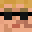
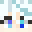
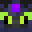
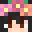
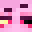
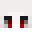
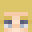
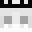
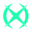
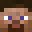

# 🛠️ Staffs

En [Mundo Pixelnet](../README.md) tenemos algunos rangos específicos para cada tarea, en la lista a continuación tendremos qué hace cada uno y quién ocupa actualmente ese rango.

#  **Admin**
El rango Admin tiene la máxima autoridad sobre el servidor, pudiendo tomar decisiones importantes.
| Skin | Usuario |
| :--: | :-----: |
| |**PokeSantiTW**|
| |**Cema21**|
| |**xFuriadaNoitex**|
| |**Marukuz**|
| |**RivalSilver97**|

#  **Moderador**
El rango Moderador tiene el poder de aplicar sanciones y controlar cosas para mantener el correcto funcionamiento del servidor.
| Skin | Usuario |
| :--: | :-----: |
| |**BonMurci**|
| |**Gametito**|
| |**JuniorCX**|
| |**Y4MAT0sama**|

#  **Helper**
El rango Helper tiene la función de ayudar con dudas y responder preguntas para mantener la mejor jugabilidad del usuario.
| Skin | Usuario |
| :--: | :-----: |
| |**Juank_16**|
| |**Morcant_**|
| |**Ikaros_YT**|
| |**ITSFrankoGG**|

#  **Developer**
El rango Developer tiene la función de programar los complementos y bots del servidor, haciéndolo aún más único y original.
| Skin | Usuario |
| :--: | :-----: |
| |**Marukuz**|
| |**Cheminsky**|

# 🧱 **Builder**
El rango Builder tiene la función de construir los mapas del servidor, ya sea para una misión o cualquier cosa nueva que implique construcción
| Skin | Usuario |
| :--: | :-----: |
| |**xFuriadaNoitex**|
| |**BonMurci**|
| |**JuniorCX**|
| |**Trolendo**|
