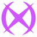
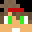
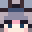

# 🛠️ Staffs

## 🛠️ Staffs

En [Universo PokéNet](../) tenemos algunos rangos específicos para cada tarea, en la lista a continuación tendremos qué hace cada uno y quién ocupa actualmente ese rango.

##  **Admin**

El rango Admin tiene la máxima autoridad sobre el servidor, pudiendo tomar decisiones importantes.
| Skin | Usuario |
| :--: | :-----: |
| |**PokeSantiTW**|
| |**Cema21**|
| |**xFuriadaNoitex**|
| |**Marukuz**|
| |**RivalSilver97**|
| |**YamatoDust**|

##  **Moderador**

El rango Moderador tiene el poder de aplicar sanciones y controlar cosas para mantener el correcto funcionamiento del servidor.
| Skin | Usuario |
| :--: | :-----: |
| |**Gamertito**|
| |**Juniorcx**|
| |**ITSFrankoGG**|

##  **Helper**

El rango Helper tiene la función de ayudar con dudas y responder preguntas para mantener la mejor jugabilidad del usuario.

|                         Skin                        |    Usuario   |
| :-------------------------------------------------: | :----------: |
|  | **teyu\_31** |

##  **Developer**

El rango Developer tiene la función de programar los complementos y bots del servidor, haciéndolo aún más único y original.

|                        Skin                        |    Usuario    |
| :------------------------------------------------: | :-----------: |
|  |  **Marukuz**  |
|  | **Cheminsky** |

## 🧱 **Builder**

El rango Builder tiene la función de construir los mapas del servidor, ya sea para una misión o cualquier cosa nueva que implique construcción
| Skin | Usuario |
| :--: | :-----: |
| |**xFuriadaNoitex**|
| |**Juniorcx**|
| |**Trolendo**|
| |**Gamertito**|
| |**ITSFrankoGG**|
| |**Mai_075**|
