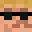
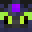
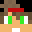
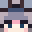
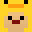
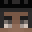

# 🛠️ Staffs

En [Universo PokéNet](../README.md) tenemos algunos rangos específicos para cada tarea, en la lista a continuación tendremos qué hace cada uno y quién ocupa actualmente ese rango.

#  **Dueño**
El rango dueño tiene toda la autoridad del servidor y la cabeza princpial en todas las deciciones finales.
| Skin | Usuario |
| :--: | :-----: |
| |**PokeSantiTW**|

#  **Administrador**
El rango Admin tiene la máxima autoridad sobre el servidor, pudiendo tomar decisiones importantes.
| Skin | Usuario |
| :--: | :-----: |
| |**YamatoDust**|
| |**xFuriadaNoitex**|
| |**Marukuz**|
| |**Mai_075**|
| |**Gamertito**|

#  **Moderador**
El rango Moderador tiene el poder de aplicar sanciones y controlar cosas para mantener el correcto funcionamiento del servidor.
| Skin | Usuario |
| :--: | :-----: |
| |**Juniorcx**|
| |**ITSFrankoGG**|
| |**Teyu_31**|
| |**RivalSilver97**|

#  **Helper**
El rango Helper tiene la función de ayudar con dudas y responder preguntas para mantener la mejor jugabilidad del usuario.
| Skin | Usuario |
| :--: | :-----: |
| |**Trolendo**|
| |**Azumi19**|
| |**Ikaros_YT**|

#  **Developer**
El rango Developer tiene la función de programar los complementos y bots del servidor, haciéndolo aún más único y original.
| Skin | Usuario |
| :--: | :-----: |
| |**Marukuz**|
| |**Cheminsky**|
| |**MiNombreEsVaro**|

# 🧱 **Builder**
El rango Builder tiene la función de construir los mapas del servidor, ya sea para una misión o cualquier cosa nueva que implique construcción
| Skin | Usuario |
| :--: | :-----: |
| |**xFuriadaNoitex**|
| |**Trolendo**|
| |**Gamertito**|
| |**ITSFrankoGG**|
| |**Mai_075**|
| |**Arii**|
