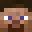

# 🛠️ Staffs

## 🛠️ Staffs

En [Universo PokéNet](../) tenemos algunos rangos específicos para cada tarea, en la lista a continuación tendremos qué hace cada uno y quién ocupa actualmente ese rango.

##  **Admin**

El rango Admin tiene la máxima autoridad sobre el servidor, pudiendo tomar decisiones importantes.

|                                  Skin                                  |       Usuario      |
| :--------------------------------------------------------------------: | :----------------: |
|    .png>)    |   **PokeSantiTW**  |
|         .png>)         |     **Cema21**     |
| .png>) | **xFuriadaNoitex** |
|        .png>)        |     **Marukuz**    |
|  .png>)  |  **RivalSilver97** |
|     .png>)     |   **YamatoDust**   |

##  **Moderador**

El rango Moderador tiene el poder de aplicar sanciones y controlar cosas para mantener el correcto funcionamiento del servidor.

|                               Skin                               |     Usuario     |
| :--------------------------------------------------------------: | :-------------: |
|    .png>)    |  **Gamertito**  |
|    .png>)    |   **Juniorcx**  |
| .png>) | **ITSFrankoGG** |

##  **Helper**

El rango Helper tiene la función de ayudar con dudas y responder preguntas para mantener la mejor jugabilidad del usuario.

|                         Skin                        |    Usuario   |
| :-------------------------------------------------: | :----------: |
|  | **teyu\_31** |

##  **Developer**

El rango Developer tiene la función de programar los complementos y bots del servidor, haciéndolo aún más único y original.

|                        Skin                        |    Usuario    |
| :------------------------------------------------: | :-----------: |
|  |  **Marukuz**  |
|  | **Cheminsky** |

## 🧱 **Builder**

El rango Builder tiene la función de construir los mapas del servidor, ya sea para una misión o cualquier cosa nueva que implique construcción

|                                  Skin                                  |       Usuario      |
| :--------------------------------------------------------------------: | :----------------: |
| .png>) | **xFuriadaNoitex** |
|       .png>)       |    **Juniorcx**    |
|         .png>)        |    **Trolendo**    |
|       .png>)      |    **Gamertito**   |
|    .png>)    |   **ITSFrankoGG**  |
|        .png>)       |    **Mai\_075**    |
