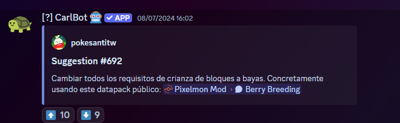

# 📥 Sugerencias

La mejor forma de dar ideas para mejorar el servidor son las Sugerencias. Los [Admins](staffs.md) leen y responden las sugerencias, y si algo es viable se implementa en el servidor.

## ¿Cómo hacer una sugerencia?

Para hacer una sugerencia primero debes estar en el [servidor de Discord exclusivo de Universo PokéNet](https://discord.com/invite/mundopixelnet). Luego busca en la categoría **Soporte** el foro llamado [📥︙sugerencias](https://discord.com/channels/978703875961921556/984958661694734396) y crea una **nueva publicación** con tu idea: ponle un título claro y explica en la descripción qué te gustaría cambiar o añadir.

Si tu sugerencia trata sobre las raids, publícala en el foro **sugerencias-raids**, que está justo debajo.

Una vez publicada, tu sugerencia quedará visible en el foro, donde podrá ser leída y evaluada por otros usuarios y [staffs](staffs.md).

## ¿Cómo puedo leer, debatir y evaluar sugerencias?

Entra al foro [📥︙sugerencias](https://discord.com/channels/978703875961921556/984958661694734396) del servidor de Discord de Universo PokéNet.

Allí podrás leer las sugerencias de otros usuarios y participar desde la propia publicación: puedes **debatir** la idea, dar tu opinión o **pedir más información** al autor. El autor también puede responder y aclarar su propuesta en el mismo hilo.

