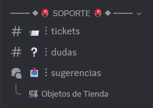
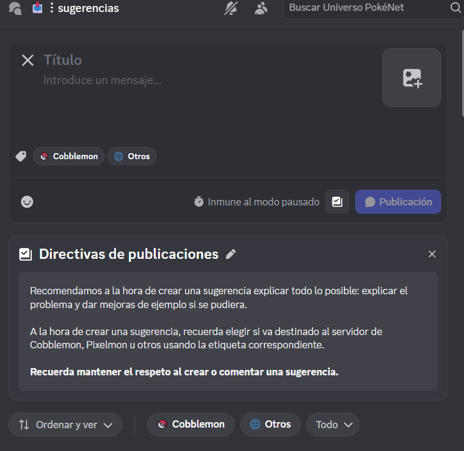
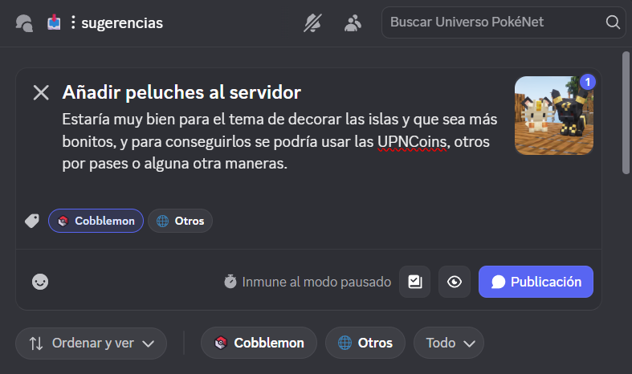
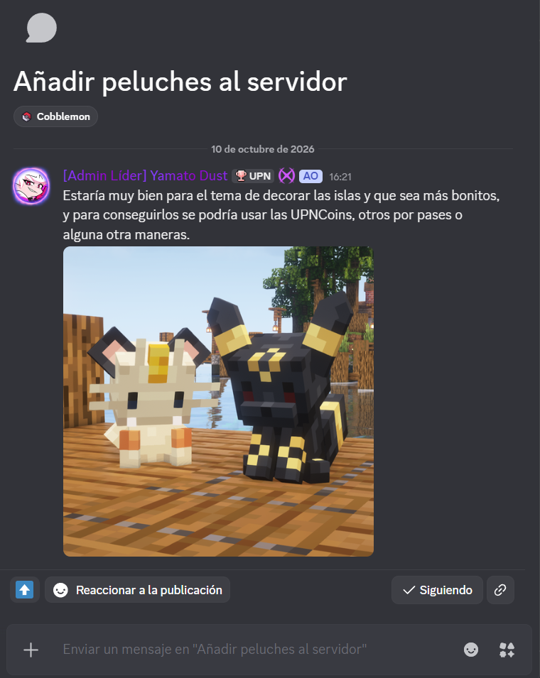

# 📥 Sugerencias

La mejor forma de dar ideas para mejorar el servidor son las Sugerencias. Los [Admins](staffs.md) leen y responden las sugerencias, y si algo es viable se implementa en el servidor.


**En resumen:** entra al foro **📥︙sugerencias** de nuestro Discord, crea una publicación con tu idea y elige su etiqueta. Después, la comunidad y el staff podrán debatirla contigo.


---

## ✍️ ¿Cómo hacer una sugerencia?

### 1️⃣ Encuentra el foro

Para hacer una sugerencia primero debes estar en el [servidor de Discord exclusivo de Universo PokéNet](https://discord.com/invite/mundopixelnet). Luego busca la categoría **Soporte** y entra en el foro [📥︙sugerencias](https://discord.com/channels/978703875961921556/984958661694734396).

### 2️⃣ Lee las directivas

Al entrar verás las **directivas de publicaciones** del foro. Te piden explicar todo lo posible, indicando cuál es el problema y, si puedes, proponiendo mejoras de ejemplo.

### 3️⃣ Crea tu publicación

Escribe un **título** y explica tu idea en la descripción. Si te ayuda a explicarte mejor, puedes adjuntar una imagen. Después elige la **etiqueta** y pulsa **Publicación**.


Es **obligatorio** elegir una etiqueta para publicar tu sugerencia.


| Etiqueta | ¿Cuándo usarla? |
| :--- | :--- |
| **Cobblemon** | Sugerencias sobre lo que ocurre **dentro del servidor** de Minecraft. |
| **Otros** | Cualquier otra cosa que mejore la comunidad: ideas para el servidor de Discord, cambios en alguna norma, etc. |


**Una buena sugerencia:** tiene un título claro, explica el problema o la necesidad, propone una mejora de ejemplo y, si hace falta, incluye una imagen.


Una vez publicada, tu sugerencia quedará visible en el foro, donde podrá ser leída y evaluada por otros usuarios y [staffs](staffs.md).

---

## 💬 ¿Cómo puedo leer, debatir y evaluar sugerencias?

Entra al foro [📥︙sugerencias](https://discord.com/channels/978703875961921556/984958661694734396) y abre la publicación que quieras leer. Desde ella puedes:

| Acción | Cómo hacerlo |
| :--- | :--- |
| ⬆️ **Apoyar la idea** | Pulsa **Reaccionar a la publicación**. |
| 💭 **Debatir u opinar** | Escribe en el cuadro de mensaje de la parte inferior. |
| ❓ **Pedir más información** | Pregunta al autor en los comentarios; él puede responder y aclarar su idea en el mismo hilo. |
| 🔔 **Recibir avisos** | Pulsa **Seguir** y Discord te avisará de las nuevas respuestas. |


**Respeto ante todo.** Comenta con respeto y sin toxicidad: opina sobre la idea, no sobre la persona que la propone, y sigue siempre las [normas](normas.md) del servidor.

