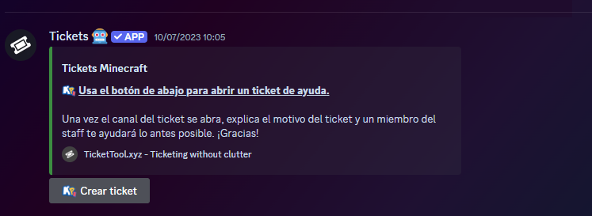

# 📩 Tickets

Los tickets son la mejor forma de comunicarte con el [Staff](staffs.md) en caso de algún problema, en él dirás en qué necesitas ayuda y luego un miembro del staff responderá, y en casos de problemas lo solucionarán.

## Como abrir un ticket?

Para abrir un ticket primero debes estar en el [servidor de Discord exclusivo de Mundo Pixelnet](https://discord.com/invite/mundopixelnet), luego busca el canal llamado [📩︙tickets
](https://discord.com/channels/978703875961921556/1127948019090858015) y haz clic en “Crear Ticket”.

Después de esto, aparecerá una ventana preguntando el motivo del ticket, tu nombre en el servidor y sobre qué servidor estás haciendo el ticket, escribe los datos correctamente, siempre preste atención a las [normas](normas.md) ya que el mal uso de un ticket puede acarrear sanción.

Una vez creado espera a que un Staff disponible te responda, y colabora para solucionar el problema, aportando siempre la mayor información posible y prestando atención al ticket creado para que todo se resuelva lo más rápido posible.
