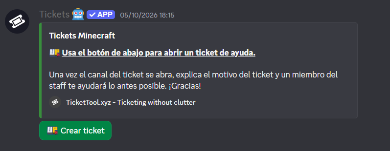
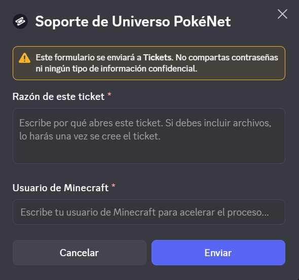

# 📩 Tickets

Los tickets son la mejor forma de comunicarte con el [Staff](staffs.md) en caso de algún problema. En ellos explicarás en qué necesitas ayuda y un miembro del staff te responderá y, si se trata de un problema, te ayudará a solucionarlo.

## ¿Cómo abrir un ticket?

Para abrir un ticket primero debes estar en el [servidor de Discord exclusivo de Universo PokéNet](https://discord.com/invite/mundopixelnet). Luego busca la categoría **Soporte**, donde encontrarás el canal [📩︙tickets](https://discord.com/channels/978703875961921556/1127948019090858015).

Entra en el canal y haz clic en “Crear Ticket”.

Después de esto, aparecerá una ventana en la que tendrás que indicar tu **nick** en el servidor y el **problema** o motivo del ticket. Escribe los datos correctamente y presta siempre atención a las [normas](normas.md), ya que el mal uso de un ticket puede acarrear sanción.

Una vez creado, espera a que un Staff disponible te responda y colabora para solucionar el problema, aportando siempre la mayor información posible y prestando atención al ticket para que todo se resuelva lo más rápido posible.
