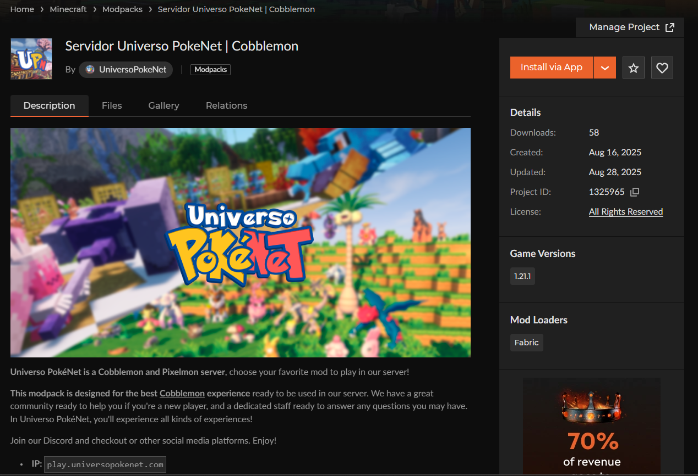
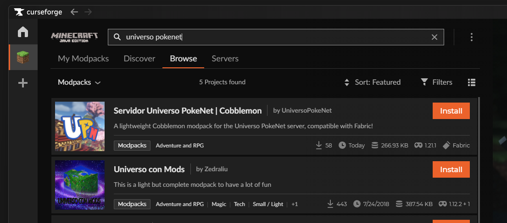

# ⚙️ Launcher Universo PokéNet
**Recomendamos usar nuestro Launcher** personalizado para la experiencia más cómoda y rápida. Tienes la guía de instalación aquí:

 [../launcher.md](../launcher.md) 

# 🎥 Vídeo de Instalación


# 📥 Descarga manual de CurseForge
Si quieres descargar el archivo `.zip` directamente puedes hacerlo desde la [Web del Modpack en CurseForge](https://www.curseforge.com/minecraft/modpacks/servidor-universo-pokenet-cobblemon).

# 📁 Descarga desde el Launcher de CurseForge
Se dará por hecho que tienes ya el Launcher de CurseForge instalado y configurado, que se puede descargar desde [aquí](https://www.curseforge.com/download/app).

Desde el Launcher: elige Minecraft, dirígete a la sección de "Browse" y **busca "Universo PokeNet"**, te saldrá el modpack de Cobblemon de los primeros. Clic en Install.

Una vez descargado e instalado, **¡haz clic en Play para iniciar tu aventura de Cobblemon en Universo PokéNet!**

