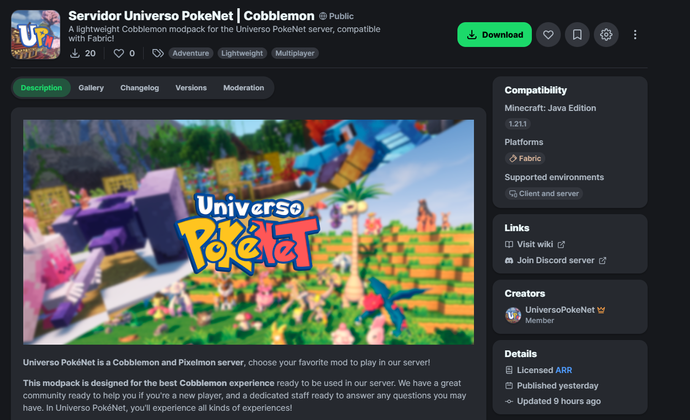
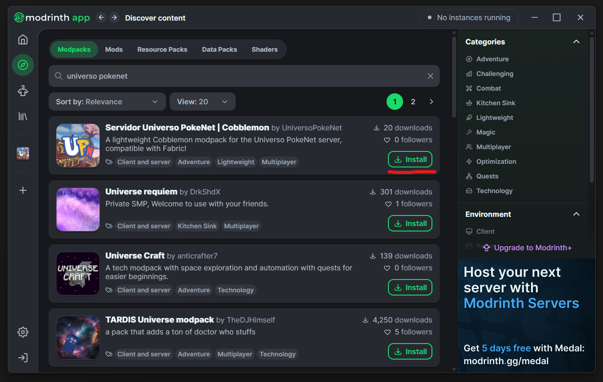
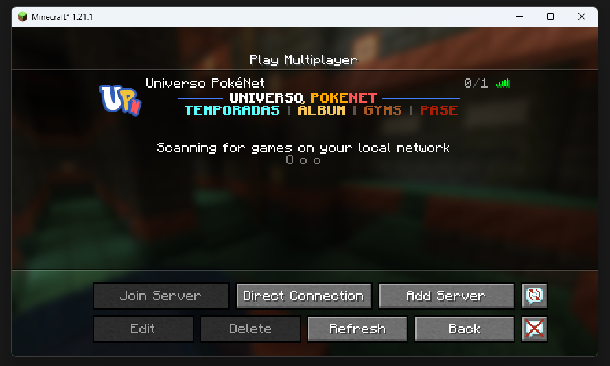

# ⚙️ Launcher Universo PokéNet
**Recomendamos usar nuestro Launcher** personalizado para la experiencia más cómoda y rápida. Tienes la guía de instalación aquí:

 [../launcher.md](../launcher.md) 

# 📥 Descarga manual de Modrinth
Si quieres descargar el archivo `.mrpack` directamente puedes hacerlo desde la [Web del Modpack en Modrinth](https://modrinth.com/modpack/servidor-universo-pokenet-cobblemon).

# 📁 Descarga desde el Launcher de Modrinth
Se dará por hecho que tienes ya el Launcher de Modrinth instalado y configurado, que se puede descargar desde [aquí](https://modrinth.com/app).

Desde el Launcher, dirígete a la sección de "Discover Content" y **en "Modpacks" busca "Universo PokeNet"**, te saldrá el modpack de Cobblemon de los primeros. Clic en Install.

Una vez descargado e instalado, **¡haz clic en Play para iniciar tu aventura de Cobblemon en Universo PokéNet!**

