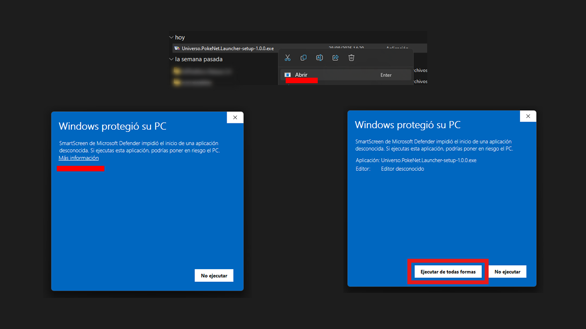
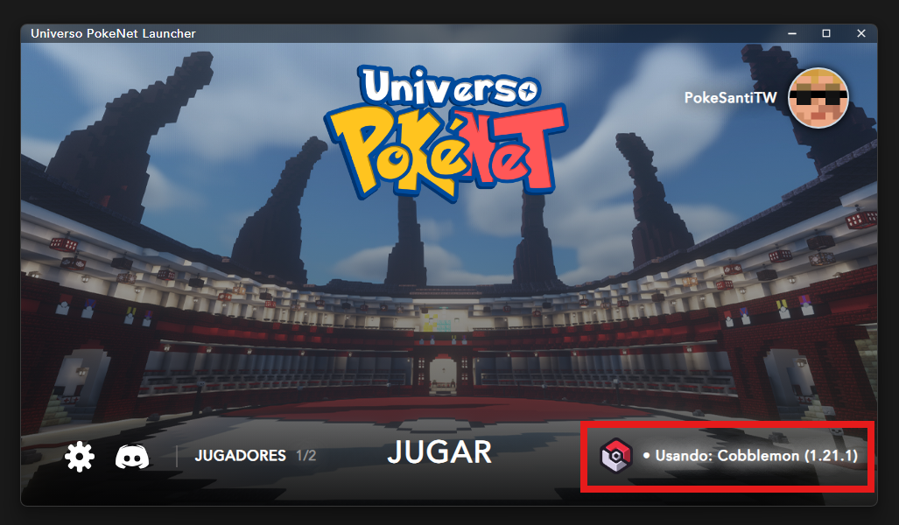
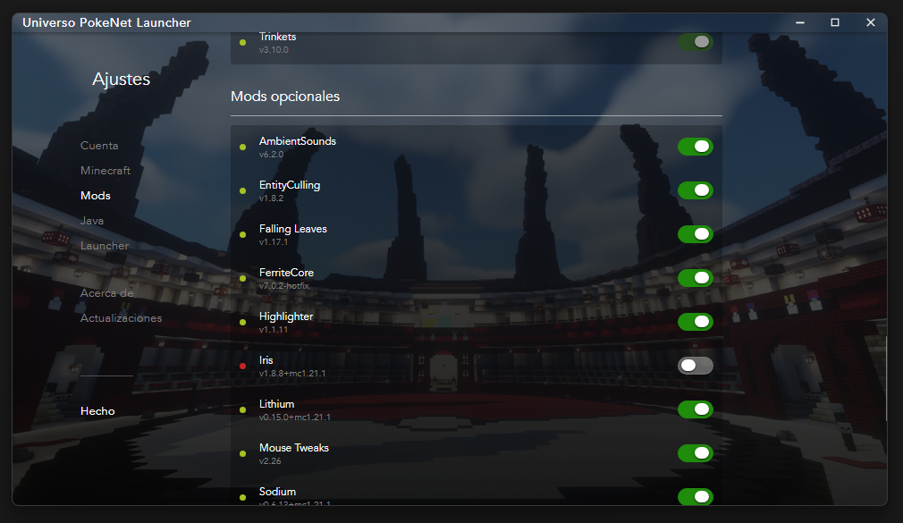

# ⚙️ Launcher Universo PokéNet

## ⚙️ Launcher Universo PokéNet

Con el Launcher de Universo PokéNet tendrás una experiencia de usuario mucho más cómoda **tanto para Cobblemon como Pixelmon**. Y las **actualizaciones del modpack se descargarán automáticamente** sin que tengas que hacer nada más. ¡Totalmente **recomendado usar nuestro Launcher**!

Con nuestro Launcher podrás **iniciar sesión con tu cuenta de Microsoft** _(premium)_ o con un nick _(no-premium)_. Pero recomendamos encarecidamente usar una cuenta con Minecraft comprado.

**Usar este Launcher es totalmente seguro**. Incluso el código está [disponible en nuestro GitHub](https://github.com/Universo-PokeNet/UPN-Launcher) por si quieres echarle un vistazo.


Si lo deseas, tenemos el modpack también disponible para los launchers de [CurseForge](cobblemon/curseforge.md) y [Modrinth](cobblemon/modrinth.md).


## 🎥 Vídeo de Instalación



## 📝 Instalación

La instalación del Launcher es bastante sencilla, y con instalarlo ya todos los modpacks se descargarán al iniciar el juego.

1. Dirígete a la [Web de Universo PokéNet](https://universopokenet.com/) y haz clic en el botón de **Launcher** para descargar la última versión _(en el GitHub anterior también tienes todas las descargas)_.

2. Una vez se descargue el ejecutable, haz **doble clic en el .exe para empezar la instalación**. Es muy probable que te salga un aviso de "Windows protegió tu PC". Esto es completamente normal, pues no somos una empresa reconocida y el ejecutable no lo reconoce Windows aún. **Haz clic en "Más información" > "Ejecutar de todas formas" y se ejecutará.**

3. Como como cualquier programa que instalas en Windows, **dale a Continuar para instalar el programa**. Al terminar marca el check para abrir el Launcher.

4. Para acabar, elige tu método de sesión preferido. **Si tienes Minecraft comprado, elige "Iniciar con Microsoft"**. Si no es el caso, elige "Iniciar con Nick" para elegir un nombre de usuario.

## 🎮 Seleccionar Modpack

Para acabar tendrás que **seleccionar** que experiencia de Pokémon en Minecraft jugar: **Cobblemon** o **Pixelmon**.

En la pantalla principal del Launcher haz click en "Usando: \[...]". Ahí podrás **seleccionar el modpack a usar**.

Con el modpack seleccionado también puedes ir a **Ajustes > Mods** y comprobar todos los mods disponibles. **En la sección de "Mods opcionales" puedes desactivar mods** si lo ves necesario.

Por último, **puedes soltar los archivos .jar de mods que tú quieras**. Por ejemplo, algún mod de optimización que no está incluido en el modpack y prefieras usarlo.


El modpack ya está hecho de esta forma para que funcione correctamente. No recomendamos añadir nada más para prevenir errores.


El Launcher ofrece aún más opciones extras, como añadir más cuentas, configuraciones de Java o **asignación de RAM**.


No toques opciones que desconozcas para no romper la ejecución de Minecraft. Si tienes alguna duda, consúltala con el Staff.


## ⚠️ Reporte de fallos

En caso de que tengas problemas o encuentres fallos con el Launcher puedes reportarlo vía Ticket en [nuestro servidor de Discord](https://discord.com/invite/p4wryDdutf).

Es muy **recomendable que reportes cualquier fallo que tengas**, pues es posible que otro usuario lo tenga en el futuro.
