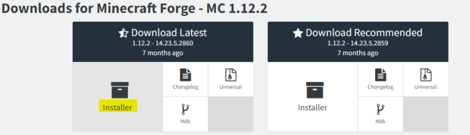
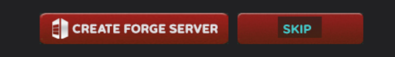

# ⚙️ Instalación de Pixelmon para la 1.12.2


Si lo deseas, puedes ver este tutorial en vídeo en vez de texto 👇




Este tutorial está orientado para launchers originales de Minecraft (premium). Para otros launchers no oficiales el proceso puede ser parecido, pero no damos soporte a ellos aquí.


## ⬇️ Descargas iniciales

Para empezar, vamos a descargar algunos archivos:

- **Forge 1.12.2 - 14.23.5.2860**
Descarga la última versión de Forge 1.12.2. Entra a la [web de Forge 1.12.2](https://files.minecraftforge.net/net/minecraftforge/forge/index_1.12.2.html) y después haz clic en “Installer”. Se te abrirá una página donde debes esperar 5 segundos y luego hacer clic en “SKIP”. Una vez hecho eso, se te descargará el **instalador de Forge**.

- **Pixelmon Reforged 8.4.3**
Descarga Pixelmon Reforged 8.4.3. Ya que Pixelmon Reforged no proporciona de manera sencilla la descarga, te dejamos aquí el enlace de descarga directa. Pero puedes seguir encontrando el mod en la web de [Pixelmon Reforged](https://reforged.gg)

🔗 [__**Descargar Pixelmon Reforged 8.4.3**__](https://dl.reforged.gg/3Wc6uvQ)

## 💻 Instalación de Forge
Con todo descargado, vamos a ejecutar el archivo de Forge 1.12.2. Si no te sale un icono de Java (un icono de un café) significa que no tienes instalado Java. Puedes descargarlo desde la web oficial de Java. Si estás seguro de que lo tienes instalado, haz clic derecho y "Abrir con" Java. Si todo es correcto, se tiene que abrir esta ventana. 

