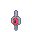
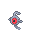

# 📕 Unown Lost Silver

## Información

**Unown Lost Silver** es una Skin exclusiva del servidor introducida en la [Pixelween](./).

|||
| ------------------------------: | -------------------------------------------------------------------------------------------------------------------------------------- |
|                      **Sprite** |                                                           |                                                                                                             |
|                      Creado por | FuriadaNoite                                                                                                                 |

### Comentario del desarrollador
La creación de esta skin hace referencia a la Creepypasta Lost Silver

## Obtención

Esta skin suele aparecer en el mapa y es la clave para iniciar la misión Lost Silver.
