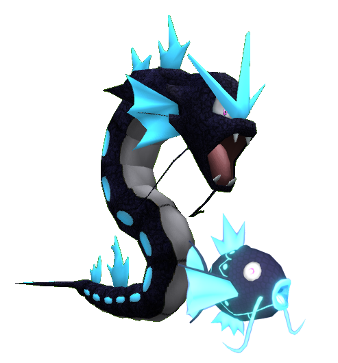
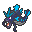
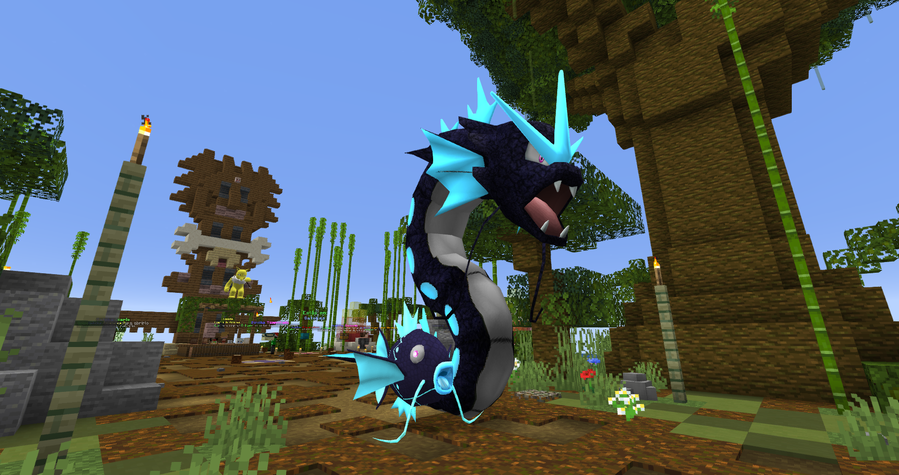

# 🗝️ Magikarp y Gyarados Leviathan
## Información

**Magikarp Leviathan** y **Gyarados Leviathan** son Skins exclusivas del servidor introducida en la [Temporada Mística (1)](./).

|                     **Artwork** |                                                                                     |
| ------------------------------: | -------------------------------------------------------------------------------------------------------------------------------------- |
|                  **Sprite** |                                                            |                                                                                                             |
|                      Creado por | FuriadaNoite y BonMurci                                                                                                                |

La creación de esta skin se basa en monstruos marinos mitológicos y también en la leviatán mariposa del mod Wyrmroost.

## Obtención

Esta skin se puede obtener en el gatcha de la temporada 1, la llave se puede obtener en el pase o la tienda de llaves gatcha con el precio de **60k**.
