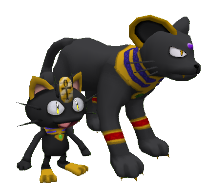
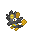
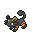
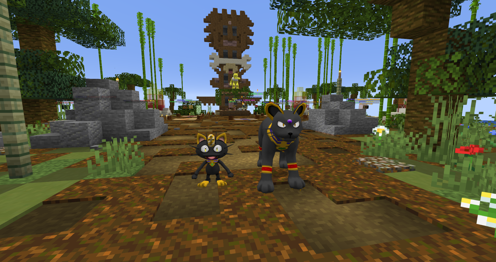

# 🗝️ Meowth y Persian Espectro Dorado
## Información

**Meowth Espectro Dorado** y **Persian Espectro Dorado** son Skins exclusivas del servidor introducida en la [Temporada Mística (1)](./).

|                     **Artwork** |                                                                                     |
| ------------------------------: | -------------------------------------------------------------------------------------------------------------------------------------- |
|                  **Sprite** |                                                            |                                                                                                             |
|                      Creado por | FuriadaNoite y BonMurci                                                                                                                |

### Comentario del desarrollador
La creación de esta skin está basada en dioses egipcios, más concretamente en la Diosa Bastet.

## Obtención

Esta skin se puede obtener en el gatcha de la temporada 1 con un 3,8% de posibilidades de conseguir esta skin, la llave se puede obtener en el pase o la tienda de llaves gatcha con el precio de **60k**.
