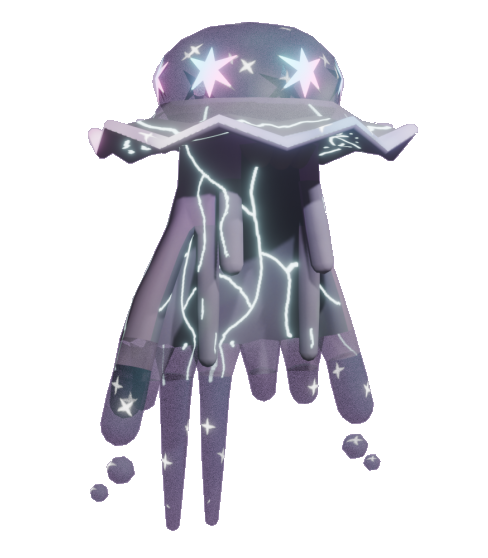
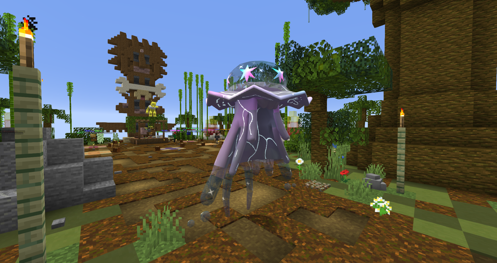

# 🗝️ Nihilego Luminarie
## Información

**Nihilego Luminarie** es una skin exclusiva del servidor introducida en la [Temporada Mística (1)](./).

|                     **Artwork** |                                                                                     |
| ------------------------------: | -------------------------------------------------------------------------------------------------------------------------------------- |
|                  **Sprite** |                                                         |                                                                                                             |
|                      Creado por | FuriadaNoite y BonMurci                                                                                                                |

La creación de esta piel se basa en el misticismo que rodea a la luna y al espacio en general.

## Obtención

Esta skin se puede obtener en el gatcha de la temporada 1 con un 0,8%, esta es la skin más rara que se consigue de esta manera, la llave se puede obtener en el pase o la tienda de llaves gatcha con el precio de **60k**.
