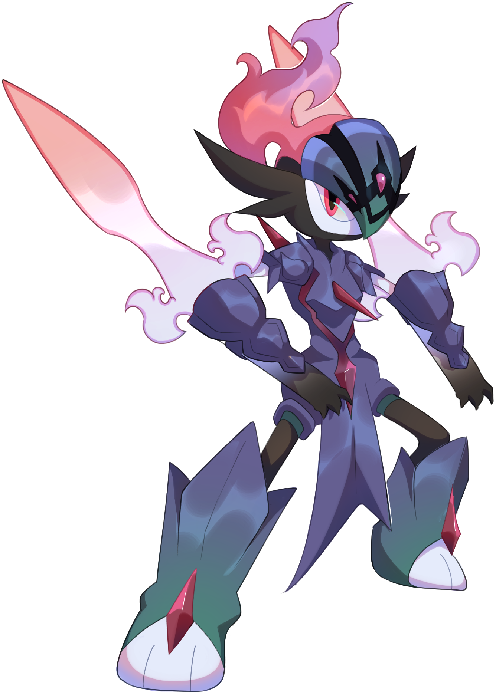
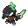
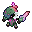

# 🧬 Cerullade

## Información

**Cerullade** es un [Pokémon híbrido](../../funciones/hibridos.md) de tipo [fantasma](https://www.wikidex.net/wiki/Tipo_fantasma)/[fuego](https://www.wikidex.net/wiki/Tipo_fuego) introducido en la [Temporada Mística (1)](./). Es la fusión de Ceruledge y Gallade.

|                         **Artwork** |                                                                                   |
| ----------------------------------: | --------------------------------------------------------------------------------------------------------------------------------------------- |
|                          **Sprite** |                                                                             |
| [Híbrido](../funciones/hibridos.md) | Ceruledge y Gallade                                                                                                                           |
|                               Tipos |                                   |
|                         Habilidades | 
<a href="https://www.wikidex.net/wiki/Cortante">Cortante</a> <a href="https://www.wikidex.net/wiki/Absorbe_fuego">Absorbe fuego</a>
 |
|                         Hab. oculta | [Justiciero](https://www.wikidex.net/wiki/Justiciero)                                                                                         |
|                          Creado por | FuriadaNoite y BonMurci                                                                                                                       |

### Descripción

La personalidad de este espécimen guarda una sorprendente similitud con la de la leyenda de un héroe legendario que salvo a toda Etheria de una criatura dimensional.

### Comentario del desarrollador

La creación de este Pokémon se basó en el típico cuento de hadas donde un héroe enfrenta una amenaza y se casa con la princesa, es la pareja de Gardewile.

## Formas

|    Forma    |                                           Sprite                                           |
| :---------: | :----------------------------------------------------------------------------------------: |
|    Normal   |                          |
|    Shiny    |              |
| Dimensional |  |
|    Nexus    |              |


Este Pokémon tiene estilos que se pueden comprar en la Tienda Web \*(tienda.mundopixelnet.com)\*, para cambiar entre ellos usa el comando /estilos.


## Obtención

Este es un Pokémon híbrido, que se obtiene de forma especial como se explica en: [🧬 Híbridos](../../funciones/hibridos.md)

## Características base

Las [características base](https://www.wikidex.net/wiki/Caracter%C3%ADsticas) de Cerullade son las siguientes:

| Estadística |  Valor  |
| :---------: | :-----: |
|      PS     |    70   |
|    Ataque   |   130   |
|   Defensa   |    85   |
|   At. esp   |    50   |
|   Def. esp  |   105   |
|  Velocidad  |    90   |
|  **Total**  | **530** |

## Movimientos

### Por nivel y de tutor



| Nivel |                            Movimiento                            |                             Tipo                            |
| :---: | :--------------------------------------------------------------: | :---------------------------------------------------------: |
|   1   |      [Impresionar](https://www.wikidex.net/wiki/Impresionar)     |    |
|   1   |           [Ascuas](https://www.wikidex.net/wiki/Ascuas)          |          |
|   1   |        [Malicioso](https://www.wikidex.net/wiki/Malicioso)       |        |
|   1   |   [Tajo umbrío](https://www.wikidex.net/wiki/Tajo_umbr%C3%ADo)   |  |
|   1   |         [Anticipo](https://www.wikidex.net/wiki/Anticipo)        |          |
|   1   |  [Garra umbría](https://www.wikidex.net/wiki/Garra_umbr%C3%ADa)  |    |
|   1   |       [Sombra vil](https://www.wikidex.net/wiki/Sombra_vil)      |    |
|   1   |   [Cuchilla solar](https://www.wikidex.net/wiki/Cuchilla_solar)  |        |
|   1   | [Tajo acuático](https://www.wikidex.net/wiki/Tajo_acu%C3%A1tico) |            |
|   1   |     [Espada santa](https://www.wikidex.net/wiki/Espada_santa)    |          |
|   1   |       [Hoja aguda](https://www.wikidex.net/wiki/Hoja_aguda)      |        |
|   4   |      [Corte furia](https://www.wikidex.net/wiki/Corte_furia)     |          |
|   8   |     [Niebla clara](https://www.wikidex.net/wiki/Niebla_clara)    |        |
|   12  |       [Giro fuego](https://www.wikidex.net/wiki/Giro_fuego)      |          |
|   16  |      [Fuego fatuo](https://www.wikidex.net/wiki/Fuego_fatuo)     |          |
|   20  |        [Tinieblas](https://www.wikidex.net/wiki/Tinieblas)       |    |
|   24  |       [Nitrocarga](https://www.wikidex.net/wiki/Nitrocarga)      |          |
|   32  |         [Humareda](https://www.wikidex.net/wiki/Humareda)        |          |
|   37  |     [Danza espada](https://www.wikidex.net/wiki/Danza_espada)    |        |
|   42  |    [Falso tortazo](https://www.wikidex.net/wiki/Falso_tortazo)   |        |
|   48  |   [Espada lamento](https://www.wikidex.net/wiki/Espada_lamento)  |          |
|   56  |       [Psicocorte](https://www.wikidex.net/wiki/Psicocorte)      |    |
|   62  |  [Envite ígneo](https://www.wikidex.net/wiki/Envite_%C3%ADgneo)  |          |
|   66  |      [A bocajarro](https://www.wikidex.net/wiki/A_bocajarro)     |          |



|                         Movimiento                         |                            Tipo                           |
| :--------------------------------------------------------: | :-------------------------------------------------------: |
| [Motivación](https://www.wikidex.net/wiki/Motivaci%C3%B3n) |        |
|  [Vasta fuerza](https://www.wikidex.net/wiki/Vasta_fuerza) |  |
|   [Triple Axel](https://www.wikidex.net/wiki/Triple_Axel)  |        |



### MTs y DTs



|                             Movimiento                             |                             Tipo                            |
| :----------------------------------------------------------------: | :---------------------------------------------------------: |
|           [Derribo](https://www.wikidex.net/wiki/Derribo)          |        |
|     [Protección](https://www.wikidex.net/wiki/Protecci%C3%B3n)     |        |
|      [Rayo confuso](https://www.wikidex.net/wiki/Rayo_confuso)     |    |
|       [Rueda fuego](https://www.wikidex.net/wiki/Rueda_fuego)      |          |
|            [Imagen](https://www.wikidex.net/wiki/Imagen)           |        |
|        [Infortunio](https://www.wikidex.net/wiki/Infortunio)       |    |
|        [Nitrocarga](https://www.wikidex.net/wiki/Nitrocarga)       |          |
|     [Poder reserva](https://www.wikidex.net/wiki/Poder_reserva)    |    |
|         [Tinieblas](https://www.wikidex.net/wiki/Tinieblas)        |    |
|       [Lanzamiento](https://www.wikidex.net/wiki/Lanzamiento)      |  |
|           [Aguante](https://www.wikidex.net/wiki/Aguante)          |        |
|    [Día soleado](https://www.wikidex.net/wiki/D%C3%ADa_soleado)    |          |
|     [Falso tortazo](https://www.wikidex.net/wiki/Falso_tortazo)    |        |
|     [Demolición](https://www.wikidex.net/wiki/Demolici%C3%B3n)     |          |
|   [Garra umbría](https://www.wikidex.net/wiki/Garra_umbr%C3%ADa)   |    |
|       [Corpulencia](https://www.wikidex.net/wiki/Corpulencia)      |          |
|       [Puya nociva](https://www.wikidex.net/wiki/Puya_nociva)      |        |
|          [Descanso](https://www.wikidex.net/wiki/Descanso)         |        |
|              [Mofa](https://www.wikidex.net/wiki/Mofa)             |  |
|      [Danza espada](https://www.wikidex.net/wiki/Danza_espada)     |        |
|  [Cabeza de hierro](https://www.wikidex.net/wiki/Cabeza_de_hierro) |          |
|         [Sustituto](https://www.wikidex.net/wiki/Sustituto)        |        |
| [Defensa férrea](https://www.wikidex.net/wiki/Defensa_f%C3%A9rrea) |          |
|          [Tijera X](https://www.wikidex.net/wiki/Tijera_X)         |          |
|       [Fuego fatuo](https://www.wikidex.net/wiki/Fuego_fatuo)      |          |
|       [Bola sombra](https://www.wikidex.net/wiki/Bola_sombra)      |    |
|     [Onda ígnea](https://www.wikidex.net/wiki/Onda_%C3%ADgnea)     |          |
|       [Lanzallamas](https://www.wikidex.net/wiki/Lanzallamas)      |          |
|          [Refuerzo](https://www.wikidex.net/wiki/Refuerzo)         |        |
|         [Llamarada](https://www.wikidex.net/wiki/Llamarada)        |          |
|    [Golpe fantasma](https://www.wikidex.net/wiki/Golpe_fantasma)   |    |
|            [Sofoco](https://www.wikidex.net/wiki/Sofoco)           |          |
|       [A bocajarro](https://www.wikidex.net/wiki/A_bocajarro)      |          |
|  [Teraexplosión](https://www.wikidex.net/wiki/Teraexplosi%C3%B3n)  |        |
|      [Inversión](https://www.wikidex.net/wiki/Inversi%C3%B3n)      |          |


