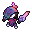
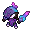
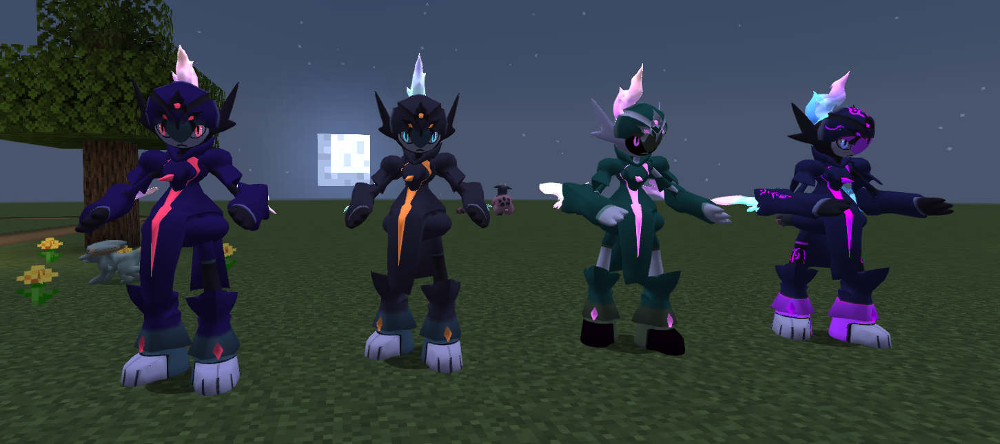

# 🧬 Cerullade

## Información

**Cerullade** es un [Pokémon híbrido](../../funciones/hibridos.md) de tipo [fantasma](https://www.wikidex.net/wiki/Tipo_fantasma)/[fuego](https://www.wikidex.net/wiki/Tipo_fuego) introducido en la [Temporada Mística (1)](./). Es la fusión de Ceruledge y Gallade.

|                     **Artwork** |                                                                                     |
| ------------------------------: | -------------------------------------------------------------------------------------------------------------------------------------- |
|                      **Sprite** |                                                           |
| [Híbrido](../funciones/hibridos.md) | Ceruledge y Gallade                                                                                                                     |
|                           Tipos |          |
|                     Habilidades | [Cortante](https://www.wikidex.net/wiki/Cortante) [Absorbe fuego](https://www.wikidex.net/wiki/Absorbe_fuego) |
|                     Hab. oculta | [Justiciero](https://www.wikidex.net/wiki/Justiciero)                                                                       |
|                      Creado por | FuriadaNoite y BonMurci                                                                                                                |

### Descripción
La personalidad de este espécimen guarda una sorprendente similitud con la de la leyenda de un héroe legendario que salvo a toda Etheria de una criatura dimensional.

### Comentario del desarrollador
La creación de este Pokémon se basó en el típico cuento de hadas donde un héroe enfrenta una amenaza y se casa con la princesa.

## Formas

|  Forma |                                            Sprite                                           |
| :----: | :-----------------------------------------------------------------------------------------: |
| Normal |                |
|  Shiny |    |
| Dimensional |  |
| Nexus |  |

 Este Pokémon tiene estilos que se pueden comprar en la Tienda Web *(tienda.mundopixelnet.com)*, para cambiar entre ellos usa el comando /estilos.

## Obtención

Este es un Pokémon híbrido, que se obtiene de forma especial como se explica en: [🧬 Híbridos](../../funciones/hibridos.md)

## Características base

Las [características base](https://www.wikidex.net/wiki/Caracter%C3%ADsticas) de Cerullade son las siguientes:

| Estadística |  Valor  |
| :---------: | :-----: |
|      PS     |    70   |
|    Ataque   |    130   |
|   Defensa   |    85   |
|   At. esp   |   50   |
|   Def. esp  |   105   |
|  Velocidad  |   90   |
|  **Total**  | **530** |

## Movimientos

### Por nivel y de tutor



| Nivel | Movimiento | Tipo |
| :-----: | :----------: | :----: |
| 1 | [Impresionar](https://www.wikidex.net/wiki/Impresionar) |  |
| 1 | [Ascuas](https://www.wikidex.net/wiki/Ascuas) |  |
| 1 | [Malicioso](https://www.wikidex.net/wiki/Malicioso) |  |
| 1 | [Tajo umbrío](https://www.wikidex.net/wiki/Tajo_umbrío) |  |
| 1 | [Anticipo](https://www.wikidex.net/wiki/Anticipo) |  |
| 1 | [Garra umbría](https://www.wikidex.net/wiki/Garra_umbría) |  |
| 1 | [Sombra vil](https://www.wikidex.net/wiki/Sombra_vil) |  |
| 1 | [Cuchilla solar](https://www.wikidex.net/wiki/Cuchilla_solar) |  |
| 1 | [Tajo acuático](https://www.wikidex.net/wiki/Tajo_acuático) |  |
| 1 | [Espada santa](https://www.wikidex.net/wiki/Espada_santa) |  |
| 1 | [Hoja aguda](https://www.wikidex.net/wiki/Hoja_aguda) |  |
| 4 | [Corte furia](https://www.wikidex.net/wiki/Corte_furia) |  |
| 8 | [Niebla clara](https://www.wikidex.net/wiki/Niebla_clara) |  |
| 12 | [Giro fuego](https://www.wikidex.net/wiki/Giro_fuego) |  |
| 16 | [Fuego fatuo](https://www.wikidex.net/wiki/Fuego_fatuo) |  |
| 20 | [Tinieblas](https://www.wikidex.net/wiki/Tinieblas) |  |
| 24 | [Nitrocarga](https://www.wikidex.net/wiki/Nitrocarga) |  |
| 32 | [Humareda](https://www.wikidex.net/wiki/Humareda) |  |
| 37 | [Danza espada](https://www.wikidex.net/wiki/Danza_espada) |  |
| 42 | [Falso tortazo](https://www.wikidex.net/wiki/Falso_tortazo) |  |
| 48 | [Espada lamento](https://www.wikidex.net/wiki/Espada_lamento) |  |
| 56 | [Psicocorte](https://www.wikidex.net/wiki/Psicocorte) |  |
| 62 | [Envite ígneo](https://www.wikidex.net/wiki/Envite_ígneo) |  |
| 66 | [A bocajarro](https://www.wikidex.net/wiki/A_bocajarro) |  |



| Movimiento | Tipo |
| :----------: | :----: |
| [Motivación](https://www.wikidex.net/wiki/Motivación) |  |
| [Vasta fuerza](https://www.wikidex.net/wiki/Vasta_fuerza) |  |
| [Triple Axel](https://www.wikidex.net/wiki/Triple_Axel) |  |



### MTs y DTs



| Movimiento | Tipo |
| :----------: | :----: |
| [Derribo](https://www.wikidex.net/wiki/Derribo) |  |
| [Protección](https://www.wikidex.net/wiki/Protección) |  |
| [Rayo confuso](https://www.wikidex.net/wiki/Rayo_confuso) |  |
| [Rueda fuego](https://www.wikidex.net/wiki/Rueda_fuego) |  |
| [Imagen](https://www.wikidex.net/wiki/Imagen) |  |
| [Infortunio](https://www.wikidex.net/wiki/Infortunio) |  |
| [Nitrocarga](https://www.wikidex.net/wiki/Nitrocarga) |  |
| [Poder reserva](https://www.wikidex.net/wiki/Poder_reserva) |  |
| [Tinieblas](https://www.wikidex.net/wiki/Tinieblas) |  |
| [Lanzamiento](https://www.wikidex.net/wiki/Lanzamiento) |  |
| [Aguante](https://www.wikidex.net/wiki/Aguante) |  |
| [Día soleado](https://www.wikidex.net/wiki/Día_soleado) |  |
| [Falso tortazo](https://www.wikidex.net/wiki/Falso_tortazo) |  |
| [Demolición](https://www.wikidex.net/wiki/Demolición) |  |
| [Garra umbría](https://www.wikidex.net/wiki/Garra_umbría) |  |
| [Corpulencia](https://www.wikidex.net/wiki/Corpulencia) |  |
| [Puya nociva](https://www.wikidex.net/wiki/Puya_nociva) |  |
| [Descanso](https://www.wikidex.net/wiki/Descanso) |  |
| [Mofa](https://www.wikidex.net/wiki/Mofa) |  |
| [Danza espada](https://www.wikidex.net/wiki/Danza_espada) |  |
| [Cabeza de hierro](https://www.wikidex.net/wiki/Cabeza_de_hierro) |  |
| [Sustituto](https://www.wikidex.net/wiki/Sustituto) |  |
| [Defensa férrea](https://www.wikidex.net/wiki/Defensa_férrea) |  |
| [Tijera X](https://www.wikidex.net/wiki/Tijera_X) |  |
| [Fuego fatuo](https://www.wikidex.net/wiki/Fuego_fatuo) |  |
| [Bola sombra](https://www.wikidex.net/wiki/Bola_sombra) |  |
| [Onda ígnea](https://www.wikidex.net/wiki/Onda_ígnea) |  |
| [Lanzallamas](https://www.wikidex.net/wiki/Lanzallamas) |  |
| [Refuerzo](https://www.wikidex.net/wiki/Refuerzo) |  |
| [Llamarada](https://www.wikidex.net/wiki/Llamarada) |  |
| [Golpe fantasma](https://www.wikidex.net/wiki/Golpe_fantasma) |  |
| [Sofoco](https://www.wikidex.net/wiki/Sofoco) |  |
| [A bocajarro](https://www.wikidex.net/wiki/A_bocajarro) |  |
| [Teraexplosión](https://www.wikidex.net/wiki/Teraexplosión) |  |
| [Inversión](https://www.wikidex.net/wiki/Inversión) |  |


