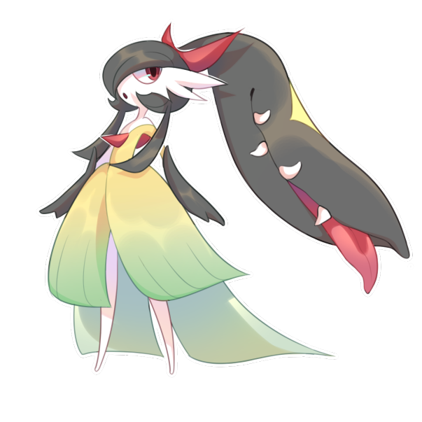
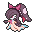
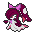
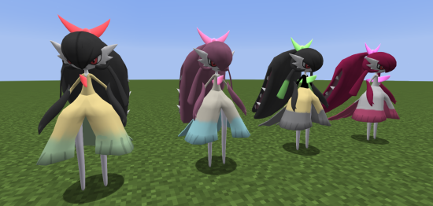

# 🧬 Gardewile

## Información

**Gardewile** es un [Pokémon híbrido](../../funciones/hibridos.md) de tipo [psíquico](https://www.wikidex.net/wiki/Tipo_psiquico)/[hada](https://www.wikidex.net/wiki/Tipo_Hada) introducido en la [Temporada Mística (1)](./). Es la fusión de Gardevoir y Mawile.

|                     **Artwork** |                                                                                     |
| ------------------------------: | -------------------------------------------------------------------------------------------------------------------------------------- |
|                      **Sprite** |                                                           |
| [Híbrido](#) | Ceruledge y Gallade                                                                                                                     |
|                           Tipos |          |
|                     Habilidades | [Potencia](https://www.wikidex.net/wiki/Potencia) [Intimidación](https://www.wikidex.net/wiki/Intimidación) |
|                     Hab. oculta | [Piel Feérica](https://www.wikidex.net/wiki/Piel_fe%C3%A9rica)                                                                       |
|                      Creado por | FuriadaNoite y BonMurci                                                                                                                |

Según artefactos antiguos, los nobles de la ciudad de Etheria solían vivir con este espécimen debido a su elegante personalidad.

## Formas

|  Forma |                                            Sprite                                           |
| :----: | :-----------------------------------------------------------------------------------------: |
| Normal |                |
|  Shiny |    |
| San Valentín |  |
| E-girl |  |

## Obtención

Este es un Pokémon híbrido, que se obtiene de forma especial como se explica en: [🧬 Híbridos](../../funciones/hibridos.md)

## Características base

Las [características base](https://www.wikidex.net/wiki/Caracter%C3%ADsticas) de Gardewile son las siguientes:

| Estadística |  Valor  |
| :---------: | :-----: |
|      PS     |    63   |
|    Ataque   |    80   |
|   Defensa   |    90   |
|   At. esp   |   125   |
|   Def. esp  |   105   |
|  Velocidad  |   105   |
|  **Total**  | **463** |

## Movimientos

### Por nivel y de tutor



| Nivel | Movimiento | Tipo |
| :-----: | :----------: | :----: |
| 1 | [Gruñido](https://www.wikidex.net/wiki/Gruñido) |  |
| 1 | [Impresionar](https://www.wikidex.net/wiki/Impresionar) |  |
| 1 | [Campo de niebla](https://www.wikidex.net/wiki/Campo_de_niebla) |  |
| 1 | [Deseo cura](https://www.wikidex.net/wiki/Deseo_cura) |  |
| 1 | [Encanto](https://www.wikidex.net/wiki/Encanto) |  |
| 1 | [Pulso cura](https://www.wikidex.net/wiki/Pulso_cura) |  |
| 1 | [Doble equipo](https://www.wikidex.net/wiki/Doble_equipo) |  |
| 1 | [Voz cautivadora](https://www.wikidex.net/wiki/Voz_cautivadora) |  |
| 1 | [Confusión](https://www.wikidex.net/wiki/Confusión) |  |
| 4 | [Viento feérico](https://www.wikidex.net/wiki/Viento_feérico) |  |
| 8 | [Relevo](https://www.wikidex.net/wiki/Relevo) |  |
| 12 | [Fuerza lunar](https://www.wikidex.net/wiki/Fuerza_lunar) |  |
| 16 | [Brillo mágico](https://www.wikidex.net/wiki/Brillo_mágico) |  |
| 20 | [Defensa férrea](https://www.wikidex.net/wiki/Defensa_férrea) |  |
| 24 | [Triturar](https://www.wikidex.net/wiki/Triturar) |  |
| 28 | [Psíquico](https://www.wikidex.net/wiki/Psíquico) |  |
| 32 | [Cabeza de hierro](https://www.wikidex.net/wiki/Cabeza_de_hierro) |  |
| 36 | [Beso dulce](https://www.wikidex.net/wiki/Beso_dulce) |  |
| 40 | [Premonición](https://www.wikidex.net/wiki/Premonición) |  |
| 44 | [Carantoña](https://www.wikidex.net/wiki/Carantoña) |  |
| 48 | [Luz lunar](https://www.wikidex.net/wiki/Luz_lunar) |  |
| 52 | [Paz mental](https://www.wikidex.net/wiki/Paz_mental) |  |
| 56 | [Psicocolmillo](https://www.wikidex.net/wiki/Psicocolmillo) |  |
| 60 | [Golpe bajo](https://www.wikidex.net/wiki/) |  |



| Movimiento | Tipo |
| :----------: | :----: |
| [Vasta fuerza](https://www.wikidex.net/wiki/Vasta_fuerza) |  |
| [Bruma explosiva](https://www.wikidex.net/wiki/Bruma_explosiva) |  |
| [Triple Axel](https://www.wikidex.net/wiki/Triple_Axel) |  |
| [Metaláser](https://www.wikidex.net/wiki/Metaláser) |  |
| [Cautivar](https://www.wikidex.net/wiki/Cautivar) |  |
| [Rayo Carga](https://www.wikidex.net/wiki/Rayo_Carga) |  |
| [Confidencia](https://www.wikidex.net/wiki/Confidencia) |  |
| [Contraataque](https://www.wikidex.net/wiki/Contraataque) |  |
| [Doble Equipo](https://www.wikidex.net/wiki/Doble_Equipo) |  |
| [Doble Filo](https://www.wikidex.net/wiki/Doble_Filo) |  |
| [Puño Dinámico](https://www.wikidex.net/wiki/Puño_Dinámico) |  |
| [Embargo](https://www.wikidex.net/wiki/Embargo) |  |
| [Ataque Finta](https://www.wikidex.net/wiki/Ataque_Finta) |  |
| [Puño Foco](https://www.wikidex.net/wiki/Puño_Foco) |  |
| [Frustración](https://www.wikidex.net/wiki/Frustración) |  |
| [Golpe Cabeza](https://www.wikidex.net/wiki/Golpe_Cabeza) |  |
| [Poder Oculto](https://www.wikidex.net/wiki/Poder_Oculto) |  |
| [Calcinar](https://www.wikidex.net/wiki/Calcinar) |  |
| [Desarme](https://www.wikidex.net/wiki/Desarme) |  |
| [Aguzar](https://www.wikidex.net/wiki/Aguzar) |  |
| [Última Baza](https://www.wikidex.net/wiki/Última_Baza) |  |
| [Levitón](https://www.wikidex.net/wiki/Levitón) |  |
| [Explosión Metálica](https://www.wikidex.net/wiki/Explosión_Metálica) |  |
| [Mímica](https://www.wikidex.net/wiki/Mímica) |  |
| [Bofetón Lodo](https://www.wikidex.net/wiki/Bofetón Lodo) |  |
| [Don Natural](https://www.wikidex.net/wiki/Don_Natural) |  |
| [Divide Dolor](https://www.wikidex.net/wiki/Divide_Dolor) |  |
| [Colmillo Veneno](https://www.wikidex.net/wiki/Colmillo_Veneno) |  |
| [Más Psique](https://www.wikidex.net/wiki/Más_Psique)( |  |
| [Castigo](https://www.wikidex.net/wiki/Castigo) |  |
| [Retribución](https://www.wikidex.net/wiki/Retribución) |  |
| [Golpe Roca](https://www.wikidex.net/wiki/Golpe_Roca) |  |
| [Poder Secreto](https://www.wikidex.net/wiki/Poder_Secreto) |  |
| [Canto](https://www.wikidex.net/wiki/Canto) |  |
| [Robo](https://www.wikidex.net/wiki/Robo) |  |
| [Fuerza](https://www.wikidex.net/wiki/Fuerza) |  |
| [Superdiente](https://www.wikidex.net/wiki/Superdiente) |  |
| [Contoneo](https://www.wikidex.net/wiki/Contoneo) |  |
| [Tormento](https://www.wikidex.net/wiki/Tormento) |  |
| [Tóxico](https://www.wikidex.net/wiki/Tóxico) |  |
| [Agarre](https://www.wikidex.net/wiki/Agarre) |  |



### MTs y DTs



| Movimiento | Tipo |
| :----------: | :----: |




| Movimiento | Tipo |
| :----------: | :----: |
| Golpe Cuerpo       |       |
| Rayo               | |
| Psíquico           |   |
| Sustituto          |       |
| Psicochoque        |   |
| Aguante            |       |
| Sonámbulo          |       |
| Otra Vez           |       |
| Bola Sombra        |   |
| Premonición        |   |
| Mofa               | |
| Truco              |   |
| Intercambio        |   |
| Vozarrón           |       |
| Paz Mental         |   |
| Onda Certera       |         |
| Bola Energía       |       |
| Cabezazo Zen       |   |
| Hierba Lazo        |       |
| Poder Reserva      |   |
| Cambio Alia        |   |
| Brillo Mágico      |           |
| Triturar           | |
| Cabeza de Hierro   |         |
| Juego Rudo         |           |
| Defensa Férrea     |         |
| Esfera Aural       |         |
| Colmillo Psíquico  |   |
| Cañón Destello     |         |



| Movimiento | Tipo |
| :----------: | :----: |
| Rayo                |   |
| Psíquico            |     |
| Sustituto           |         |
| Psicocarga          |     |
| Aguante             |         |
| Sonámbulo           |         |
| Otra vez            |         |
| Bola sombra         |     |
| Premonición         |     |
| Mofa                |   |
| Truco               |     |
| Intercambio         |     |
| Vozarrón            |         |
| Paz mental          |     |
| Onda certera        |           |
| Energibola          |         |
| Cabezazo zen        |     |
| Hierba lazo         |         |
| Poder oculto        |         |
| Cambio de Banda     |     |
| Brillo mágico       |             |
| Triturar            |   |
| Cabeza de hierro    |           |
| Carantoña           |             |
| Disparo espejo      |           |
| Defensa férrea      |           |
| Sombra vil          |   |
| Viento feérico      |             |
| Fuerza lunar        |             |



| Movimiento | Tipo |
| :----------: | :----: |




| Movimiento | Tipo |
| :----------: | :----: |




| Movimiento | Tipo |
| :----------: | :----: |




| Movimiento | Tipo |
| :----------: | :----: |
| Paz mental          |     |
| Tóxico              |     |
| Poder oculto        |     |
| Día soleado         |     |
| Mofa                |     |
| Hiperrayo           |     |
| Pantalla de luz     |     |
| Protección          |     |
| Danza lluvia        |     |
| Velo sagrado        |     |
| Frustración         |     |
| Rayo                |     |
| Retribución         |     |
| Psíquico            |     |
| Bola sombra         |     |
| Doble equipo        |     |
| Reflejo             |     |
| Onda voltio         |     |
| Tormento            |     |
| Imagen              |     |
| Daño secreto        |     |
| Descanso            |     |
| Atracción           |     |
| Ladrón              |     |
| Intercambio         |     |
| Robo                |     |




