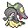

# 🧬 Gardewile

## Información

**Gardewile** es un [Pokémon híbrido](../../funciones/hibridos.md) de tipo [psíquico](https://www.wikidex.net/wiki/Tipo_psiquico)/[hada](https://www.wikidex.net/wiki/Tipo_Hada) introducido en la [Temporada Mística (1)](./). Es la fusión de Gardevoir y Mawile.

|                            **Artwork** |                                                                                      |
| -------------------------------------: | ------------------------------------------------------------------------------------------------------------------------------------------------ |
|                             **Sprite** |                                                                                |
| [Híbrido](../../funciones/hibridos.md) | Gardevoir y Mawile                                                                                                                               |
|                                  Tipos |                                        |
|                            Habilidades | 
<a href="https://www.wikidex.net/wiki/Potencia">Potencia</a> <a href="https://www.wikidex.net/wiki/Intimidaci%C3%B3n">Intimidación</a>
 |
|                            Hab. oculta | [Piel Feérica](https://www.wikidex.net/wiki/Piel_fe%C3%A9rica)                                                                                   |
|                             Creado por | FuriadaNoite y BonMurci                                                                                                                          |

### Descripción

Según artefactos antiguos, los nobles de la ciudad de Etheria solían vivir con este espécimen debido a su elegante personalidad.

### Comentario del desarrollador

La creación de este Pokémon se basó en el típico cuento de hadas donde un héroe enfrenta una amenaza y se casa con la princesa, es la pareja de Cerullade.

## Formas

Gardewile tiene varias formas disponibles que pueden ser cambios gracias a Modificadores de skin, u otras formas.

|     Forma    |                                           Sprite                                           |
| :----------: | :----------------------------------------------------------------------------------------: |
|    Normal    |                          |
|     Shiny    |              |
| San Valentín |  |
|    E-girl    |             |

## Obtención

Este es un Pokémon híbrido, que se obtiene de forma especial como se explica en: [🧬 Híbridos](../../funciones/hibridos.md)

## Características base

Las [características base](https://www.wikidex.net/wiki/Caracter%C3%ADsticas) de Gardewile son las siguientes:

| Estadística |  Valor  |
| :---------: | :-----: |
|      PS     |    63   |
|    Ataque   |    80   |
|   Defensa   |    90   |
|   At. esp   |   125   |
|   Def. esp  |   105   |
|  Velocidad  |   105   |
|  **Total**  | **463** |

## Movimientos

### Por nivel y de tutor



| Nivel |                             Movimiento                             |                             Tipo                            |
| :---: | :----------------------------------------------------------------: | :---------------------------------------------------------: |
|   1   |        [Gruñido](https://www.wikidex.net/wiki/Gru%C3%B1ido)        |        |
|   1   |       [Impresionar](https://www.wikidex.net/wiki/Impresionar)      |    |
|   1   |   [Campo de niebla](https://www.wikidex.net/wiki/Campo_de_niebla)  |            |
|   1   |        [Deseo cura](https://www.wikidex.net/wiki/Deseo_cura)       |    |
|   1   |           [Encanto](https://www.wikidex.net/wiki/Encanto)          |            |
|   1   |        [Pulso cura](https://www.wikidex.net/wiki/Pulso_cura)       |    |
|   1   |      [Doble equipo](https://www.wikidex.net/wiki/Doble_equipo)     |        |
|   1   |   [Voz cautivadora](https://www.wikidex.net/wiki/Voz_cautivadora)  |            |
|   1   |      [Confusión](https://www.wikidex.net/wiki/Confusi%C3%B3n)      |    |
|   4   | [Viento feérico](https://www.wikidex.net/wiki/Viento_fe%C3%A9rico) |            |
|   8   |            [Relevo](https://www.wikidex.net/wiki/Relevo)           |        |
|   12  |      [Fuerza lunar](https://www.wikidex.net/wiki/Fuerza_lunar)     |            |
|   16  |  [Brillo mágico](https://www.wikidex.net/wiki/Brillo_m%C3%A1gico)  |            |
|   20  | [Defensa férrea](https://www.wikidex.net/wiki/Defensa_f%C3%A9rrea) |          |
|   24  |          [Triturar](https://www.wikidex.net/wiki/Triturar)         |  |
|   28  |       [Psíquico](https://www.wikidex.net/wiki/Ps%C3%ADquico)       |    |
|   32  |  [Cabeza de hierro](https://www.wikidex.net/wiki/Cabeza_de_hierro) |          |
|   36  |        [Beso dulce](https://www.wikidex.net/wiki/Beso_dulce)       |            |
|   40  |    [Premonición](https://www.wikidex.net/wiki/Premonici%C3%B3n)    |    |
|   44  |      [Carantoña](https://www.wikidex.net/wiki/Caranto%C3%B1a)      |            |
|   48  |         [Luz lunar](https://www.wikidex.net/wiki/Luz_lunar)        |            |
|   52  |        [Paz mental](https://www.wikidex.net/wiki/Paz_mental)       |    |
|   56  |     [Psicocolmillo](https://www.wikidex.net/wiki/Psicocolmillo)    |    |
|   60  |             [Golpe bajo](https://www.wikidex.net/wiki/)            |  |



|                             Movimiento                             |                            Tipo                           |
| :----------------------------------------------------------------: | :-------------------------------------------------------: |
|  [Fuerza Expansiva](https://www.wikidex.net/wiki/Fuerza_Expansiva) |  |
|  [Niebla Explosiva](https://www.wikidex.net/wiki/Niebla_Explosiva) |          |
|       [Triple Axel](https://www.wikidex.net/wiki/Triple_Axel)      |        |
| [Meteoro Férreo](https://www.wikidex.net/wiki/Meteoro_F%C3%A9rreo) |        |



|                               Movimiento                              |                             Tipo                            |
| :-------------------------------------------------------------------: | :---------------------------------------------------------: |
|           [Embeleso](https://www.wikidex.net/wiki/Embeleso)           |        |
|         [Rayo Carga](https://www.wikidex.net/wiki/Rayo_Carga)         |  |
|        [Confidencia](https://www.wikidex.net/wiki/Confidencia)        |        |
|       [Contraataque](https://www.wikidex.net/wiki/Contraataque)       |          |
|       [Doble Equipo](https://www.wikidex.net/wiki/Doble_Equipo)       |        |
|         [Doble Filo](https://www.wikidex.net/wiki/Doble_Filo)         |        |
| [Puño Dinámico](https://www.wikidex.net/wiki/Pu%C3%B1o_Din%C3%A1mico) |          |
|            [Embargo](https://www.wikidex.net/wiki/Embargo)            |  |
|         [Golpe Bajo](https://www.wikidex.net/wiki/Golpe_Bajo)         |  |
|     [Puño Certero](https://www.wikidex.net/wiki/Pu%C3%B1o_Certero)    |          |
|      [Frustración](https://www.wikidex.net/wiki/Frustraci%C3%B3n)     |        |
|       [Golpe Cabeza](https://www.wikidex.net/wiki/Golpe_Cabeza)       |        |
|       [Poder Oculto](https://www.wikidex.net/wiki/Poder_Oculto)       |        |
|          [Incinerar](https://www.wikidex.net/wiki/Incinerar)          |          |
|            [Desarme](https://www.wikidex.net/wiki/Desarme)            |  |
|    [Enfoque Láser](https://www.wikidex.net/wiki/Enfoque_L%C3%A1ser)   |        |
|      [Última Baza](https://www.wikidex.net/wiki/%C3%9Altima_Baza)     |        |
|          [Levitón](https://www.wikidex.net/wiki/Levit%C3%B3n)         |  |
|  [Represión Metal](https://www.wikidex.net/wiki/Represi%C3%B3n_Metal) |          |
|         [Mimético](https://www.wikidex.net/wiki/Mim%C3%A9tico)        |        |
|     [Bofetón Lodo](https://www.wikidex.net/wiki/Bofet%C3%B3n_Lodo)    |        |
|        [Don Natural](https://www.wikidex.net/wiki/Don_Natural)        |        |
|       [Divide Dolor](https://www.wikidex.net/wiki/Divide_Dolor)       |    |
|    [Colmillo Veneno](https://www.wikidex.net/wiki/Colmillo_Veneno)    |        |
|       [Más Psique](https://www.wikidex.net/wiki/M%C3%A1s_Psique)      |        |
|            [Castigo](https://www.wikidex.net/wiki/Castigo)            |  |
|      [Retribución](https://www.wikidex.net/wiki/Retribuci%C3%B3n)     |        |
|         [Golpe Roca](https://www.wikidex.net/wiki/Golpe_Roca)         |          |
|     [Daño Secreto](https://www.wikidex.net/wiki/Da%C3%B1o_Secreto)    |        |
|              [Canto](https://www.wikidex.net/wiki/Canto)              |        |
|               [Robo](https://www.wikidex.net/wiki/Robo)               |  |
|             [Fuerza](https://www.wikidex.net/wiki/Fuerza)             |        |
|        [Superdiente](https://www.wikidex.net/wiki/Superdiente)        |        |
|           [Contoneo](https://www.wikidex.net/wiki/Contoneo)           |        |
|           [Tormento](https://www.wikidex.net/wiki/Tormento)           |  |
|           [Tóxico](https://www.wikidex.net/wiki/T%C3%B3xico)          |        |
|             [Agarre](https://www.wikidex.net/wiki/Agarre)             |        |



### MTs y DTs



|                                   Movimiento                                  |                             Tipo                            |
| :---------------------------------------------------------------------------: | :---------------------------------------------------------: |
|     [Puño Dinámico](https://www.wikidex.net/wiki/Pu%C3%B1o_Din%C3%A1mico)     |          |
|             [Megapatada](https://www.wikidex.net/wiki/Megapatada)             |        |
|           [Puño Fuego](https://www.wikidex.net/wiki/Pu%C3%B1o_Fuego)          |          |
|           [Puño Hielo](https://www.wikidex.net/wiki/Pu%C3%B1o_Hielo)          |          |
|          [Puño Trueno](https://www.wikidex.net/wiki/Pu%C3%B1o_Trueno)         |  |
|              [Hiperrayo](https://www.wikidex.net/wiki/Hiperrayo)              |        |
|           [Giga Impacto](https://www.wikidex.net/wiki/Giga_Impacto)           |        |
|          [Hoja Mágica](https://www.wikidex.net/wiki/Hoja_M%C3%A1gica)         |        |
|            [Onda Trueno](https://www.wikidex.net/wiki/Onda_Trueno)            |  |
|        [Pantalla de Luz](https://www.wikidex.net/wiki/Pantalla_de_Luz)        |    |
|                [Reflejo](https://www.wikidex.net/wiki/Reflejo)                |    |
|           [Velo Sagrado](https://www.wikidex.net/wiki/Velo_Sagrado)           |        |
|               [Descanso](https://www.wikidex.net/wiki/Descanso)               |    |
|               [Ladrón](https://www.wikidex.net/wiki/Ladr%C3%B3n)              |  |
|               [Ronquido](https://www.wikidex.net/wiki/Ronquido)               |        |
|           [Protección](https://www.wikidex.net/wiki/Protecci%C3%B3n)          |        |
|           [Viento Hielo](https://www.wikidex.net/wiki/Viento_Hielo)           |          |
|                [Encanto](https://www.wikidex.net/wiki/Encanto)                |            |
|            [Atracción](https://www.wikidex.net/wiki/Atracci%C3%B3n)           |        |
|           [Danza Lluvia](https://www.wikidex.net/wiki/Danza_Lluvia)           |            |
|          [Día Soleado](https://www.wikidex.net/wiki/D%C3%ADa_Soleado)         |          |
|            [Fuego Fatuo](https://www.wikidex.net/wiki/Fuego_Fatuo)            |          |
|                 [Imagen](https://www.wikidex.net/wiki/Imagen)                 |        |
|                [Rapidez](https://www.wikidex.net/wiki/Rapidez)                |        |
|             [Mano Amiga](https://www.wikidex.net/wiki/Mano_Amiga)             |        |
|            [Lanzamiento](https://www.wikidex.net/wiki/Lanzamiento)            |  |
|   [Intercambio de Poder](https://www.wikidex.net/wiki/Intercambio_de_Poder)   |    |
| [Intercambio de Defensa](https://www.wikidex.net/wiki/Intercambio_de_Defensa) |    |
|         [Sala de Trucos](https://www.wikidex.net/wiki/Sala_de_Trucos)         |    |
|         [Zona Extraña](https://www.wikidex.net/wiki/Zona_Extra%C3%B1a)        |    |
|          [Zona Mágica](https://www.wikidex.net/wiki/Zona_M%C3%A1gica)         |    |
|                  [Canon](https://www.wikidex.net/wiki/Canon)                  |        |
|           [Beso Drenaje](https://www.wikidex.net/wiki/Beso_Drenaje)           |            |
|        [Campo de Niebla](https://www.wikidex.net/wiki/Campo_de_Niebla)        |            |
|       [Campo Psíquico](https://www.wikidex.net/wiki/Campo_Ps%C3%ADquico)      |    |
|        [Fuego Místico](https://www.wikidex.net/wiki/Fuego_M%C3%ADstico)       |          |



|                                Movimiento                                |                             Tipo                            |
| :----------------------------------------------------------------------: | :---------------------------------------------------------: |
|         [Golpe Cuerpo](https://www.wikidex.net/wiki/Golpe_Cuerpo)        |        |
|                 [Rayo](https://www.wikidex.net/wiki/Rayo)                |  |
|          [Psíquico](https://www.wikidex.net/wiki/Ps%C3%ADquico)          |    |
|            [Sustituto](https://www.wikidex.net/wiki/Sustituto)           |        |
|          [Psicochoque](https://www.wikidex.net/wiki/Psicochoque)         |    |
|              [Aguante](https://www.wikidex.net/wiki/Aguante)             |        |
|         [Sonámbulo](https://www.wikidex.net/wiki/Son%C3%A1mbulo)         |        |
|             [Otra Vez](https://www.wikidex.net/wiki/Otra_Vez)            |        |
|          [Bola Sombra](https://www.wikidex.net/wiki/Bola_Sombra)         |    |
|       [Premonición](https://www.wikidex.net/wiki/Premonici%C3%B3n)       |    |
|                 [Mofa](https://www.wikidex.net/wiki/Mofa)                |  |
|                [Truco](https://www.wikidex.net/wiki/Truco)               |    |
|          [Intercambio](https://www.wikidex.net/wiki/Intercambio)         |    |
|          [Vozarrón](https://www.wikidex.net/wiki/Vozarr%C3%B3n)          |        |
|           [Paz Mental](https://www.wikidex.net/wiki/Paz_Mental)          |    |
|         [Onda Certera](https://www.wikidex.net/wiki/Onda_Certera)        |          |
|      [Bola Energía](https://www.wikidex.net/wiki/Bola_Energ%C3%ADa)      |        |
|         [Cabezazo Zen](https://www.wikidex.net/wiki/Cabezazo_Zen)        |    |
|          [Hierba Lazo](https://www.wikidex.net/wiki/Hierba_Lazo)         |        |
|        [Poder Reserva](https://www.wikidex.net/wiki/Poder_Reserva)       |    |
|          [Cambio Alia](https://www.wikidex.net/wiki/Cambio_Alia)         |    |
|     [Brillo Mágico](https://www.wikidex.net/wiki/Brillo_M%C3%A1gico)     |            |
|             [Triturar](https://www.wikidex.net/wiki/Triturar)            |  |
|     [Cabeza de Hierro](https://www.wikidex.net/wiki/Cabeza_de_Hierro)    |          |
|           [Juego Rudo](https://www.wikidex.net/wiki/Juego_Rudo)          |            |
|    [Defensa Férrea](https://www.wikidex.net/wiki/Defensa_F%C3%A9rrea)    |          |
|         [Esfera Aural](https://www.wikidex.net/wiki/Esfera_Aural)        |          |
| [Colmillo Psíquico](https://www.wikidex.net/wiki/Colmillo_Ps%C3%ADquico) |    |
|  [Cañón Destello](https://www.wikidex.net/wiki/Ca%C3%B1%C3%B3n_Destello) |          |



|                             Movimiento                             |                             Tipo                            |
| :----------------------------------------------------------------: | :---------------------------------------------------------: |
|              [Rayo](https://www.wikidex.net/wiki/Rayo)             |  |
|       [Psíquico](https://www.wikidex.net/wiki/Ps%C3%ADquico)       |    |
|         [Sustituto](https://www.wikidex.net/wiki/Sustituto)        |        |
|        [Psicocarga](https://www.wikidex.net/wiki/Psicocarga)       |    |
|           [Aguante](https://www.wikidex.net/wiki/Aguante)          |        |
|      [Sonámbulo](https://www.wikidex.net/wiki/Son%C3%A1mbulo)      |        |
|          [Otra vez](https://www.wikidex.net/wiki/Otra_vez)         |        |
|       [Bola sombra](https://www.wikidex.net/wiki/Bola_sombra)      |    |
|    [Premonición](https://www.wikidex.net/wiki/Premonici%C3%B3n)    |    |
|              [Mofa](https://www.wikidex.net/wiki/Mofa)             |  |
|             [Truco](https://www.wikidex.net/wiki/Truco)            |    |
|       [Intercambio](https://www.wikidex.net/wiki/Intercambio)      |    |
|       [Vozarrón](https://www.wikidex.net/wiki/Vozarr%C3%B3n)       |        |
|        [Paz mental](https://www.wikidex.net/wiki/Paz_mental)       |    |
|      [Onda certera](https://www.wikidex.net/wiki/Onda_certera)     |          |
|        [Energibola](https://www.wikidex.net/wiki/Energibola)       |        |
|      [Cabezazo zen](https://www.wikidex.net/wiki/Cabezazo_zen)     |    |
|       [Hierba lazo](https://www.wikidex.net/wiki/Hierba_lazo)      |        |
|      [Poder oculto](https://www.wikidex.net/wiki/Poder_oculto)     |        |
|   [Cambio de Banda](https://www.wikidex.net/wiki/Cambio_de_Banda)  |    |
|  [Brillo mágico](https://www.wikidex.net/wiki/Brillo_m%C3%A1gico)  |            |
|          [Triturar](https://www.wikidex.net/wiki/Triturar)         |  |
|  [Cabeza de hierro](https://www.wikidex.net/wiki/Cabeza_de_hierro) |          |
|      [Carantoña](https://www.wikidex.net/wiki/Caranto%C3%B1a)      |            |
|    [Disparo espejo](https://www.wikidex.net/wiki/Disparo_espejo)   |          |
| [Defensa férrea](https://www.wikidex.net/wiki/Defensa_f%C3%A9rrea) |          |
|        [Sombra vil](https://www.wikidex.net/wiki/Sombra_vil)       |  |
| [Viento feérico](https://www.wikidex.net/wiki/Viento_fe%C3%A9rico) |            |
|      [Fuerza lunar](https://www.wikidex.net/wiki/Fuerza_lunar)     |            |



|                                Movimiento                               |                             Tipo                            |
| :---------------------------------------------------------------------: | :---------------------------------------------------------: |
|          [Rayo Hielo](https://www.wikidex.net/wiki/Rayo_Hielo)          |          |
|           [Hiperrayo](https://www.wikidex.net/wiki/Hiperrayo)           |        |
|        [Protección](https://www.wikidex.net/wiki/Protecci%C3%B3n)       |        |
|        [Danza Lluvia](https://www.wikidex.net/wiki/Danza_Lluvia)        |            |
|       [Frustración](https://www.wikidex.net/wiki/Frustraci%C3%B3n)      |        |
|       [Retribución](https://www.wikidex.net/wiki/Retribuci%C3%B3n)      |        |
|         [Bola Sombra](https://www.wikidex.net/wiki/Bola_Sombra)         |    |
|        [Demolición](https://www.wikidex.net/wiki/Demolici%C3%B3n)       |          |
|        [Doble Equipo](https://www.wikidex.net/wiki/Doble_Equipo)        |        |
|         [Lanzallamas](https://www.wikidex.net/wiki/Lanzallamas)         |          |
|          [Bomba Lodo](https://www.wikidex.net/wiki/Bomba_Lodo)          |        |
|   [Tormenta de Arena](https://www.wikidex.net/wiki/Tormenta_de_Arena)   |            |
|           [Llamarada](https://www.wikidex.net/wiki/Llamarada)           |          |
|         [Tumba Rocas](https://www.wikidex.net/wiki/Tumba_Rocas)         |            |
|            [Tormento](https://www.wikidex.net/wiki/Tormento)            |  |
|              [Imagen](https://www.wikidex.net/wiki/Imagen)              |        |
|            [Descanso](https://www.wikidex.net/wiki/Descanso)            |    |
|         [Atracción](https://www.wikidex.net/wiki/Atracci%C3%B3n)        |        |
|               [Canon](https://www.wikidex.net/wiki/Canon)               |        |
|        [Onda Certera](https://www.wikidex.net/wiki/Onda_Certera)        |          |
|       [Falso Tortazo](https://www.wikidex.net/wiki/Falso_Tortazo)       |        |
|         [Lanzamiento](https://www.wikidex.net/wiki/Lanzamiento)         |  |
|          [Rayo Carga](https://www.wikidex.net/wiki/Rayo_Carga)          |  |
|       [Calcinación](https://www.wikidex.net/wiki/Calcinaci%C3%B3n)      |          |
|             [Embargo](https://www.wikidex.net/wiki/Embargo)             |  |
|            [Revancha](https://www.wikidex.net/wiki/Revancha)            |  |
|        [Giga Impacto](https://www.wikidex.net/wiki/Giga_Impacto)        |        |
|        [Roca Afilada](https://www.wikidex.net/wiki/Roca_Afilada)        |            |
|        [Danza Espada](https://www.wikidex.net/wiki/Danza_Espada)        |        |
|        [Más Psique](https://www.wikidex.net/wiki/M%C3%A1s_Psique)       |        |
|           [Avalancha](https://www.wikidex.net/wiki/Avalancha)           |            |
|         [Hierba Lazo](https://www.wikidex.net/wiki/Hierba_Lazo)         |        |
|            [Contoneo](https://www.wikidex.net/wiki/Contoneo)            |        |
|         [Sonámbulo](https://www.wikidex.net/wiki/Son%C3%A1mbulo)        |        |
|           [Sustituto](https://www.wikidex.net/wiki/Sustituto)           |        |
|    [Cañón Flash](https://www.wikidex.net/wiki/Ca%C3%B1%C3%B3n_Flash)    |          |
|      [Daño Secreto](https://www.wikidex.net/wiki/Da%C3%B1o_Secreto)     |        |
|      [Pulso Umbrío](https://www.wikidex.net/wiki/Pulso_Umbr%C3%ADo)     |  |
|   [Puño Incremento](https://www.wikidex.net/wiki/Pu%C3%B1o_Incremento)  |          |
|         [Confidencia](https://www.wikidex.net/wiki/Confidencia)         |        |
|                [Rayo](https://www.wikidex.net/wiki/Rayo)                |  |
|          [Psíquico](https://www.wikidex.net/wiki/Ps%C3%ADquico)         |    |
|           [Sustituto](https://www.wikidex.net/wiki/Sustituto)           |        |
|          [Psicocarga](https://www.wikidex.net/wiki/Psicocarga)          |    |
|             [Aguante](https://www.wikidex.net/wiki/Aguante)             |        |
|         [Sonámbulo](https://www.wikidex.net/wiki/Son%C3%A1mbulo)        |        |
|            [Otra Vez](https://www.wikidex.net/wiki/Otra_Vez)            |        |
|         [Bola Sombra](https://www.wikidex.net/wiki/Bola_Sombra)         |    |
|       [Premonición](https://www.wikidex.net/wiki/Premonici%C3%B3n)      |    |
|                [Mofa](https://www.wikidex.net/wiki/Mofa)                |  |
|               [Truco](https://www.wikidex.net/wiki/Truco)               |    |
| [Cambio de Habilidad](https://www.wikidex.net/wiki/Cambio_de_Habilidad) |    |
|          [Vozarrón](https://www.wikidex.net/wiki/Vozarr%C3%B3n)         |        |
|          [Paz mental](https://www.wikidex.net/wiki/Paz_mental)          |    |
|        [Onda certera](https://www.wikidex.net/wiki/Onda_certera)        |          |
|          [Energibola](https://www.wikidex.net/wiki/Energibola)          |        |
|        [Cabezazo zen](https://www.wikidex.net/wiki/Cabezazo_zen)        |    |
|         [Hierba lazo](https://www.wikidex.net/wiki/Hierba_lazo)         |        |
|       [Poder reserva](https://www.wikidex.net/wiki/Poder_reserva)       |    |
|     [Cambio de banda](https://www.wikidex.net/wiki/Cambio_de_banda)     |    |
|     [Brillo mágico](https://www.wikidex.net/wiki/Brillo_m%C3%A1gico)    |            |
|            [Triturar](https://www.wikidex.net/wiki/Triturar)            |  |
|    [Cabeza de hierro](https://www.wikidex.net/wiki/Cabeza_de_hierro)    |          |
|         [Carantoña](https://www.wikidex.net/wiki/Caranto%C3%B1a)        |            |
|      [Disparo espejo](https://www.wikidex.net/wiki/Disparo_espejo)      |          |
|    [Defensa férrea](https://www.wikidex.net/wiki/Defensa_f%C3%A9rrea)   |          |
|    [Viento feérico](https://www.wikidex.net/wiki/Viento_fe%C3%A9rico)   |            |
|        [Fuerza lunar](https://www.wikidex.net/wiki/Fuerza_lunar)        |            |



|                                Movimiento                               |                             Tipo                            |
| :---------------------------------------------------------------------: | :---------------------------------------------------------: |
|          [Rayo Hielo](https://www.wikidex.net/wiki/Rayo_Hielo)          |          |
|           [Hiperrayo](https://www.wikidex.net/wiki/Hiperrayo)           |        |
|        [Protección](https://www.wikidex.net/wiki/Protecci%C3%B3n)       |        |
|        [Danza Lluvia](https://www.wikidex.net/wiki/Danza_Lluvia)        |            |
|       [Frustración](https://www.wikidex.net/wiki/Frustraci%C3%B3n)      |        |
|       [Retribución](https://www.wikidex.net/wiki/Retribuci%C3%B3n)      |        |
|         [Bola Sombra](https://www.wikidex.net/wiki/Bola_Sombra)         |    |
|        [Demolición](https://www.wikidex.net/wiki/Demolici%C3%B3n)       |          |
|        [Doble Equipo](https://www.wikidex.net/wiki/Doble_Equipo)        |        |
|         [Lanzallamas](https://www.wikidex.net/wiki/Lanzallamas)         |          |
|          [Bomba Lodo](https://www.wikidex.net/wiki/Bomba_Lodo)          |        |
|   [Tormenta de Arena](https://www.wikidex.net/wiki/Tormenta_de_Arena)   |            |
|           [Llamarada](https://www.wikidex.net/wiki/Llamarada)           |          |
|         [Tumba Rocas](https://www.wikidex.net/wiki/Tumba_Rocas)         |            |
|            [Tormento](https://www.wikidex.net/wiki/Tormento)            |  |
|              [Imagen](https://www.wikidex.net/wiki/Imagen)              |        |
|            [Descanso](https://www.wikidex.net/wiki/Descanso)            |    |
|         [Atracción](https://www.wikidex.net/wiki/Atracci%C3%B3n)        |        |
|               [Canon](https://www.wikidex.net/wiki/Canon)               |        |
|        [Onda Certera](https://www.wikidex.net/wiki/Onda_Certera)        |          |
|       [Falso Tortazo](https://www.wikidex.net/wiki/Falso_Tortazo)       |        |
|         [Lanzamiento](https://www.wikidex.net/wiki/Lanzamiento)         |  |
|          [Rayo Carga](https://www.wikidex.net/wiki/Rayo_Carga)          |  |
|       [Calcinación](https://www.wikidex.net/wiki/Calcinaci%C3%B3n)      |          |
|             [Embargo](https://www.wikidex.net/wiki/Embargo)             |  |
|            [Revancha](https://www.wikidex.net/wiki/Revancha)            |  |
|        [Giga Impacto](https://www.wikidex.net/wiki/Giga_Impacto)        |        |
|        [Roca Afilada](https://www.wikidex.net/wiki/Roca_Afilada)        |            |
|        [Danza Espada](https://www.wikidex.net/wiki/Danza_Espada)        |        |
|        [Más Psique](https://www.wikidex.net/wiki/M%C3%A1s_Psique)       |        |
|           [Avalancha](https://www.wikidex.net/wiki/Avalancha)           |            |
|         [Hierba Lazo](https://www.wikidex.net/wiki/Hierba_Lazo)         |        |
|            [Contoneo](https://www.wikidex.net/wiki/Contoneo)            |        |
|         [Sonámbulo](https://www.wikidex.net/wiki/Son%C3%A1mbulo)        |        |
|           [Sustituto](https://www.wikidex.net/wiki/Sustituto)           |        |
|    [Cañón Flash](https://www.wikidex.net/wiki/Ca%C3%B1%C3%B3n_Flash)    |          |
|      [Daño Secreto](https://www.wikidex.net/wiki/Da%C3%B1o_Secreto)     |        |
|      [Pulso Umbrío](https://www.wikidex.net/wiki/Pulso_Umbr%C3%ADo)     |  |
|   [Puño Incremento](https://www.wikidex.net/wiki/Pu%C3%B1o_Incremento)  |          |
|         [Confidencia](https://www.wikidex.net/wiki/Confidencia)         |        |
|                [Rayo](https://www.wikidex.net/wiki/Rayo)                |  |
|          [Psíquico](https://www.wikidex.net/wiki/Ps%C3%ADquico)         |    |
|           [Sustituto](https://www.wikidex.net/wiki/Sustituto)           |        |
|          [Psicocarga](https://www.wikidex.net/wiki/Psicocarga)          |    |
|             [Aguante](https://www.wikidex.net/wiki/Aguante)             |        |
|         [Sonámbulo](https://www.wikidex.net/wiki/Son%C3%A1mbulo)        |        |
|            [Otra Vez](https://www.wikidex.net/wiki/Otra_Vez)            |        |
|         [Bola Sombra](https://www.wikidex.net/wiki/Bola_Sombra)         |    |
|       [Premonición](https://www.wikidex.net/wiki/Premonici%C3%B3n)      |    |
|                [Mofa](https://www.wikidex.net/wiki/Mofa)                |  |
|               [Truco](https://www.wikidex.net/wiki/Truco)               |    |
| [Cambio de Habilidad](https://www.wikidex.net/wiki/Cambio_de_Habilidad) |    |
|          [Vozarrón](https://www.wikidex.net/wiki/Vozarr%C3%B3n)         |        |
|          [Paz Mental](https://www.wikidex.net/wiki/Paz_Mental)          |    |
|        [Onda Certera](https://www.wikidex.net/wiki/Onda_Certera)        |          |
|          [Energibola](https://www.wikidex.net/wiki/Energibola)          |        |
|        [Cabezazo Zen](https://www.wikidex.net/wiki/Cabezazo_Zen)        |    |
|         [Hierba Lazo](https://www.wikidex.net/wiki/Hierba_Lazo)         |        |
|       [Poder Reserva](https://www.wikidex.net/wiki/Poder_Reserva)       |    |
|        [Cambio Banda](https://www.wikidex.net/wiki/Cambio_Banda)        |    |
|     [Brillo Mágico](https://www.wikidex.net/wiki/Brillo_M%C3%A1gico)    |            |
|            [Triturar](https://www.wikidex.net/wiki/Triturar)            |  |
|    [Cabeza de Hierro](https://www.wikidex.net/wiki/Cabeza_de_Hierro)    |          |
|         [Carantoña](https://www.wikidex.net/wiki/Caranto%C3%B1a)        |            |
|      [Disparo Espejo](https://www.wikidex.net/wiki/Disparo_Espejo)      |          |
|    [Defensa Férrea](https://www.wikidex.net/wiki/Defensa_F%C3%A9rrea)   |          |
|          [Golpe Bajo](https://www.wikidex.net/wiki/Golpe_Bajo)          |  |
|    [Viento Feérico](https://www.wikidex.net/wiki/Viento_Fe%C3%A9rico)   |            |
|        [Fuerza Lunar](https://www.wikidex.net/wiki/Fuerza_Lunar)        |            |



|                                Movimiento                               |                             Tipo                            |
| :---------------------------------------------------------------------: | :---------------------------------------------------------: |
|          [Rayo Hielo](https://www.wikidex.net/wiki/Rayo_Hielo)          |          |
|           [Hiperrayo](https://www.wikidex.net/wiki/Hiperrayo)           |        |
|        [Protección](https://www.wikidex.net/wiki/Protecci%C3%B3n)       |        |
|        [Danza Lluvia](https://www.wikidex.net/wiki/Danza_Lluvia)        |            |
|       [Frustración](https://www.wikidex.net/wiki/Frustraci%C3%B3n)      |        |
|       [Retribución](https://www.wikidex.net/wiki/Retribuci%C3%B3n)      |        |
|         [Bola Sombra](https://www.wikidex.net/wiki/Bola_Sombra)         |    |
|        [Demolición](https://www.wikidex.net/wiki/Demolici%C3%B3n)       |          |
|        [Doble Equipo](https://www.wikidex.net/wiki/Doble_Equipo)        |        |
|         [Lanzallamas](https://www.wikidex.net/wiki/Lanzallamas)         |          |
|          [Bomba Lodo](https://www.wikidex.net/wiki/Bomba_Lodo)          |        |
|   [Tormenta de Arena](https://www.wikidex.net/wiki/Tormenta_de_Arena)   |            |
|           [Llamarada](https://www.wikidex.net/wiki/Llamarada)           |          |
|         [Tumba Rocas](https://www.wikidex.net/wiki/Tumba_Rocas)         |            |
|            [Tormento](https://www.wikidex.net/wiki/Tormento)            |  |
|              [Imagen](https://www.wikidex.net/wiki/Imagen)              |        |
|      [Daño Secreto](https://www.wikidex.net/wiki/Da%C3%B1o_Secreto)     |        |
|            [Descanso](https://www.wikidex.net/wiki/Descanso)            |    |
|         [Atracción](https://www.wikidex.net/wiki/Atracci%C3%B3n)        |        |
|        [Onda Certera](https://www.wikidex.net/wiki/Onda_Certera)        |          |
|         [Lanzamiento](https://www.wikidex.net/wiki/Lanzamiento)         |  |
|          [Rayo Carga](https://www.wikidex.net/wiki/Rayo_Carga)          |  |
|             [Aguante](https://www.wikidex.net/wiki/Aguante)             |        |
|             [Embargo](https://www.wikidex.net/wiki/Embargo)             |  |
|            [Revancha](https://www.wikidex.net/wiki/Revancha)            |  |
|        [Giga Impacto](https://www.wikidex.net/wiki/Giga_Impacto)        |        |
|        [Danza Espada](https://www.wikidex.net/wiki/Danza_Espada)        |        |
|      [Pulso Umbrío](https://www.wikidex.net/wiki/Pulso_Umbr%C3%ADo)     |  |
|           [Avalancha](https://www.wikidex.net/wiki/Avalancha)           |            |
|         [Sonámbulo](https://www.wikidex.net/wiki/Son%C3%A1mbulo)        |        |
|         [Don Natural](https://www.wikidex.net/wiki/Don_Natural)         |        |
|         [Hierba Lazo](https://www.wikidex.net/wiki/Hierba_Lazo)         |        |
|            [Contoneo](https://www.wikidex.net/wiki/Contoneo)            |        |
|           [Sustituto](https://www.wikidex.net/wiki/Sustituto)           |        |
|    [Cañón Flash](https://www.wikidex.net/wiki/Ca%C3%B1%C3%B3n_Flash)    |          |
|          [Paz Mental](https://www.wikidex.net/wiki/Paz_Mental)          |    |
|                [Rayo](https://www.wikidex.net/wiki/Rayo)                |  |
|          [Psíquico](https://www.wikidex.net/wiki/Ps%C3%ADquico)         |    |
|           [Sustituto](https://www.wikidex.net/wiki/Sustituto)           |        |
|          [Psicocarga](https://www.wikidex.net/wiki/Psicocarga)          |    |
|             [Aguante](https://www.wikidex.net/wiki/Aguante)             |        |
|         [Sonámbulo](https://www.wikidex.net/wiki/Son%C3%A1mbulo)        |        |
|            [Otra Vez](https://www.wikidex.net/wiki/Otra_Vez)            |        |
|         [Bola Sombra](https://www.wikidex.net/wiki/Bola_Sombra)         |    |
|       [Premonición](https://www.wikidex.net/wiki/Premonici%C3%B3n)      |    |
|                [Mofa](https://www.wikidex.net/wiki/Mofa)                |  |
|               [Truco](https://www.wikidex.net/wiki/Truco)               |    |
| [Cambio de Habilidad](https://www.wikidex.net/wiki/Cambio_de_Habilidad) |    |
|          [Vozarrón](https://www.wikidex.net/wiki/Vozarr%C3%B3n)         |        |
|        [Onda Certera](https://www.wikidex.net/wiki/Onda_Certera)        |          |
|          [Energibola](https://www.wikidex.net/wiki/Energibola)          |        |
|         [Lanzamiento](https://www.wikidex.net/wiki/Lanzamiento)         |  |
|          [Rayo Carga](https://www.wikidex.net/wiki/Rayo_Carga)          |  |
|        [Giga Impacto](https://www.wikidex.net/wiki/Giga_Impacto)        |        |
|            [Destello](https://www.wikidex.net/wiki/Destello)            |        |
|         [Onda Trueno](https://www.wikidex.net/wiki/Onda_Trueno)         |  |
|        [Más Psique](https://www.wikidex.net/wiki/M%C3%A1s_Psique)       |        |
|        [Comesueños](https://www.wikidex.net/wiki/Comesue%C3%B1os)       |    |
|         [Hierba Lazo](https://www.wikidex.net/wiki/Hierba_Lazo)         |        |
|            [Contoneo](https://www.wikidex.net/wiki/Contoneo)            |        |
|           [Sustituto](https://www.wikidex.net/wiki/Sustituto)           |        |
|       [Sala de Truco](https://www.wikidex.net/wiki/Sala_de_Truco)       |    |



|                            Movimiento                           |                             Tipo                            |
| :-------------------------------------------------------------: | :---------------------------------------------------------: |
|      [Paz mental](https://www.wikidex.net/wiki/Paz_mental)      |    |
|        [Tóxico](https://www.wikidex.net/wiki/T%C3%B3xico)       |        |
|    [Poder oculto](https://www.wikidex.net/wiki/Poder_oculto)    |        |
|   [Día soleado](https://www.wikidex.net/wiki/D%C3%ADa_soleado)  |          |
|            [Mofa](https://www.wikidex.net/wiki/Mofa)            |  |
|       [Hiperrayo](https://www.wikidex.net/wiki/Hiperrayo)       |        |
| [Pantalla de luz](https://www.wikidex.net/wiki/Pantalla_de_luz) |    |
|    [Protección](https://www.wikidex.net/wiki/Protecci%C3%B3n)   |        |
|    [Danza lluvia](https://www.wikidex.net/wiki/Danza_lluvia)    |            |
|    [Velo sagrado](https://www.wikidex.net/wiki/Velo_sagrado)    |        |
|   [Frustración](https://www.wikidex.net/wiki/Frustraci%C3%B3n)  |        |
|            [Rayo](https://www.wikidex.net/wiki/Rayo)            |  |
|   [Retribución](https://www.wikidex.net/wiki/Retribuci%C3%B3n)  |        |
|      [Psíquico](https://www.wikidex.net/wiki/Ps%C3%ADquico)     |    |
|     [Bola sombra](https://www.wikidex.net/wiki/Bola_sombra)     |    |
|    [Doble equipo](https://www.wikidex.net/wiki/Doble_equipo)    |        |
|         [Reflejo](https://www.wikidex.net/wiki/Reflejo)         |    |
|     [Onda voltio](https://www.wikidex.net/wiki/Onda_voltio)     |  |
|        [Tormento](https://www.wikidex.net/wiki/Tormento)        |  |
|          [Imagen](https://www.wikidex.net/wiki/Imagen)          |        |
|  [Daño secreto](https://www.wikidex.net/wiki/Da%C3%B1o_secreto) |        |
|        [Descanso](https://www.wikidex.net/wiki/Descanso)        |    |
|     [Atracción](https://www.wikidex.net/wiki/Atracci%C3%B3n)    |        |
|        [Ladrón](https://www.wikidex.net/wiki/Ladr%C3%B3n)       |  |
|     [Intercambio](https://www.wikidex.net/wiki/Intercambio)     |    |
|            [Robo](https://www.wikidex.net/wiki/Robo)            |  |


