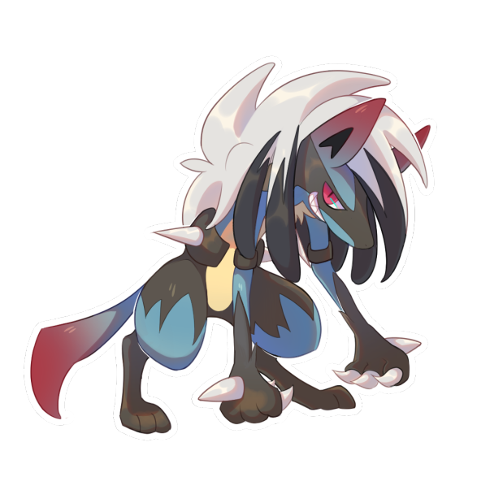
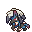
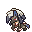
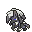
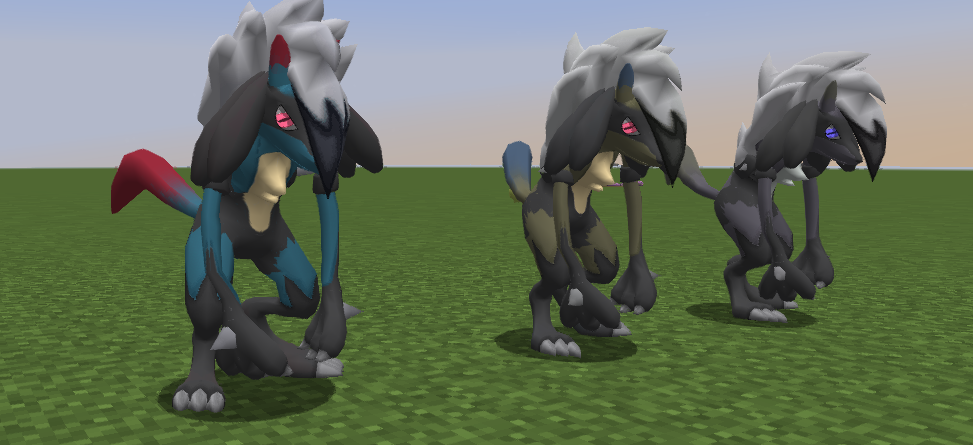

# 🧬 Lycario

## Información

**Gardewile** es un [Pokémon híbrido](../../funciones/hibridos.md) de tipo [lucha](https://www.wikidex.net/wiki/Tipo_lucha)/[roca](https://www.wikidex.net/wiki/Tipo_roca) introducido en la [Temporada Mística (1)](./). Es la fusión de Lucario y Lycanroc.

|                     **Artwork** |                                                                                     |
| ------------------------------: | -------------------------------------------------------------------------------------------------------------------------------------- |
|                      **Sprite** |                                                           |
| [Híbrido](#) | Lopunny y Zoroark                                                                                                                     |
|                           Tipos |          |
|                     Habilidades | [Vista lince](https://www.wikidex.net/wiki/Vista_lince) [Espíritu vital](https://www.wikidex.net/wiki/Espíritu_vital) |
|                     Hab. oculta | [Indefenso](https://www.wikidex.net/wiki/Indefenso)                                                                       |
|                      Creado por | FuriadaNoite y BonMurci                                                                                                                |

### Descripcion
Los jóvenes que deambulan por la noche a menudo confunden a este espécimen con la leyenda del hombre lobo, cautivados por su aura misteriosa y su presencia enigmática.

### Comentario del desarrollador
La creación de este Pokémon se basó en el típico cuento de hadas donde un héroe enfrenta una amenaza y se casa con la princesa.

## Formas

|  Forma |                                            Sprite                                           |
| :----: | :-----------------------------------------------------------------------------------------: |
| Normal |                |
|  Shiny |    |
| Spirit |  |

## Obtención

Este es un Pokémon híbrido, que se obtiene de forma especial como se explica en: [🧬 Híbridos](../../funciones/hibridos.md)

## Características base

Las [características base](https://www.wikidex.net/wiki/Caracter%C3%ADsticas) de Lycario son las siguientes:

| Estadística |  Valor  |
| :---------: | :-----: |
|      PS     |    75   |
|    Ataque   |    115   |
|   Defensa   |    65   |
|   At. esp   |   55   |
|   Def. esp  |   65   |
|  Velocidad  |   112   |
|  **Total**  | **487** |

## Movimientos

### Por nivel y de tutor



| Nivel | Movimiento | Tipo |
| :-----: | :----------: | :----: |
| 1 | [Roca veloz](https://www.wikidex.net/wiki/Roca_veloz) |  |
| 1 | [Doble equipo](https://www.wikidex.net/wiki/Doble_equipo) |  |
| 1 | [Malicioso](https://www.wikidex.net/wiki/Malicioso) |  |
| 1 | [Ataque rápido](https://www.wikidex.net/wiki/Ataque_rápido) |  |
| 1 | [Anticipo](https://www.wikidex.net/wiki/Anticipo) |  |
| 1 | [Ataque arena](https://www.wikidex.net/wiki/Ataque_arena) |  |
| 1 | [Golpe bajo](https://www.wikidex.net/wiki/Golpe_bajo) |  |
| 1 | [Placaje](https://www.wikidex.net/wiki/Placaje) |  |
| 1 | [Golpe roca](https://www.wikidex.net/wiki/Golpe_roca) |  |
| 1 | [Onda vacío](https://www.wikidex.net/wiki/Onda_vacío) |  |
| 1 | [Sacrificio](https://www.wikidex.net/wiki/Sacrificio) |  |
| 1 | [Garra metal](https://www.wikidex.net/wiki/Garra_metal) |  |
| 1 | [Inversión](https://www.wikidex.net/wiki/Inversión) |  |
| 1 | [Mach Punch](https://www.wikidex.net/wiki/Mach_Punch) |  |
| 5 | [Garra metal](https://www.wikidex.net/wiki/Garra_metal) |  |
| 9 | [Mordisco](https://www.wikidex.net/wiki/Mordisco) |  |
| 13 | [Contraataque](https://www.wikidex.net/wiki/Contraataque) |  |
| 17 | [Lanzarrocas](https://www.wikidex.net/wiki/Lanzarrocas) |  |
| 21 | [Palmeo](https://www.wikidex.net/wiki/Palmeo) |  |
| 25 | [Danza espada](https://www.wikidex.net/wiki/Danza_espada) |  |
| 29 | [Avalancha](https://www.wikidex.net/wiki/Avalancha) |  |
| 33 | [Puño incremento](https://www.wikidex.net/wiki/Puño_incremento) |  |
| 37 | [A bocajarro](https://www.wikidex.net/wiki/A_bocajarro) |  |
| 41 | [Roca veloz](https://www.wikidex.net/wiki/Roca_veloz) |  |
| 45 | [Roca afilada](https://www.wikidex.net/wiki/Roca_afilada) |  |
| 49 | [Triturar](https://www.wikidex.net/wiki/Triturar) |  |
| 53 | [Esfera aural](https://www.wikidex.net/wiki/Esfera_aural) |  |
| 57 | [Velocidad extrema](https://www.wikidex.net/wiki/Velocidad_extrema) |  |
| 69 | [Cabeza de hierro](https://www.wikidex.net/wiki/Cabeza_de_hierro) |  |



| Movimiento | Tipo |
| :----------: | :----: |
| [Antojo](https://www.wikidex.net/wiki/Antojo) |  |
| [Golpe Bis](https://www.wikidex.net/wiki/Golpe_Bis) |  |
| [Tierra Viva](https://www.wikidex.net/wiki/Tierra_Viva) |  |
| [Esfuerzo](https://www.wikidex.net/wiki/Esfuerzo) |  |
| [Puño Fuego](https://www.wikidex.net/wiki/Pu%C3%B1o_Fuego) |  |
| [Puño Certero](https://www.wikidex.net/wiki/Pu%C3%B1o_Certero) |  |
| [Juego Sucio](https://www.wikidex.net/wiki/Juego_Sucio) |  |
| [Hiperrayo](https://www.wikidex.net/wiki/Hiperrayo) |  |
| [Defensa Férrea](https://www.wikidex.net/wiki/Defensa_F%C3%A9rrea) |  |
| [Cabeza de Hierro](https://www.wikidex.net/wiki/Cabeza_de_Hierro) |  |
| [Cola Férrea](https://www.wikidex.net/wiki/Cola_F%C3%A9rrea) |  |
| [Punto Límite](https://www.wikidex.net/wiki/Punto_L%C3%ADmite) |  |
| [Última Baza](https://www.wikidex.net/wiki/%C3%9Altima_Baza) |  |
| [Enfado](https://www.wikidex.net/wiki/Enfado) |  |
| [Ronquido](https://www.wikidex.net/wiki/Ronquido) |  |
| [Trampa Rocas](https://www.wikidex.net/wiki/Trampa_Rocas) |  |
| [Pataleta](https://www.wikidex.net/wiki/Pataleta) |  |
| [Golpe Bajo](https://www.wikidex.net/wiki/Golpe_Bajo) |  |
| [Puño Trueno](https://www.wikidex.net/wiki/Pu%C3%B1o_Trueno) |  |
| [Alboroto](https://www.wikidex.net/wiki/Alboroto) |  |
| [Cabezazo Zen](https://www.wikidex.net/wiki/Cabezazo_Zen) |  |
| [Refuerzo](https://www.wikidex.net/wiki/Refuerzo) |  |
| [Metaláser](https://www.wikidex.net/wiki/Metal%C3%A1ser) |  |
| [Pulso de Campo](https://www.wikidex.net/wiki/Pulso_de_Campo) |  |



| Movimiento | Tipo |
| :----------: | :----: |
| [Seducción](https://www.wikidex.net/wiki/Seducción) |  |
| [Antojo](https://www.wikidex.net/wiki/Antojo) |  |
| [Garra Brutal](https://www.wikidex.net/wiki/Garra_Brutal) |  |
| [Eco Voz](https://www.wikidex.net/wiki/Eco_Voz) |  |
| [Frustración](https://www.wikidex.net/wiki/Frustraci%C3%B3n) |  |
| [Poder Oculto](https://www.wikidex.net/wiki/Poder_Oculto) |  |
| [Rastreo](https://www.wikidex.net/wiki/Rastreo) |  |
| [Retribución](https://www.wikidex.net/wiki/Retribuci%C3%B3n) |  |
| [Treparrocas](https://www.wikidex.net/wiki/Treparrocas) |  |
| [Pulimento](https://www.wikidex.net/wiki/Pulimento) |  |
| [Contoneo](https://www.wikidex.net/wiki/Contoneo) |  |
| [Tóxico](https://www.wikidex.net/wiki/T%C3%B3xico) |  |
| [Doble Equipo](https://www.wikidex.net/wiki/Doble_Equipo) |  |
| [Golpe Bis](https://www.wikidex.net/wiki/Golpe_Bis) |  |
| [Puño Certero](https://www.wikidex.net/wiki/Pu%C3%B1o_Certero) |  |
| [Sígueme](https://www.wikidex.net/wiki/S%C3%ADgueme) |  |
| [Profecía](https://www.wikidex.net/wiki/Profec%C3%ADa) |  |
| [Imitación](https://www.wikidex.net/wiki/Imitaci%C3%B3n) |  |
| [Corte Furia](https://www.wikidex.net/wiki/Corte_Furia) |  |
| [Golpe Cabeza](https://www.wikidex.net/wiki/Golpe_Cabeza) |  |
| [Afilagarras](https://www.wikidex.net/wiki/Afilagarras) |  |
| [Levitón](https://www.wikidex.net/wiki/Levit%C3%B3n) |  |
| [Anticipo](https://www.wikidex.net/wiki/Anticipo) |  |
| [Bofetón Lodo](https://www.wikidex.net/wiki/Bofet%C3%B3n_Lodo) |  |
| [Don Natural](https://www.wikidex.net/wiki/Don_Natural) |  |
| [Rugido](https://www.wikidex.net/wiki/Rugido) |  |
| [Daño Secreto](https://www.wikidex.net/wiki/Da%C3%B1o_Secreto) |  |
| [Gancho Alto](https://www.wikidex.net/wiki/Gancho_Alto) |  |
| [Fuerza](https://www.wikidex.net/wiki/Fuerza) |  |



### MTs y DTs



| Movimiento | Tipo |
| :----------: | :----: |
| [Giga Impacto](https://www.wikidex.net/wiki/Giga_Impacto) |  |
| [Descanso](https://www.wikidex.net/wiki/Descanso) |  |
| [Avalancha](https://www.wikidex.net/wiki/Avalancha) |  |
| [Ronquido](https://www.wikidex.net/wiki/Ronquido) |  |
| [Protección](https://www.wikidex.net/wiki/Protecci%C3%B3n) |  |
| [Cara Susto](https://www.wikidex.net/wiki/Cara_Susto) |  |
| [Atracción](https://www.wikidex.net/wiki/Atracci%C3%B3n) |  |
| [Tormenta Arena](https://www.wikidex.net/wiki/Tormenta_Arena) |  |
| [Imagen](https://www.wikidex.net/wiki/Imagen) |  |
| [Golpe Roca](https://www.wikidex.net/wiki/Golpe_Roca) |  |
| [Tumba Rocas](https://www.wikidex.net/wiki/Tumba_Rocas) |  |
| [Pedrada](https://www.wikidex.net/wiki/Pedrada) |  |
| [Buena Baza](https://www.wikidex.net/wiki/Buena_Baza) |  |
| [Colmillo Trueno](https://www.wikidex.net/wiki/Colmillo_Trueno) |  |
| [Colmillo Ígneo](https://www.wikidex.net/wiki/Colmillo_%C3%8Dgneo) |  |
| [Canto](https://www.wikidex.net/wiki/Canto) |  |
| [Planta Feroz](https://www.wikidex.net/wiki/Planta_Feroz) |  |
| [Alarido](https://www.wikidex.net/wiki/Alarido) |  |
| [Pataleta](https://www.wikidex.net/wiki/Pataleta) |  |
| [Danza Lluvia](https://www.wikidex.net/wiki/Danza_Lluvia) |  |
| [Día Soleado](https://www.wikidex.net/wiki/D%C3%ADa_Soleado) |  |
| [Mano Amiga](https://www.wikidex.net/wiki/Mano_Amiga) |  |
| [Revancha](https://www.wikidex.net/wiki/Revancha) |  |
| [Vendetta](https://www.wikidex.net/wiki/Vendetta) |  |
| [Lanzamiento](https://www.wikidex.net/wiki/Lanzamiento) |  |
| [Puño Drenaje](https://www.wikidex.net/wiki/Pu%C3%B1o_Drenaje) |  |
| [Garra Umbría](https://www.wikidex.net/wiki/Garra_Umbr%C3%ADa) |  |
| [Golpe Bajo](https://www.wikidex.net/wiki/Golpe_Bajo) |  |
| [Represalia](https://www.wikidex.net/wiki/Represalia) |  |
| [Terratemblor](https://www.wikidex.net/wiki/Terratemblor) |  |



| Movimiento | Tipo |
| :----------: | :----: |
| [Danza Espada](https://www.wikidex.net/wiki/Danza_Espada) |  |
| [Agilidad](https://www.wikidex.net/wiki/Agilidad) |  |
| [Sustituto](https://www.wikidex.net/wiki/Sustituto) |  |
| [Aguante](https://www.wikidex.net/wiki/Aguante) |  |
| [Sonámbulo](https://www.wikidex.net/wiki/Son%C3%A1mbulo) |  |
| [Cola Férrea](https://www.wikidex.net/wiki/Cola_F%C3%A9rrea) |  |
| [Triturar](https://www.wikidex.net/wiki/Triturar) |  |
| [Mofa](https://www.wikidex.net/wiki/Mofa) |  |
| [Vozarrón](https://www.wikidex.net/wiki/Vozarr%C3%B3n) |  |
| [Defensa Férrea](https://www.wikidex.net/wiki/Defensa_F%C3%A9rrea) |  |
| [Corpulencia](https://www.wikidex.net/wiki/Corpulencia) |  |
| [A Bocajarro](https://www.wikidex.net/wiki/A_Bocajarro) |  |
| [Tierra Viva](https://www.wikidex.net/wiki/Tierra_Viva) |  |
| [Cabezazo Zen](https://www.wikidex.net/wiki/Cabezazo_Zen) |  |
| [Cabeza de Hierro](https://www.wikidex.net/wiki/Cabeza_de_Hierro) |  |
| [Roca Afilada](https://www.wikidex.net/wiki/Roca_Afilada) |  |
| [Trampa Rocas](https://www.wikidex.net/wiki/Trampa_Rocas) |  |
| [Taladradora](https://www.wikidex.net/wiki/Taladradora) |  |
| [Carantoña](https://www.wikidex.net/wiki/Caranto%C3%B1a) |  |
| [Ps Colmillo](https://www.wikidex.net/wiki/Ps_colmillo) |  |
| [Patada Baja](https://www.wikidex.net/wiki/Patada_Baja) |  |
| [Terremoto](https://www.wikidex.net/wiki/Terremoto) |  |
| [Psíquico](https://www.wikidex.net/wiki/Ps%C3%ADquico) |  |
| [Concentración](https://www.wikidex.net/wiki/Concentraci%C3%B3n) |  |
| [Inversión](https://www.wikidex.net/wiki/Inversi%C3%B3n) |  |
| [Bola Sombra](https://www.wikidex.net/wiki/Bola_Sombra) |  |
| [Patada Ígnea](https://www.wikidex.net/wiki/Patada_%C3%8Dgnea) |  |
| [Paz Mental](https://www.wikidex.net/wiki/Paz_Mental) |  |
| [Esfera Aural](https://www.wikidex.net/wiki/Esfera_Aural) |  |
| [Puya Nociva](https://www.wikidex.net/wiki/Puya_Nociva) |  |
| [Pulso Umbrío](https://www.wikidex.net/wiki/Pulso_Umbr%C3%ADo) |  |
| [Pulso Dragón](https://www.wikidex.net/wiki/Pulso_Drag%C3%B3n) |  |
| [Foco Resplandor](https://www.wikidex.net/wiki/Foco_Resplandor) |  |
| [Maquinación](https://www.wikidex.net/wiki/Maquinaci%C3%B3n) |  |
| [Cañón Destello](https://www.wikidex.net/wiki/Ca%C3%B1%C3%B3n_Destello) |  |
| [Doble Filo](https://www.wikidex.net/wiki/Doble_Filo) |  |



| Movimiento | Tipo |
| :----------: | :----: |
| [Rugido](https://www.wikidex.net/wiki/Rugido) |  |
| [Tóxico](https://www.wikidex.net/wiki/T%C3%B3xico) |  |
| [Corpulencia](https://www.wikidex.net/wiki/Corpulencia) |  |
| [Poder Oculto](https://www.wikidex.net/wiki/Poder_Oculto) |  |
| [Mofa](https://www.wikidex.net/wiki/Mofa) |  |
| [Protección](https://www.wikidex.net/wiki/Protecci%C3%B3n) |  |
| [Frustración](https://www.wikidex.net/wiki/Frustraci%C3%B3n) |  |
| [Retribución](https://www.wikidex.net/wiki/Retribuci%C3%B3n) |  |
| [Demolición](https://www.wikidex.net/wiki/Demolici%C3%B3n) |  |
| [Doble Equipo](https://www.wikidex.net/wiki/Doble_Equipo) |  |
| [Tumba Rocas](https://www.wikidex.net/wiki/Tumba_Rocas) |  |
| [Imagen](https://www.wikidex.net/wiki/Imagen) |  |
| [Descanso](https://www.wikidex.net/wiki/Descanso) |  |
| [Atracción](https://www.wikidex.net/wiki/Atracci%C3%B3n) |  |
| [Canto](https://www.wikidex.net/wiki/Canto) |  |
| [Eco Metálico](https://www.wikidex.net/wiki/Eco_Met%C3%A1lico) |  |
| [Pulimento](https://www.wikidex.net/wiki/Pulimento) |  |
| [Roca Afilada](https://www.wikidex.net/wiki/Roca_Afilada) |  |
| [Danza Espada](https://www.wikidex.net/wiki/Danza_Espada) |  |
| [Avalancha](https://www.wikidex.net/wiki/Avalancha) |  |
| [Contoneo](https://www.wikidex.net/wiki/Contoneo) |  |
| [Habla Dormida](https://www.wikidex.net/wiki/Habla_Dormida) |  |
| [Sustituto](https://www.wikidex.net/wiki/Sustituto) |  |
| [Alarido](https://www.wikidex.net/wiki/Alarido) |  |
| [Confidencia](https://www.wikidex.net/wiki/Confidencia) |  |
| [Avivar](https://www.wikidex.net/wiki/Avivar) |  |
| [Paz Mental](https://www.wikidex.net/wiki/Paz_Mental) |  |
| [Día Soleado](https://www.wikidex.net/wiki/D%C3%ADa_Soleado) |  |
| [Hiperrayo](https://www.wikidex.net/wiki/Hiperrayo) |  |
| [Danza Lluvia](https://www.wikidex.net/wiki/Danza_Lluvia) |  |
| [Terremoto](https://www.wikidex.net/wiki/Terremoto) |  |
| [Psíquico](https://www.wikidex.net/wiki/Ps%C3%ADquico) |  |
| [Bola Sombra](https://www.wikidex.net/wiki/Bola_Sombra) |  |
| [Golpe Bajo](https://www.wikidex.net/wiki/Golpe_Bajo) |  |
| [Onda Certera](https://www.wikidex.net/wiki/Onda_Certera) |  |
| [Lanzamiento](https://www.wikidex.net/wiki/Lanzamiento) |  |
| [Garra Umbría](https://www.wikidex.net/wiki/Garra_Umbr%C3%ADa) |  |
| [Revancha](https://www.wikidex.net/wiki/Revancha) |  |
| [Giga Impacto](https://www.wikidex.net/wiki/Giga_Impacto) |  |
| [Terratemblor](https://www.wikidex.net/wiki/Terratemblor) |  |
| [Puya Nociva](https://www.wikidex.net/wiki/Puya_Nociva) |  |
| [Foco Resplandor](https://www.wikidex.net/wiki/Foco_Resplandor) |  |
| [Pulso Umbrío](https://www.wikidex.net/wiki/Pulso_Umbr%C3%ADo) |  |



