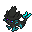
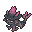
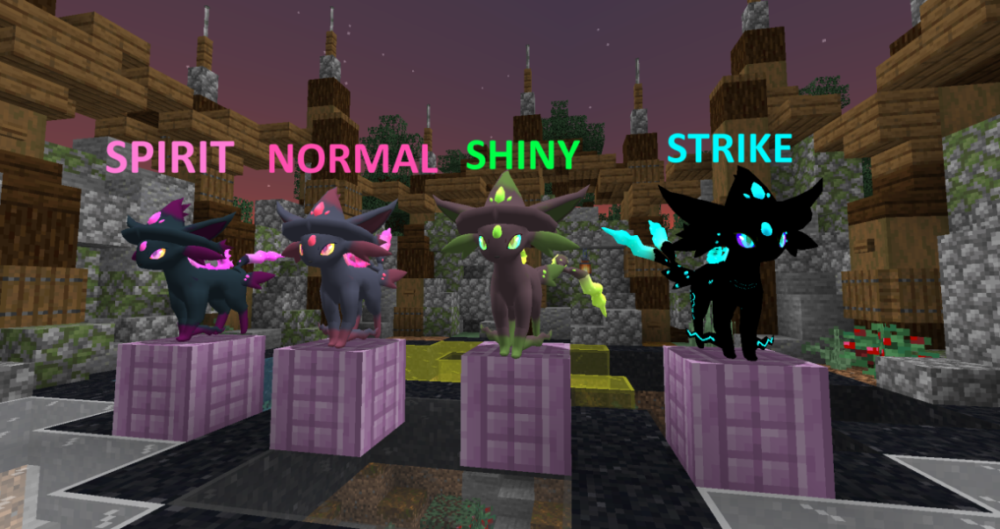

# 🧬 Mismapeon

## Información

**Mismapeon** es un [Pokémon híbrido](hibrido-mismapeon.md) de tipo [psíquico](https://www.wikidex.net/wiki/Tipo\_ps%C3%ADquico)/[fantasma](https://www.wikidex.net/wiki/Tipo\_fantasma) introducido en la [Temporada Mística (1)](./). Es la fusión de Mismagius y Espeon.

|                     **Artwork** |                                                                                     |
| ------------------------------: | -------------------------------------------------------------------------------------------------------------------------------------- |
|                      **Sprite** |                                                           |
| [Híbrido](hibrido-mismapeon.md) | Mismagius y Espeon                                                                                                                     |
|                           Tipos |          |
|                     Habilidades | 
<a href="https://www.wikidex.net/wiki/Sincron%C3%ADa">Sincronía</a> <a href="https://www.wikidex.net/wiki/Filtro">Filtro</a>
 |
|                     Hab. oculta | [Espejo mágico](https://www.wikidex.net/wiki/Espejo\_m%C3%A1gic)                                                                       |
|                      Creado por | FuriadaNoite y BonMurci                                                                                                                |

Las leyendas cuentan que el poder de este majestuoso espécimen viene de las estrellas. En las noches claras, es común verlos mirando al cielo en busca de constelaciones.

## Formas

Mismapeon tiene varias formas disponibles que pueden ser cambios gracias a Modificadores de skin, u otras formas.

|  Forma |                                            Sprite                                           |
| :----: | :-----------------------------------------------------------------------------------------: |
| Normal |                |
|  Shiny |    |
| Strike |  |
| Spirit |  |

## Obtención

_No disponible por el momento_

## Características base

Las [características base](https://www.wikidex.net/wiki/Caracter%C3%ADsticas) de Mismapeon son las siguientes:

| Estadística |  Valor  |
| :---------: | :-----: |
|      PS     |    65   |
|    Ataque   |    60   |
|   Defensa   |    60   |
|   At. esp   |   130   |
|   Def. esp  |   100   |
|  Velocidad  |   110   |
|  **Total**  | **525** |

## Movimientos

### Por nivel y de tutor



| Nivel | Movimiento | Tipo |
| :-----: | :----------: | :----: |
| 1 | Relevo |  |
| 1 | Mordisco |  |
| 1 | Encanto |  |
| 1 | Confusión |  |
| 1 | Copión |  |
| 1 | Antojo |  |
| 1 | Doble filo |  |
| 1 | Gruñido |  |
| 1 | Refuerzo |  |
| 1 | Placaje |  |
| 1 | Látigo |  |
| 1 | Derribo |  |
| 1 | Infortunio |  |
| 5 | Ataque arena |  |
| 10 | Sombra vil |  |
| 25 | Psíquico |  |
| 32 | Bola sombra |  |
| 35 | Cambiafuerza |  |
| 40 | Deseo |  |
| 45 | Hipnosis |  |
| 50 | Golpe fantasma |  |
| 55 | Hoja mágica |  |
| 60 | Premonición |  |
| 65 | Brillo mágico |  |



| Movimiento | Tipo |
| :----------: | :----: |
| Celebración |  |
| Vozarrón |  |
| Ronquido |  |
| Capa mágica |  |
| Zona mágica |  |
| Viento hielo |  |
| Cascabel cura |  |
| Telequinesis |  |
| Truco |  |
| Vasta fuerza |  |
| Venganza |  |
| Seducción |  |
| Confidencia |  |
| Corte |  |
| Doble equipo |  |
| Comesueños |  |
| Eco voz |  |
| Destello |  |
| Frustración |  |
| Golpe cabeza |  |
| Poder oculto |  |
| Aguzar |  |
| Capa mágica |  |
| Mimético |  |
| Don natural |  |
| Pesadilla |  |
| Furia |  |
| Retribución |  |
| Rayo señal |  |
| Canto |  |
| Cabezazo |  |
| Contoneo |  |
| Sincrorruido |  |
| Telequinesis |  |
| As oculto |  |



### MTs y DTs



| Movimiento | Tipo |
| :----------: | :----: |
| Paz mental |  |
| Tóxico |  |
| Poder oculto |  |
| Día soleado |  |
| Hiperrayo |  |
| Protección |  |
| Danza lluvia |  |
| Psíquico |  |
| Bola sombra |  |
| Doble equipo |  |
| Descanso |  |
| Atracción |  |
| Canon |  |
| Gigaimpacto |  |
| Autosugestión |  |
| Comesueños |  |
| Contoneo |  |
| Sonámbulo |  |
| Sustituto |  |
| Espacio raro |  |
| Brillo mágico |  |



| Movimiento | Tipo |
| :----------: | :----: |
| Golpe cuerpo |  |
| Psíquico |  |
| Foco energía |  |
| Sustituto |  |
| Psicocarga |  |
| Aguante |  |
| Sonámbulo |  |
| Relevo |  |
| Cola férrea |  |
| Premonición |  |
| Bola sombra |  |
| Truco |  |
| Intercambio |  |
| Vozarrón |  |
| Paz mental |  |
| Cabezazo zen |  |
| Hierba lazo |  |
| Poder reserva |  |
| Cambio de banda |  |
| Avivar |  |
| Brillo mágico |  |
| Psicocolmillo |  |



