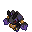
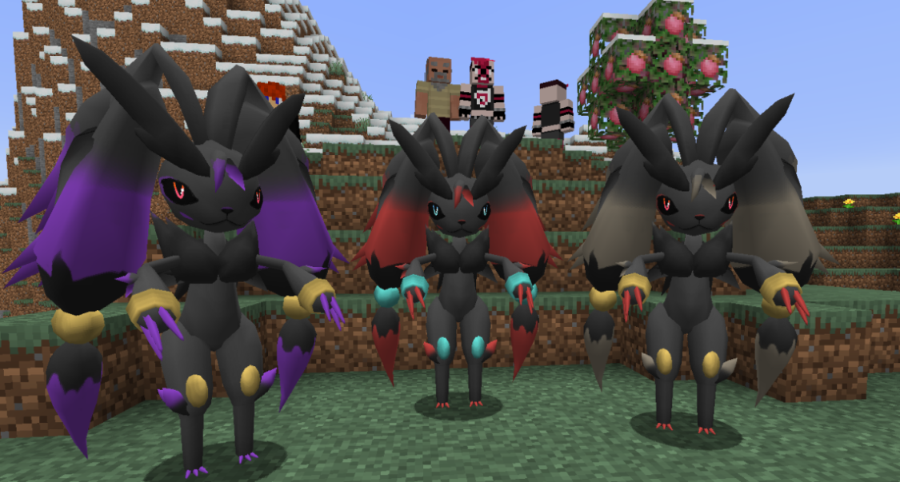

# 🧬 Zoropunny

## Información

**Gardewile** es un [Pokémon híbrido](../../funciones/hibridos.md) de tipo [siniestro](https://www.wikidex.net/wiki/Tipo_siniestro)/[lucha](https://www.wikidex.net/wiki/Tipo_lucha) introducido en la [Temporada Mística (1)](./). Es la fusión de Gardevoir y Mawile.

|                     **Artwork** |                                                                                     |
| ------------------------------: | -------------------------------------------------------------------------------------------------------------------------------------- |
|                      **Sprite** |                                                           |
| [Híbrido](#) | Lopunny y Zoroark                                                                                                                     |
|                           Tipos |          |
|                     Habilidades | [Flexibilidad](https://www.wikidex.net/wiki/Flexibilidad)|
|                     Hab. oculta | [Ilusión](https://www.wikidex.net/wiki/Ilusión)                                                                       |
|                      Creado por | FuriadaNoite y BonMurci                                                                                                                |

Reconocido por ser un excelente cazador, este espécimen engaña a sus presas y gana su confianza. Cuando se dan cuenta, ya es tarde.

## Formas

|  Forma |                                            Sprite                                           |
| :----: | :-----------------------------------------------------------------------------------------: |
| Normal |                |
|  Shiny |    |
| Muerte |  |

## Obtención

Este es un Pokémon híbrido, que se obtiene de forma especial como se explica en: [🧬 Híbridos](../../funciones/hibridos.md)

## Características base

Las [características base](https://www.wikidex.net/wiki/Caracter%C3%ADsticas) de Zoropunny son las siguientes:

| Estadística |  Valor  |
| :---------: | :-----: |
|      PS     |    65   |
|    Ataque   |    115   |
|   Defensa   |    75   |
|   At. esp   |   115   |
|   Def. esp  |   75   |
|  Velocidad  |   105   |
|  **Total**  | **550** |

## Movimientos

### Por nivel y de tutor



| Nivel | Movimiento | Tipo |
| :-----: | :----------: | :----: |
| 1 | Gruñido |  |
| 1 | Impresionar |  |
| 1 | Campo de niebla |  |
| 1 | Deseo cura |  |
| 1 | Encanto |  |
| 1 | Pulso cura |  |
| 1 | Doble equipo |  |
| 1 | Voz cautivadora |  |
| 1 | Confusión |  |
| 4 | Viento feérico |  |
| 8 | Relevo |  |
| 12 | Fuerza lunar |  |
| 16 | Brillo mágico |  |
| 20 | Defensa férrea |  |
| 24 | Triturar |  |
| 28 | Psíquico |  |
| 32 | Cabeza de hierro |  |
| 36 | Beso dulce |  |
| 40 | Premonición |  |
| 44 | Carantoña |  |
| 48 | Luz lunar |  |
| 52 | Paz mental |  |
| 56 | Psicocolmillo |  |
| 60 | Golpe bajo |  |



| Movimiento | Tipo |
| :----------: | :----: |
| [Triple Axel](https://www.wikidex.net/wiki/Triple_Axel) |  |
| [Envidia ardiente](https://www.wikidex.net/wiki/Envidia_ardiente) |  |
| [Desahogo](https://www.wikidex.net/wiki/Desahogo) |  |
| [Golpe rastrero](https://www.wikidex.net/wiki/Golpe_rastrero) |  |



| Movimiento | Tipo |
| :----------: | :----: |
| [Cautivar](https://www.wikidex.net/wiki/Cautivar)         |       |
| [Rayo Carga](https://www.wikidex.net/wiki/Rayo_Carga)       | |
| [Confidencia](https://www.wikidex.net/wiki/Confidencia)      |       |
| [Antojo](https://www.wikidex.net/wiki/)           |       |
| [Puño Mareo](https://www.wikidex.net/wiki/Puño_Mareo)       |       |
| [Esfuerzo](https://www.wikidex.net/wiki/Esfuerzo)         |       |
| [Profecía](https://www.wikidex.net/wiki/Profecía)         |       |
| [Corte Furia](https://www.wikidex.net/wiki/Corte_Furia)      |         |
| [Patada Salto](https://www.wikidex.net/wiki/Patada_Salto)    |         |
| [Enfoque Láser](https://www.wikidex.net/wiki/Enfoque_Láser)    |       |
| [Bofetón Lodo](https://www.wikidex.net/wiki/Bofetón_Lodo)     |       |
| [Puño Incremento](https://www.wikidex.net/wiki/Puño_Incremento)  |         |
| [Retribución](https://www.wikidex.net/wiki/Retribución)      |       |
| [Poder Secreto](https://www.wikidex.net/wiki/Poder_Secreto)    |       |
| [Onda Voltio](https://www.wikidex.net/wiki/Onda_Voltio)      | |
| [Contoneo](https://www.wikidex.net/wiki/Contoneo)         |       |
| [Tóxico](https://www.wikidex.net/wiki/Tóxico)           |       |
| [Golpe Aéreo](https://www.wikidex.net/wiki/Golpe_Aéreo)      |     |
| [Embargo](https://www.wikidex.net/wiki/Embargo)          | |
| [Ataque Finta](https://www.wikidex.net/wiki/Ataque_Finta)     | |
| [Más Psique](https://www.wikidex.net/wiki/Más_Psique)       |       |
| [Castigo](https://www.wikidex.net/wiki/Castigo)          | |
| [Persecución](https://www.wikidex.net/wiki/Persecución)      | |
| [Rugido](https://www.wikidex.net/wiki/Rugido)           |       |
| [Robo](https://www.wikidex.net/wiki/Robo)             | |
| [Rencor](https://www.wikidex.net/wiki/Rencor)           |   |



### MTs y DTs



| Movimiento | Tipo |
| :----------: | :----: |
| [Puño Dinámico](https://www.wikidex.net/wiki/Pu%C3%B1o_Din%C3%A1mico) |  |
| [Megapatada](https://www.wikidex.net/wiki/Megapatada) |  |
| [Puño Fuego](https://www.wikidex.net/wiki/Pu%C3%B1o_Fuego) |  |
| [Puño Hielo](https://www.wikidex.net/wiki/Pu%C3%B1o_Hielo) |  |
| [Puño Trueno](https://www.wikidex.net/wiki/Pu%C3%B1o_Trueno) |  |
| [Hiperrayo](https://www.wikidex.net/wiki/Hiperrayo) |  |
| [Giga Impacto](https://www.wikidex.net/wiki/Giga_Impacto) |  |
| [Rayo Solar](https://www.wikidex.net/wiki/Rayo_Solar) |  |
| [Onda Trueno](https://www.wikidex.net/wiki/Onda_Trueno) |  |
| [Excavar](https://www.wikidex.net/wiki/Excavar) |  |
| [Descanso](https://www.wikidex.net/wiki/Descanso) |  |
| [Ronquido](https://www.wikidex.net/wiki/Ronquido) |  |
| [Protección](https://www.wikidex.net/wiki/Protección) |  |
| [Encanto](https://www.wikidex.net/wiki/Encanto) |  |
| [Atracción](https://www.wikidex.net/wiki/Atracción) |  |
| [Danza Lluvia](https://www.wikidex.net/wiki/Danza_Lluvia) |  |
| [Día Soleado](https://www.wikidex.net/wiki/D%C3%ADa_Soleado) |  |
| [Imagen](https://www.wikidex.net/wiki/Imagen) |  |
| [Rapidez](https://www.wikidex.net/wiki/Rapidez) |  |
| [Mano Amiga](https://www.wikidex.net/wiki/Mano_Amiga) |  |
| [Llanto Falso](https://www.wikidex.net/wiki/Llanto_Falso) |  |
| [Bote](https://www.wikidex.net/wiki/Bote) |  |
| [Ida y Vuelta](https://www.wikidex.net/wiki/Ida_y_Vuelta) |  |
| [Revancha](https://www.wikidex.net/wiki/Revancha) |  |
| [Buena Baza](https://www.wikidex.net/wiki/Buena_Baza) |  |
| [Lanzamiento](https://www.wikidex.net/wiki/Lanzamiento) |  |
| [Puño Drenaje](https://www.wikidex.net/wiki/Pu%C3%B1o_Drenaje) |  |
| [Puntapié](https://www.wikidex.net/wiki/Puntapi%C3%A9) |  |
| [Redonda](https://www.wikidex.net/wiki/Redonda) |  |
| [Acróbata](https://www.wikidex.net/wiki/Acr%C3%B3bata) |  |
| [Desquite](https://www.wikidex.net/wiki/Desquite) |  |
| [Giro Vil](https://www.wikidex.net/wiki/Giro_Vil) |  |
| [Ladrón](https://www.wikidex.net/wiki/Ladr%C3%B3n) |  |
| [Cara Susto](https://www.wikidex.net/wiki/Cara_Susto) |  |
| [Desquite](https://www.wikidex.net/wiki/Desquite) |  |
| [Cerca](https://www.wikidex.net/wiki/Cerca) |  |
| [Garra Umbría](https://www.wikidex.net/wiki/Garra_Umbr%C3%ADa) |  |
| [Infortunio](https://www.wikidex.net/wiki/Infortunio) |  |
| [Alarido](https://www.wikidex.net/wiki/Alarido) |  |



| Movimiento | Tipo |
| :----------: | :----: |
| [Bola Sombra](https://www.wikidex.net/wiki/Bola_Sombra) |  |
| [Carantoña](https://www.wikidex.net/wiki/Caranto%C3%B1a) |  |
| [Danza Espada](https://www.wikidex.net/wiki/Danza_Espada) |  |
| [Sustituto](https://www.wikidex.net/wiki/Sustituto) |  |
| [Aguante](https://www.wikidex.net/wiki/Aguante) |  |
| [Sonámbulo](https://www.wikidex.net/wiki/Son%C3%A1mbulo) |  |
| [Otra Vez](https://www.wikidex.net/wiki/Otra_Vez) |  |
| [Bola Sombra](https://www.wikidex.net/wiki/Bola_Sombra) |  |
| [Mofa](https://www.wikidex.net/wiki/Mofa) |  |
| [Pulso Umbrío](https://www.wikidex.net/wiki/Pulso_Umbr%C3%ADo) |  |
| [Maquinación](https://www.wikidex.net/wiki/Maquinaci%C3%B3n) |  |
| [Onda Certera](https://www.wikidex.net/wiki/Onda_Certera) |  |
| [Juego Sucio](https://www.wikidex.net/wiki/Juego_Sucio) |  |
| [Golpe Bajo](https://www.wikidex.net/wiki/Golpe_Bajo) |  |



| Movimiento | Tipo |
| :----------: | :----: |
| [Puño Dinámico](https://www.wikidex.net/wiki/Pu%C3%B1o_Din%C3%A1mico) |  |
| [Megapatada](https://www.wikidex.net/wiki/Megapatada) |  |
| [Hiperrayo](https://www.wikidex.net/wiki/Hiperrayo) |  |
| [Giga Impacto](https://www.wikidex.net/wiki/Giga_Impacto) |  |
| [Rayo Solar](https://www.wikidex.net/wiki/Rayo_Solar) |  |
| [Onda Trueno](https://www.wikidex.net/wiki/Onda_Trueno) |  |
| [Excavar](https://www.wikidex.net/wiki/Excavar) |  |
| [Descanso](https://www.wikidex.net/wiki/Descanso) |  |
| [Ronquido](https://www.wikidex.net/wiki/Ronquido) |  |
| [Protección](https://www.wikidex.net/wiki/Protección) |  |
| [Encanto](https://www.wikidex.net/wiki/Encanto) |  |
| [Atracción](https://www.wikidex.net/wiki/Atracción) |  |
| [Danza Lluvia](https://www.wikidex.net/wiki/Danza_Lluvia) |  |
| [Día Soleado](https://www.wikidex.net/wiki/D%C3%ADa_Soleado) |  |
| [Imagen](https://www.wikidex.net/wiki/Imagen) |  |
| [Rapidez](https://www.wikidex.net/wiki/Rapidez) |  |
| [Mano Amiga](https://www.wikidex.net/wiki/Mano_Amiga) |  |
| [Llanto Falso](https://www.wikidex.net/wiki/Llanto_Falso) |  |
| [Bote](https://www.wikidex.net/wiki/Bote) |  |
| [Ida y Vuelta](https://www.wikidex.net/wiki/Ida_y_Vuelta) |  |
| [Revancha](https://www.wikidex.net/wiki/Revancha) |  |
| [Buena Baza](https://www.wikidex.net/wiki/Buena_Baza) |  |
| [Lanzamiento](https://www.wikidex.net/wiki/Lanzamiento) |  |
| [Puño Drenaje](https://www.wikidex.net/wiki/Pu%C3%B1o_Drenaje) |  |
| [Puntapié](https://www.wikidex.net/wiki/Puntapi%C3%A9) |  |
| [Redonda](https://www.wikidex.net/wiki/Redonda) |  |
| [Acróbata](https://www.wikidex.net/wiki/Acr%C3%B3bata) |  |
| [Desquite](https://www.wikidex.net/wiki/Desquite) |  |
| [Giro Vil](https://www.wikidex.net/wiki/Giro_Vil) |  |
| [Ladrón](https://www.wikidex.net/wiki/Ladr%C3%B3n) |  |
| [Cara Susto](https://www.wikidex.net/wiki/Cara_Susto) |  |
| [Represalia](https://www.wikidex.net/wiki/Represalia) |  |
| [Cerca](https://www.wikidex.net/wiki/Cerca) |  |
| [Garra Umbría](https://www.wikidex.net/wiki/Garra_Umbr%C3%ADa) |  |
| [Infortunio](https://www.wikidex.net/wiki/Infortunio) |  |
| [Alarido](https://www.wikidex.net/wiki/Alarido) |  |



| Movimiento | Tipo |
| :----------: | :----: |
| [Puño Dinámico](https://www.wikidex.net/wiki/Pu%C3%B1o_Din%C3%A1mico) |  |
| [Megapatada](https://www.wikidex.net/wiki/Megapatada) |  |
| [Hiperrayo](https://www.wikidex.net/wiki/Hiperrayo) |  |
| [Giga Impacto](https://www.wikidex.net/wiki/Giga_Impacto) |  |
| [Rayo Solar](https://www.wikidex.net/wiki/Rayo_Solar) |  |
| [Onda Trueno](https://www.wikidex.net/wiki/Onda_Trueno) |  |
| [Excavar](https://www.wikidex.net/wiki/Excavar) |  |
| [Descanso](https://www.wikidex.net/wiki/Descanso) |  |
| [Ronquido](https://www.wikidex.net/wiki/Ronquido) |  |
| [Protección](https://www.wikidex.net/wiki/Protección) |  |
| [Encanto](https://www.wikidex.net/wiki/Encanto) |  |
| [Atracción](https://www.wikidex.net/wiki/Atracción) |  |
| [Danza Lluvia](https://www.wikidex.net/wiki/Danza_Lluvia) |  |
| [Día Soleado](https://www.wikidex.net/wiki/D%C3%ADa_Soleado) |  |
| [Imagen](https://www.wikidex.net/wiki/Imagen) |  |
| [Rapidez](https://www.wikidex.net/wiki/Rapidez) |  |
| [Mano Amiga](https://www.wikidex.net/wiki/Mano_Amiga) |  |
| [Llanto Falso](https://www.wikidex.net/wiki/Llanto_Falso) |  |
| [Bote](https://www.wikidex.net/wiki/Bote) |  |
| [Ida y Vuelta](https://www.wikidex.net/wiki/Ida_y_Vuelta) |  |
| [Revancha](https://www.wikidex.net/wiki/Revancha) |  |
| [Buena Baza](https://www.wikidex.net/wiki/Buena_Baza) |  |
| [Lanzamiento](https://www.wikidex.net/wiki/Lanzamiento) |  |
| [Puño Drenaje](https://www.wikidex.net/wiki/Pu%C3%B1o_Drenaje) |  |
| [Puntapié](https://www.wikidex.net/wiki/Puntapi%C3%A9) |  |
| [Redonda](https://www.wikidex.net/wiki/Redonda) |  |
| [Acróbata](https://www.wikidex.net/wiki/Acr%C3%B3bata) |  |
| [Desquite](https://www.wikidex.net/wiki/Desquite) |  |
| [Giro Vil](https://www.wikidex.net/wiki/Giro_Vil) |  |
| [Ladrón](https://www.wikidex.net/wiki/Ladr%C3%B3n) |  |
| [Cara Susto](https://www.wikidex.net/wiki/Cara_Susto) |  |
| [Represalia](https://www.wikidex.net/wiki/Represalia) |  |
| [Cerca](https://www.wikidex.net/wiki/Cerca) |  |
| [Garra Umbría](https://www.wikidex.net/wiki/Garra_Umbr%C3%ADa) |  |
| [Infortunio](https://www.wikidex.net/wiki/Infortunio) |  |
| [Alarido](https://www.wikidex.net/wiki/Alarido) |  |



| Movimiento | Tipo |
| :----------: | :----: |
| [Hiperrayo](https://www.wikidex.net/wiki/Hiperrayo) |  |
| [Giga Impacto](https://www.wikidex.net/wiki/Giga_Impacto) |  |
| [Onda Trueno](https://www.wikidex.net/wiki/Onda_Trueno) |  |
| [Excavar](https://www.wikidex.net/wiki/Excavar) |  |
| [Descanso](https://www.wikidex.net/wiki/Descanso) |  |
| [Ronquido](https://www.wikidex.net/wiki/Ronquido) |  |
| [Protección](https://www.wikidex.net/wiki/Protección) |  |
| [Encanto](https://www.wikidex.net/wiki/Encanto) |  |
| [Atracción](https://www.wikidex.net/wiki/Atracción) |  |
| [Danza Lluvia](https://www.wikidex.net/wiki/Danza_Lluvia) |  |
| [Día Soleado](https://www.wikidex.net/wiki/D%C3%ADa_Soleado) |  |
| [Imagen](https://www.wikidex.net/wiki/Imagen) |  |
| [Rapidez](https://www.wikidex.net/wiki/Rapidez) |  |
| [Mano Amiga](https://www.wikidex.net/wiki/Mano_Amiga) |  |
| [Llanto Falso](https://www.wikidex.net/wiki/Llanto_Falso) |  |
| [Bote](https://www.wikidex.net/wiki/Bote) |  |
| [Ida y Vuelta](https://www.wikidex.net/wiki/Ida_y_Vuelta) |  |
| [Revancha](https://www.wikidex.net/wiki/Revancha) |  |
| [Buena Baza](https://www.wikidex.net/wiki/Buena_Baza) |  |
| [Lanzamiento](https://www.wikidex.net/wiki/Lanzamiento) |  |
| [Puntapié](https://www.wikidex.net/wiki/Puntapi%C3%A9) |  |
| [Redonda](https://www.wikidex.net/wiki/Redonda) |  |
| [Desquite](https://www.wikidex.net/wiki/Desquite) |  |
| [Ladrón](https://www.wikidex.net/wiki/Ladr%C3%B3n) |  |
| [Cara Susto](https://www.wikidex.net/wiki/Cara_Susto) |  |
| [Garra Umbría](https://www.wikidex.net/wiki/Garra_Umbr%C3%ADa) |  |
| [Alarido](https://www.wikidex.net/wiki/Alarido) |  |



| Movimiento | Tipo |
| :----------: | :----: |
| [Hiperrayo](https://www.wikidex.net/wiki/Hiperrayo) |  |
| [Giga Impacto](https://www.wikidex.net/wiki/Giga_Impacto) |  |
| [Onda Trueno](https://www.wikidex.net/wiki/Onda_Trueno) |  |
| [Excavar](https://www.wikidex.net/wiki/Excavar) |  |
| [Descanso](https://www.wikidex.net/wiki/Descanso) |  |
| [Ronquido](https://www.wikidex.net/wiki/Ronquido) |  |
| [Protección](https://www.wikidex.net/wiki/Protección) |  |
| [Encanto](https://www.wikidex.net/wiki/Encanto) |  |
| [Atracción](https://www.wikidex.net/wiki/Atracción) |  |
| [Danza Lluvia](https://www.wikidex.net/wiki/Danza_Lluvia) |  |
| [Día Soleado](https://www.wikidex.net/wiki/D%C3%ADa_Soleado) |  |
| [Imagen](https://www.wikidex.net/wiki/Imagen) |  |
| [Rapidez](https://www.wikidex.net/wiki/Rapidez) |  |
| [Mano Amiga](https://www.wikidex.net/wiki/Mano_Amiga) |  |
| [Llanto Falso](https://www.wikidex.net/wiki/Llanto_Falso) |  |
| [Bote](https://www.wikidex.net/wiki/Bote) |  |
| [Ida y Vuelta](https://www.wikidex.net/wiki/Ida_y_Vuelta) |  |
| [Revancha](https://www.wikidex.net/wiki/Revancha) |  |
| [Buena Baza](https://www.wikidex.net/wiki/Buena_Baza) |  |
| [Lanzamiento](https://www.wikidex.net/wiki/Lanzamiento) |  |
| [Puntapié](https://www.wikidex.net/wiki/Puntapi%C3%A9) |  |
| [Redonda](https://www.wikidex.net/wiki/Redonda) |  |
| [Desquite](https://www.wikidex.net/wiki/Desquite) |  |
| [Ladrón](https://www.wikidex.net/wiki/Ladr%C3%B3n) |  |
| [Cara Susto](https://www.wikidex.net/wiki/Cara_Susto) |  |
| [Garra Umbría](https://www.wikidex.net/wiki/Garra_Umbr%C3%ADa) |  |
| [Alarido](https://www.wikidex.net/wiki/Alarido) |  |



