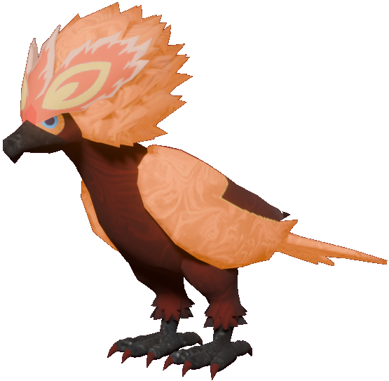
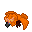

# 🥈 Braviary Fénix

## Información

**Braviary Fénix** es una Skin exclusiva del servidor introducida en la [Temporada Mística (1)](./).

|                     **Artwork** |                                                                                     |
| ------------------------------: | -------------------------------------------------------------------------------------------------------------------------------------- |
|                      **Sprite** |                                                           |                                                                                                             |
|                      Creado por | FuriadaNoite y BonMurci                                                                                                                |

La creación de esta skin hace referencia a la criatura mitológica Fénix y también al lore de la temporada, con el nacimiento de un nuevo mundo.

## Obtención

Esta skin se puede obtener en el nivel 70 del pase gratuito.
