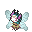

# 🥇 Meloetta Faerie

## Información

**Meloetta Faerie** es una Skin exclusiva del servidor introducida en la [Temporada Mística (1)](./).

|                     **Artwork** |                                                                                     |
| ------------------------------: | -------------------------------------------------------------------------------------------------------------------------------------- |
|                      **Sprite** |          |                                                                                                             |
|                      Creado por | FuriadaNoite y BonMurci                                                                                                                |

La creación de esta skin está basada en las hadas y también en el nuevo bioma místico.

 Esta skin, al igual que la versión original, puede cambiar de forma mediante el movimiento [Canto arcaico](https://www.wikidex.net/wiki/Canto_arcaico).

## Formas

## Obtención

Esta skin se puede obtener en el nivel 100 del pase de paga.
